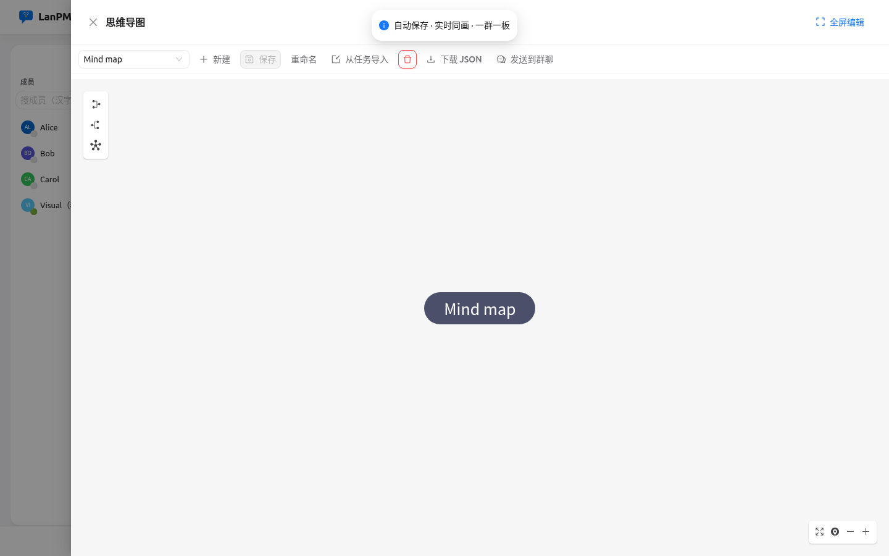

<p align="center">
  
</p>

<h1 align="center">LanPM</h1>

<p align="center">
  <strong>Chat like FeiQ. Plan like a PM. Keep everything on your LAN.</strong>
</p>

<p align="center">
  <a href="README.zh-CN.md">简体中文</a> ·
  <a href="https://wangqiqi.github.io/lanpm/">Website</a> ·
  <a href="#-more-views">Views</a> ·
  <a href="#-why-lanpm">Why</a> ·
  <a href="#-features">Features</a> ·
  <a href="#-quick-start">Quick Start</a> ·
  <a href="#-docs">Docs</a>
</p>

<p align="center">
  
  
  
  
</p>

<p align="center">
  
</p>
<p align="center"><sub><b>Chat</b> — group &amp; DM, members, code highlights, eight-view shell</sub></p>

**LanPM** is a **decentralized LAN/VPN collaboration desktop app**: instant messaging and project management in a single Electron shell, with **peer-to-peer sync inside the group** and **no mandatory cloud**.

## 📸 More views

<table>
  <tr>
    <td width="50%"><br /><sub><b>Board</b> — drag columns, tags, schedule health</sub></td>
    <td width="50%"><br /><sub><b>Task tree</b> — hierarchy, roll-up, cross-view locate</sub></td>
  </tr>
  <tr>
    <td width="50%"><br /><sub><b>Gantt</b> — timeline, deps, export PNG/PDF/Markdown/CSV</sub></td>
    <td width="50%"><br /><sub><b>Calendar</b> — drag to reschedule</sub></td>
  </tr>
  <tr>
    <td width="50%"><br /><sub><b>Whiteboard</b> — realtime Excalidraw (chat drawer)</sub></td>
    <td width="50%"><br /><sub><b>Mind map</b> — Yjs collab (chat drawer)</sub></td>
  </tr>
  <tr>
    <td width="50%"><br /><sub><b>Files</b> — resumable transfer, deliverables (chat drawer)</sub></td>
    <td width="50%"><br /><sub><b>Cockpit</b> — cross-group attention and project health</sub></td>
  </tr>
</table>

## 🎯 Why LanPM

| Pain today | LanPM answer |
|------------|----------------|
| IM tools don’t do real project views | **8 views**: Chat · Board · Tree · Gantt · Calendar · Whiteboard · Files · Cockpit |
| Project tools need cloud accounts | **P2P in the group** — LAN discovery, no central server |
| Sensitive files forced through SaaS | **Local SQLite** (optional passphrase at rest), encrypted transport, **LibreOffice preview on device** |
| FeiQ / Feige feel but no tasks | **Familiar IM UX** + boards, calendar, whiteboard, dependencies |

## 🚀 Features

| Area | Highlights |
|------|------------|
| **Communication** | Groups & DM, @mentions, code blocks, `/task` & `#` refs, message↔task, offline catch-up (chat / tasks / receipts / **file library index**), discover & VPN seeds. Optional **meeting plugin**: license CTA; Lite mesh vs Pro LiveKit; Pro video grid (auto-fit, screenshare tile, i18n); LAN LiveKit bypass ops in docs |
| **Project mgmt** | Kanban, tree, Gantt, calendar, FS/SS/FF/SF deps, tags, acceptance checklist, presence, schedule health. Optional **schedule plugin** (`lanpm.schedule`, paid): Gantt critical-path on FS/SS/FF/SF, one frozen baseline per group, and same-assignee explicit-date overlap hints. Optional **agile plugin** (`lanpm.agile`, paid): story points, column totals, remaining-points burndown, per-column WIP hints (never blocks drag), date-bounded iteration containers, and a completed-points velocity chart |
| **Collab** | Excalidraw whiteboard + mind maps (Yjs CRDT over P2P), group files, LibreOffice preview, resumable transfers |
| **Org & UX** | Project / functional / anonymous groups, leadership cockpit, light/dark, **zh / en**. Optional **weekly plugin** (`lanpm.weekly`, paid): license-gated weekly (incl. next-week plan) / monthly (own template) Markdown export. Optional **backup plugin** (`lanpm.backup`, free, **on by default**): encrypted single-group `.lanpm-bundle` in Profile; turn the plugin off to hide the section |
| **Security** | AES-GCM on TCP links. After pairing or first TOFU, the peer ECDH public key is pinned to `deviceId` — a LAN MITM cannot silently swap keys. The first discovery still trusts on first use. Local-first SQLite with **optional passphrase encryption at rest**. Win/macOS/Linux × x64/arm64 packages. |

Full capability list, protocols, and verify scripts → [docs/00](./docs/00_文档导航.md) · [PRD](./docs/01_产品需求文档.md) · [CHANGELOG](./CHANGELOG.md).

## ⚡ Quick Start

**Prerequisites:** Node.js 20+, npm 10+, Git.

```bash
git clone <your-repo-url> lanpm && cd lanpm
chmod +x onekey_run.sh    # first time (Unix)
./onekey_run.sh start     # or: npm install && npm run dev
```

| OS | Command |
|----|---------|
| Windows CMD | `onekey_run.bat start` |
| PowerShell | `.\onekey_run.ps1 start` |
| Git Bash / WSL | `./onekey_run.sh start` |

First launch runs a short setup wizard, then opens the demo group at `#/g/demo-project/chat`.

## 🛠️ For contributors

```bash
npm run lint && npm run typecheck && npm run test
npm run verify:p0          # guards (IPC, i18n, docs, screenshots layout)
npm run verify:chat-perf-observe  # chat perf code guards (+ local .cursorGrowth/decisions if present)
npm run measure:perf -- --quick   # Electron baseline JSON → .lanpm/perf/ (see docs/05 §5)
npm run verify:linux-installer-smoke  # Linux installer guards; LANPM_REQUIRE_INSTALLER=1 launches unpacked
npm run measure:list-scroll -- --schema-only   # four-view list scroll schema (full run needs build)
npm run verify:m7          # full RC regression before release
npm run build
```

| Topic | Note |
|-------|------|
| README images | `npm run screenshots:capture` → `npm run screenshots:sync-readme` ([docs/screenshots](./docs/screenshots/README.md)) |
| English wrap | `npm run verify:i18n-en` · `npm run verify:visual-screenshots-en` (cockpit + chat `en-US` PNGs; Linux `xvfb-run`) |
| Acceptance | **Electron** (`npm run dev`) is source of truth — not browser stub (`npm run dev:web`) |
| Chat perf QA | Budget in local `.cursorGrowth/decisions/chat-perf.md` · guards → `verify:chat-perf*` |
| App perf baseline | `npm run measure:perf` · `verify:measure-perf` · `measure:list-scroll` / `verify:list-scroll` (chat/board/files/gantt jank) · `verify:linux-installer-smoke` (static; `LANPM_REQUIRE_INSTALLER=1` launches unpacked → chat tab) · [docs/05 §5](./docs/05_测试与联调发布.md#5-性能测量m7) — Linux GPU is off by default (`LANPM_ENABLE_GPU=1` to opt in; `--quick` RSS is not the 200MB budget); Board/Tree/Files/Cockpit are lazy-split; cockpit dashboard is one JOIN; file-chunk progress IPC is 100ms-throttled; SQLite probe reads 16-byte header; task writes patch locally |
| Release QA | [docs/05](./docs/05_测试与联调发布.md) · cross-platform matrix §1.4 |
| LAN / “real network” | `npm run verify:m6` is **localhost loopback**, not two PCs. Dual-machine steps: [docs/05 §6](./docs/05_测试与联调发布.md#6-局域网真网联调m6) (manual; CI does not run them) |

Agent workflow (Super Cursor): [`/plan` · `/run`](./.cursor/AGENTS.md) — details in [`.cursor/`](./.cursor/).

## 📚 Docs

| | |
|--|--|
| [Project website](https://wangqiqi.github.io/lanpm/) | VitePress homepage (quick start, features) |
| [docs/00 — Index](./docs/00_文档导航.md) | All product & engineering docs |
| [ROADMAP](./docs/06_ROADMAP.md) | Backlog & milestones |
| [plugins](./plugins/README.md) | Official plugin layout |

**Current `1.106.14`** — VitePress project homepage on GitHub Pages. Test playbooks: calendar & dev:web E2E, dual-machine / cold-start / meeting / AI `verify:*-playbook` guards; discover UX P0–P2 (project groups land on the board; discover is a two-step connect→join wizard); project groups keep Gantt/calendar off the bottom bar by default (enable in Navigation & views). Paid agile: remaining-points burndown + column WIP hints + iteration containers + completed-points velocity chart. Paid schedule: freeze baseline + assignee date-overlap hints. Weekly next-week plan + independent monthly template. Free `lanpm.backup` (default on). License [AGPL-3.0-or-later](./LICENSE).

---

<p align="center">
  <sub>English · <a href="README.zh-CN.md">简体中文</a></sub><br />
  <sub>Built for teams who want FeiQ-speed chat and real PM tooling — without shipping IP to someone else's cloud.</sub>
</p>
