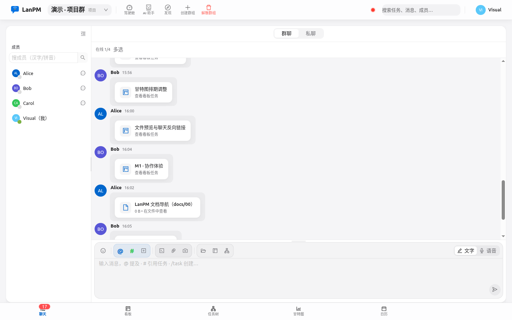
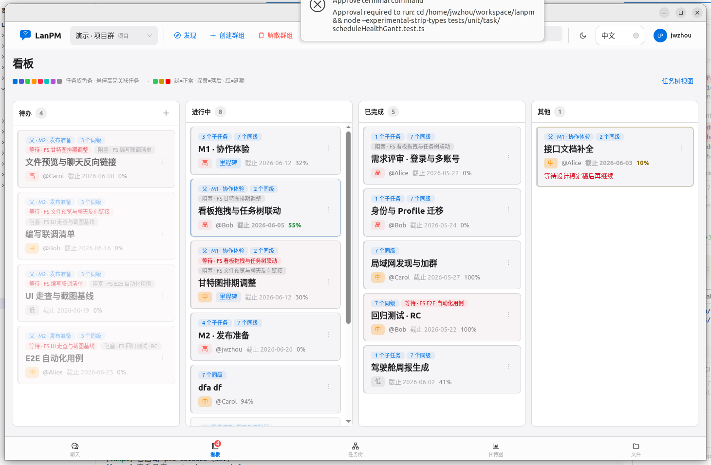
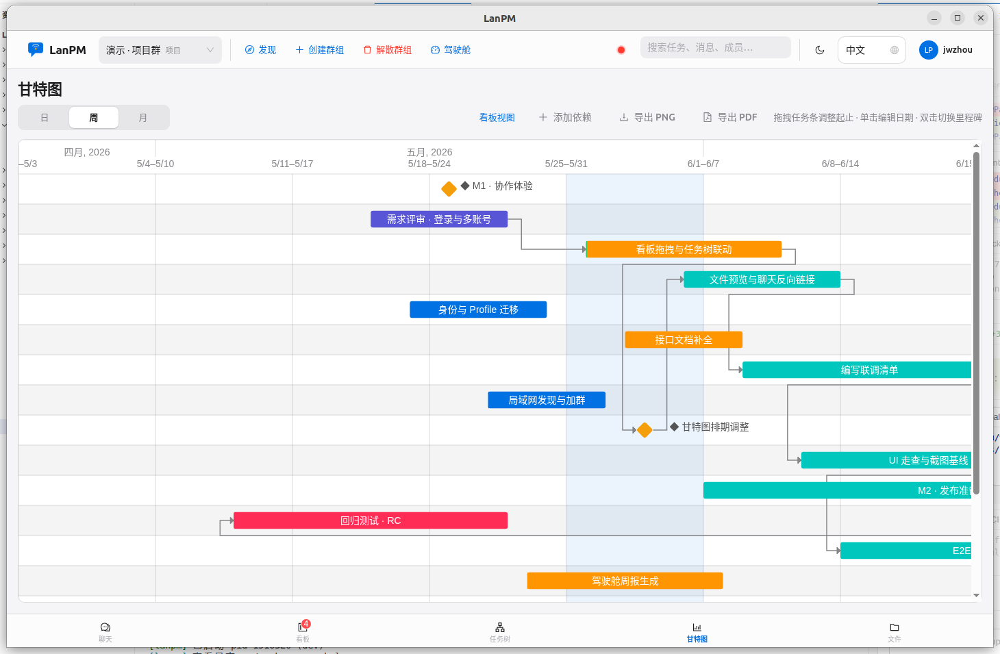
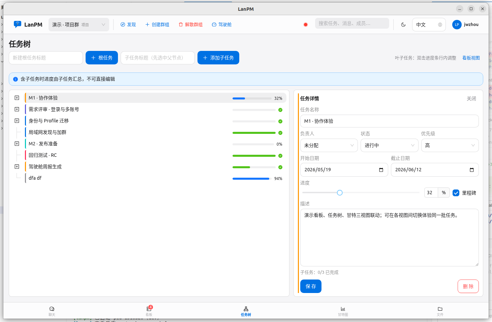
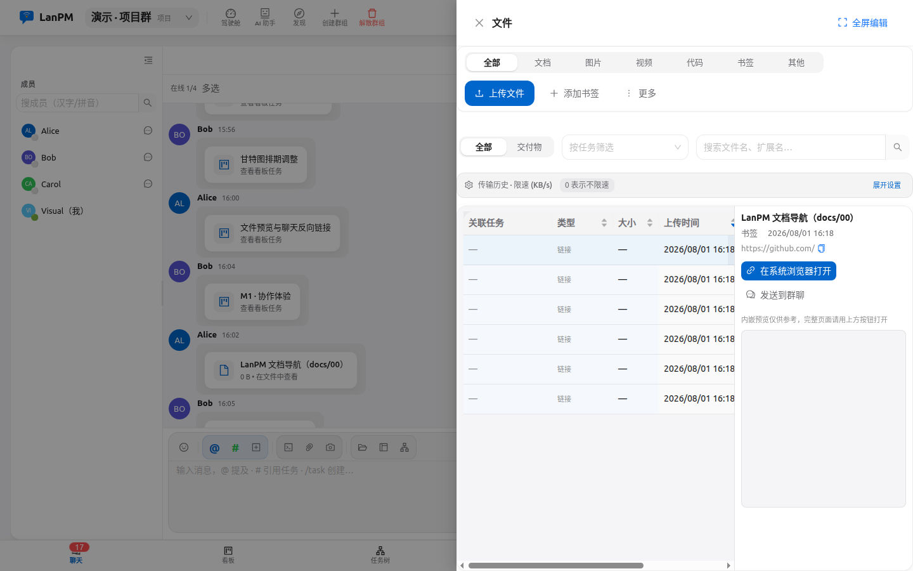
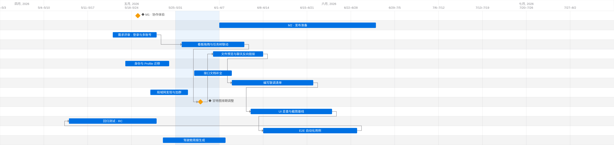

<p align="center">
  
</p>

<h1 align="center">LanPM</h1>

<p align="center">
  <strong>Chat like FeiQ. Plan like a PM. Keep everything on your LAN.</strong>
</p>

<p align="center">
  <a href="README.zh-CN.md">简体中文</a> ·
  <a href="#-screenshots">Screenshots</a> ·
  <a href="#-why-lanpm">Why LanPM</a> ·
  <a href="#-features">Features</a> ·
  <a href="#-quick-start">Quick Start</a> ·
  <a href="#-documentation">Docs</a>
</p>

<p align="center">
  
  
  
  
</p>

---

## ✨ One line

**LanPM** is a **decentralized LAN/VPN collaboration desktop app** — instant messaging, project management (Kanban / task tree / Gantt / calendar), group whiteboard, and file sharing in **one window**, with **no central server** and **data that stays on your network**.

---

## 📸 Screenshots

<p align="center">
  
</p>
<p align="center"><sub><b>Chat</b> — group &amp; DM, members, code highlights, seven-tab shell</sub></p>

<table>
  <tr>
    <td width="50%"></td>
    <td width="50%"></td>
  </tr>
  <tr>
    <td align="center"><sub><b>Board</b> — drag columns, family colors, tags &amp; schedule health</sub></td>
    <td align="center"><sub><b>Gantt</b> — timeline, dependencies, milestones, export</sub></td>
  </tr>
  <tr>
    <td width="50%"></td>
    <td width="50%"></td>
  </tr>
  <tr>
    <td align="center"><sub><b>Task tree</b> — hierarchy, progress, cross-view locate</sub></td>
    <td align="center"><sub><b>Files</b> — uploads, bookmarks, deliverables by task</sub></td>
  </tr>
</table>

<p align="center">
  
</p>
<p align="center"><sub><b>Gantt export</b> — PNG / PDF from the chart view · <i>also in-app: Calendar (month/week) · Whiteboard (Excalidraw realtime)</i></sub></p>

---

## 🎯 Why LanPM

| Pain today | LanPM answer |
|------------|----------------|
| IM tools don’t do real project views | **7 views in one shell**: Chat · Board · Tree · Gantt · Calendar · Whiteboard · Files |
| Project tools need cloud & accounts | **Peer-to-peer in the group** — discover nodes on the LAN, sync in-group |
| Sensitive files forced through SaaS | **Local-first SQLite**, encrypted transport, **LibreOffice preview on device** |
| “FeiQ / Feige” feel but no tasks | **Familiar IM UX** plus boards, calendar, whiteboard, dependencies, cockpit |

```
   ┌──────────────────────────────────────────────────────────────────┐
   │  IM  +  PM (Board / Tree / Gantt / Calendar)  +  Whiteboard      │
   │              +  Files  +  Leadership cockpit  +  AI (opt-in)     │
   │                                                                  │
   │     Core business data syncs inside the LAN — not to cloud       │
   └──────────────────────────────────────────────────────────────────┘
```

---

## 🚀 Features

### 💬 Communication

- Group & DM, **@mentions**, read receipts, desktop notifications  
- **Syntax-highlighted code** blocks, attachments, **`/task`** from chat, **`#`** task refs  
- **Message ↔ task (A2)**: bubble → task; discuss from detail; link files to tasks  
- **7-day offline catch-up** for chat (paginated), tasks/dependencies, read receipts  
- **Weak-net publish outbox (B4):** durable queue for failed task/file/tag publishes; auto-flush on reconnect (`sync_outbox`)  
- Chat history **load-more**; failed sends mark **`failed`** with auto-retry + bubble **Retry**  
- TopBar **Discover**: join groups, ping members, start DMs; **seed peers** for VPN / cross-subnet (A5)  
- TopBar **group switcher**: name/pinyin search, pins, recent activity sort  
- Owner **dissolve** clears peers via `member_event`; **avatars** in TopBar, bubbles, member lists  

### 📋 Project management

- **Kanban**: drag columns, family colors, FS/SS/FF/SF deps; **tags** (group dictionary, OR filter, palette)  
- **Task tree**: parent/child, progress roll-up, locate in board/Gantt  
- **Gantt**: timeline, milestones, dependency lines, zoom, PNG/PDF export  
- **Calendar**: month/week (FullCalendar); **drag / resize to reschedule**; inferred windows for undated tasks  
- **Schedule health** (on track / behind / overdue) aligned across board, tree, Gantt, cockpit  
- **Acceptance checklist** on tasks; incomplete items → subtasks  
- **Presence**: who is viewing a task; **description caret** awareness while co-editing  
- **A1 nudge (v1.20.0)**: due today/overdue desktop reminders (toggle); `@assignee` alias in chat; **Nudge assignee** from task detail  
- **B2 member search**: pinyin/keyword filter for assignees on the board, searchable assignee Select, chat member sidebar search (`verify:member-search`)  
- **Plugin loader + form-js POC**: discover `plugins/*/plugin.json`; Host capability proxy; task-detail slot with free stub + paid form-js schema POC (`verify:plugin-loader`)  
- **Plugin enable UI**: Profile **Extensions** tab toggles official plugins; detail slot refreshes live (`verify:plugin-enable-ui`)  
- **Encrypted group backup (B3+B5)**: `.lanpm-bundle` dry-run / overwrite; newest-first message export; transactional import + FK remap; progress/port/plugin defaults (`verify:bundle`)  
- Nav badges: chat unread · board **mine-open** (todo/doing assigned to me) · weak recent-change dot  

### 🎨 Whiteboard

- 7th tab: **Excalidraw** group board (one scene per group)  
- **Realtime CRDT** + pointer awareness over P2P (no public room)  
- Open from a task (linked); export PNG into the group file library  

### 📁 Files

- Upload/download on the group network, **resumable** transfers & queue  
- **Cancel / retry / rate · ETA** (A4 · v1.19.0)  
- **LibreOffice local preview** for Office docs  
- Bookmarks & in-app WebView  
- **Deliverables (A3)**: filter by linked tasks; attach/detach from Files tab  

### 🏢 Org shapes & identity

- **Project**, **functional**, and **anonymous** groups — tabs adapt (calendar/whiteboard project-only)  
- **Leadership cockpit**: portfolio, reports, optional AI API keys  
- **Multi-device identity**: online if any device is up; optional display-name **suffix**  
- **Light / dark** theme with shared chrome vibe tokens · **zh / en** UI  

### 🔒 Security & shipping

- **AES-GCM** on the wire with ECDH (see [technical notes](./docs/02_技术实现建议.md))  
- No mandatory cloud; optional AI can use **redacted** outbound calls  
- **Cross-platform packages**: Win / macOS / Linux × **x64 + arm64** (`docs/05` §1.4, `verify:platform-matrix`)  
- **`npm run verify:m7`** full RC regression before release  
- Plugin **load-boundary** designed (SPIKE); loader not shipped yet  

---

## ⚡ Quick Start

### Prerequisites

- **Node.js** 20+ (22 LTS recommended)  
- **npm** 10+  
- **Git**  

### Run in 30 seconds (Linux / macOS / Git Bash)

```bash
git clone <your-repo-url> lanpm && cd lanpm
chmod +x onekey_run.sh    # first time only
./onekey_run.sh start     # dev in background → .lanpm/dev.log
```

Or classic:

```bash
npm install    # postinstall aligns better-sqlite3 to Electron ABI
npm run dev    # Electron dev shell
```

### Windows

| Terminal | Command |
|----------|---------|
| CMD | `onekey_run.bat start` |
| PowerShell | `.\onekey_run.ps1 start` |
| Git Bash / WSL | `./onekey_run.sh start` |

First launch runs a short **setup wizard** (display name, device name, optional department & avatar). Then you land in the main shell — default demo route `#/g/demo-project/chat`.

---

## 🛠️ For contributors

```bash
npm run lint && npm run typecheck
npm run test              # Vitest unit tests
npm run verify:p0         # IPC / i18n / docs guards
npm run verify:m7         # full RC regression (recommended before release)
npm run build             # production Electron build
npm run dist:linux:x64    # package for current host OS/arch via electron-builder
npm run verify:platform-matrix  # Win/mac/Linux × x64+arm64 wiring
```

| Topic | Command / note |
|-------|----------------|
| Browser UI stub only | `npm run dev:web` — **Electron is the source of truth** for IPC & SQLite |
| Visual consistency gate | `npm run verify:visual` (see [06_ROADMAP](./docs/06_ROADMAP.md) §4) |
| Feature verifiers | `verify:transfer-a4` · `verify:project-files` · `verify:discover-a5` · `verify:whiteboard-realtime` · `verify:calendar-drag` · `verify:checklist` · `verify:message-task` · … |
| Cross-platform packages | `dist:win` / `dist:mac` / `dist:linux` (+ `:x64` / `:arm64`); matrix in [docs/05 §1.4](./docs/05_测试与联调发布.md#14-跨平台发版矩阵) |
| One-key menu | `./onekey_run.sh` → start / stop / status / build / pack …; `11` for more (check / verify / rebuild …) |

### Browser stub vs Electron

| Scenario | Electron (`npm run dev`) | Browser Vite (`:5173`) |
|----------|----------------------------|-------------------------|
| IPC / SQLite | Main-process API (real or stub) | In-memory `browserLanpmStub` |
| File upload / preview | System dialog + local paths | Limited or mocked |
| Acceptance | ✅ **Source of truth** | UI preview only |

Stub error strings go through i18n (`verify:i18n-en` guard).

---

## 🧱 Tech stack

| Layer | Choice |
|-------|--------|
| Desktop | **Electron** |
| UI | **React 18** + **TypeScript** + **Ant Design 5** |
| State | **Zustand** · styling **CSS Modules** |
| Calendar | **FullCalendar** (+ interaction for drag/resize) |
| Whiteboard | **Excalidraw** + Yjs / `@mizuka-wu/y-excalidraw` |
| Gantt | **gantt-task-react** |
| Persistence | **SQLite** (single source of truth) |
| Sync | UDP discovery + TCP/P2P; task CRDT · whiteboard CRDT · AES-GCM transport |
| Packaging | electron-builder — Win / macOS / Linux × x64 + arm64 |

---

## 📚 Documentation

| Doc | Contents |
|-----|----------|
| [docs/00 — Index](./docs/00_文档导航.md) | Navigation, traceability, decisions |
| [docs/01 — PRD](./docs/01_产品需求文档.md) | Product requirements |
| [docs/02 — Architecture](./docs/02_技术实现建议.md) | System design, networking |
| [docs/03 — Data & protocol](./docs/03_数据模型与协议草案.md) | Schema, sync messages |
| [docs/04 — UI](./docs/04_交互与UI约定.md) | Layout, themes, seven-tab shell |
| [docs/05 — Testing](./docs/05_测试与联调发布.md) | Vitest, verify:*, release QA |
| [docs/06 — ROADMAP](./docs/06_ROADMAP.md) | Open backlog · meeting plugin · marketplace |
| [docs/05 §1.4 — Platform matrix](./docs/05_测试与联调发布.md#14-跨平台发版矩阵) | Cross-platform build & CI |
| [Feige / FeiQ mapping](./docs/飞鸽飞秋.md) | Feature parity notes vs classic LAN IM |

---

## 🗺️ Status & roadmap

| Milestone | Scope |
|-----------|--------|
| **M0–M1** | Scaffold, first-run setup, multi-view shell |
| **M2–M5** | Chat, tasks, files, groups, cockpit |
| **M6–M7** | Real network paths, perf & release gates |
| **v1.1–v1.19** | CRDT · tags · Presence · calendar · whiteboard realtime · deliverables · discover · transfer UX · platform matrix |

**Current:** `1.33.5` — SPRINT-04～07 UX 评估闭环 · 截图 CI · P3 抛光 · `verify:release-gate` 全绿; **onekey** slim menu + preflight; **Cockpit density accordion** (CK-410–415). M0–M7 closed in automation; true-device hand tests still deferred ([06_ROADMAP](./docs/06_ROADMAP.md) §4). License: [AGPL-3.0-or-later](./LICENSE).

**Next (queue):** meeting implementation sprint · marketplace SPIKE.

**Later (P1+):** purchasable meeting plugin (voice/video/screen share), mind maps, mobile PWA — [full list · §1/§3](./docs/06_ROADMAP.md).

---

## 🤖 Agent workflow (contributors)

This repo uses the Super Cursor SOP under [`.cursor/`](./.cursor/). Day-to-day: **`/master`** · **`/plan`** · **`/run`** · **`/learn`** · **`/scaffold`** · **`/release`** · **`/delivery`** · **`/ux`** · **`/ia`**.

Skills (loaded from `.cursor/skills/`): **master** · **plan** · **run** · **learn** · **scaffold** · **git** · **security** · **api** · **ux** · **ia** · **release** · **debug** · **test** · **mcp** · **refactor** · **perf** · **review** · **study** · **delivery** · **week** · **disk** · **maintain**.

Agents: **ship** · **review** · **spike**.

Template self-check: `bash .cursor/bin/template-verify.sh` · `bash .cursor/bin/cursor-coherence.sh`.

---

## 🌐 Languages

- **English** — this file  
- **简体中文** — [README.zh-CN.md](./README.zh-CN.md)

---

<p align="center">
  <sub>Built for teams who want FeiQ-speed chat and real PM tooling — without shipping their IP to someone else's cloud.</sub>
</p>
