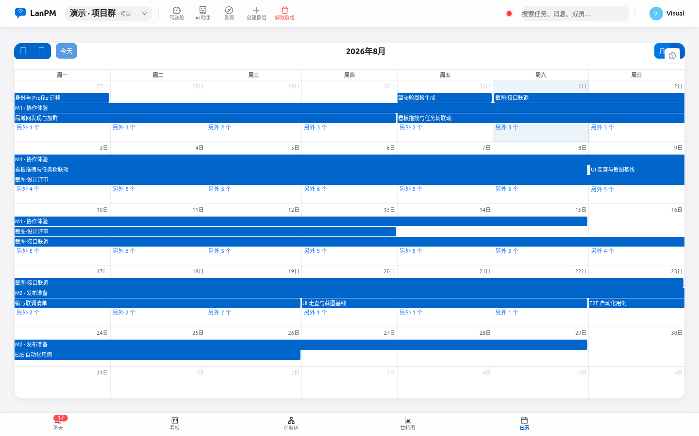
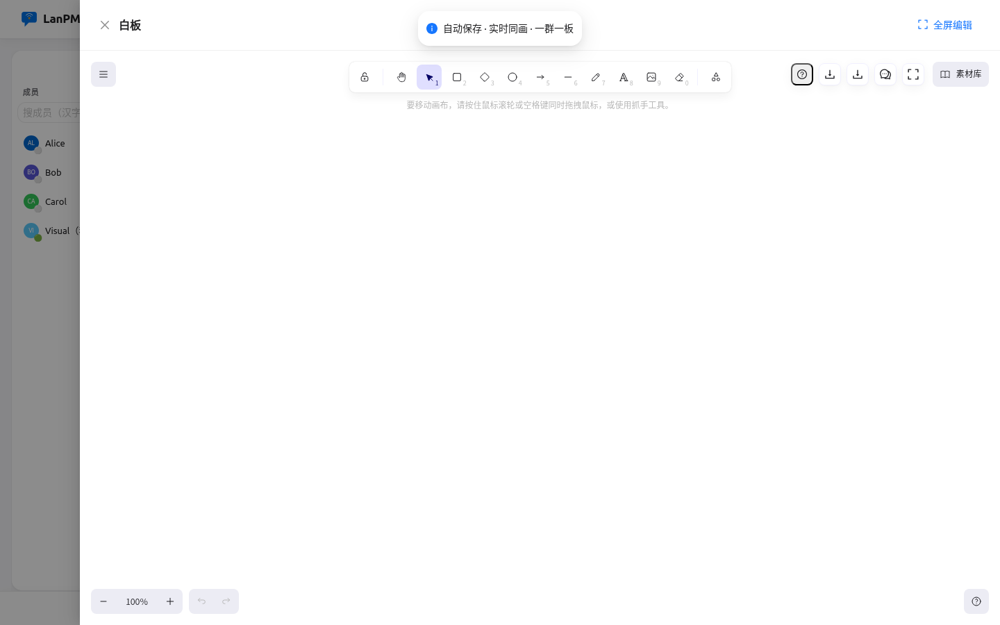
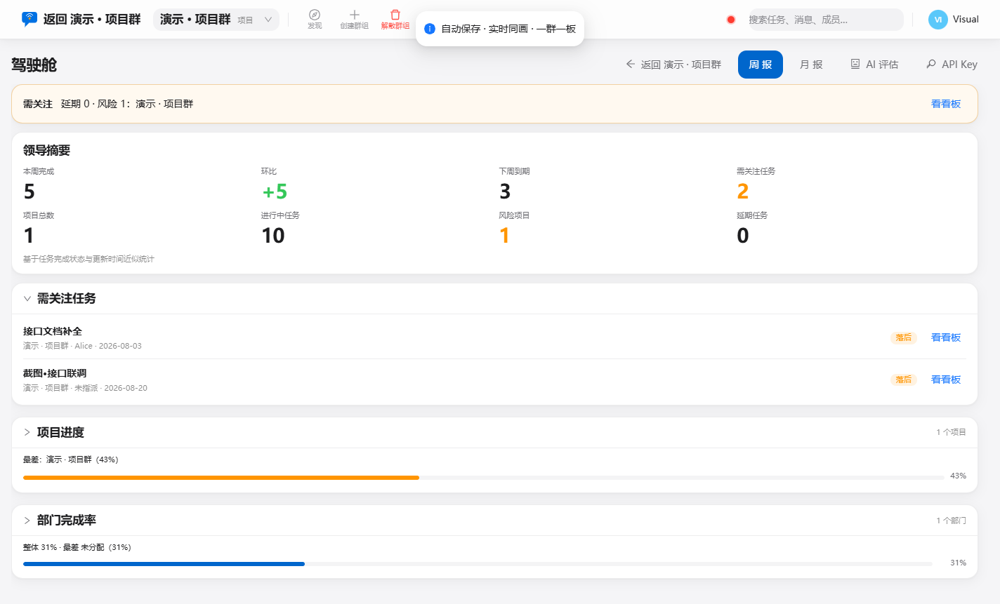

<p align="center">
  
</p>

<h1 align="center">LanPM</h1>

<p align="center">
  <strong>飞秋般畅聊，项目经理般协作，数据留在你的局域网。</strong>
</p>

<p align="center">
  <a href="README.md">English</a> ·
  <a href="#-更多视图">视图</a> ·
  <a href="#-为什么选择-lanpm">为什么</a> ·
  <a href="#-核心能力">能力</a> ·
  <a href="#-快速开始">上手</a> ·
  <a href="#-文档">文档</a>
</p>

<p align="center">
  
  
  
  
</p>

<p align="center">
  
</p>
<p align="center"><sub><b>聊天</b> — 群聊 / 私聊、成员状态、代码高亮、八视图主壳</sub></p>

**LanPM** 是**分布式局域网 / VPN 协作桌面客户端**：即时通讯与项目管理装进同一 Electron 壳，群组内 **P2P 同步**，**不绑公有云**。

## 📸 更多视图

<table>
  <tr>
    <td width="50%"><br /><sub><b>看板</b> — 拖拽流转、标签、工期健康度</sub></td>
    <td width="50%"><br /><sub><b>任务树</b> — 层级、汇总、跨视图定位</sub></td>
  </tr>
  <tr>
    <td width="50%"><br /><sub><b>甘特图</b> — 时间轴、依赖、导出 PNG/PDF</sub></td>
    <td width="50%"><br /><sub><b>日历</b> — 拖拽改期</sub></td>
  </tr>
  <tr>
    <td width="50%"><br /><sub><b>白板</b> — Excalidraw 实时同画</sub></td>
    <td width="50%"><br /><sub><b>文件</b> — 断点续传、交付物</sub></td>
  </tr>
  <tr>
    <td colspan="2" align="center"><br /><sub><b>驾驶舱</b> — 跨群需关注与项目健康度</sub></td>
  </tr>
</table>

## 🎯 为什么选择 LanPM

| 常见痛点 | LanPM 的做法 |
|----------|----------------|
| 聊天工具做不了正经项目视图 | **八大视图**：聊天 · 看板 · 任务树 · 甘特 · 日历 · 白板 · 文件 · 驾驶舱 |
| 项目管理强依赖云端账号 | **群组内 P2P**，局域网发现，无中心服务器 |
| 敏感文件只能走 SaaS | **本地 SQLite**，传输加密，**LibreOffice 本地预览** |
| 飞秋 / 飞鸽好用但没有任务 | **保留 IM 体验** + 看板、日历、白板、依赖关系 |

## 🚀 核心能力

| 领域 | 要点 |
|------|------|
| **沟通** | 群聊 / 私聊、@提及、代码高亮、`/task` 与 `#` 引用、消息↔任务、离线补同步、发现与 VPN 种子 |
| **项目管理** | 看板、任务树、甘特、日历、四类依赖、标签、验收清单、Presence、工期健康度 |
| **协作** | Excalidraw 白板（群内 P2P CRDT）、群文件、LibreOffice 预览、断点续传 |
| **组织与体验** | 项目 / 职能 / 匿名群、领导驾驶舱、亮暗主题、**中 / 英** |
| **安全** | TCP 链路上 AES-GCM。配对成功或首次 TOFU 后把对端 ECDH 公钥钉到 `deviceId` — 局域网中间人无法再静默换钥。首次发现仍是信任首次使用。本地优先 SQLite。Win/macOS/Linux × x64/arm64 安装包。 |

完整能力、协议与验收脚本 → [docs/00](./docs/00_文档导航.md) · [PRD](./docs/01_产品需求文档.md) · [CHANGELOG](./CHANGELOG.md)。

## ⚡ 快速开始

**环境：** Node.js 20+、npm 10+、Git。

```bash
git clone <你的仓库地址> lanpm && cd lanpm
chmod +x onekey_run.sh    # 首次（Unix）
./onekey_run.sh start     # 或：npm install && npm run dev
```

| 系统 | 命令 |
|------|------|
| Windows CMD | `onekey_run.bat start` |
| PowerShell | `.\onekey_run.ps1 start` |
| Git Bash / WSL | `./onekey_run.sh start` |

首次启动走配置向导，随后进入示例群 `#/g/demo-project/chat`。

## 🛠️ 开发者

```bash
npm run lint && npm run typecheck && npm run test
npm run verify:p0          # 守卫（IPC、i18n、文档、截图布局）
npm run verify:m7          # 发版前全量回归
npm run build
```

| 说明 | 注意 |
|------|------|
| README 配图 | `npm run screenshots:capture` → `npm run screenshots:sync-readme`（[docs/screenshots](./docs/screenshots/README.md)） |
| 验收 | 以 **Electron**（`npm run dev`）为准 — 浏览器 stub（`npm run dev:web`）仅 UI 预览 |
| 发版 | [docs/05](./docs/05_测试与联调发布.md) · 跨平台矩阵 §1.4 |

Agent 工作流（Super Cursor）：[`/plan` · `/run`](./.cursor/AGENTS.md) — 详见 [`.cursor/`](./.cursor/)。

## 📚 文档

| | |
|--|--|
| [docs/00 — 导航](./docs/00_文档导航.md) | 产品与工程文档索引 |
| [ROADMAP](./docs/06_ROADMAP.md) | backlog 与里程碑 |
| [plugins](./plugins/README.md) | 官方插件目录 |

**当前版本 `1.103.0`** — SDD spec/决策迁入 `.cursorGrowth/`；chat-perf 守卫更新。许可 [AGPL-3.0-or-later](./LICENSE)。

---

<p align="center">
  <sub><a href="README.md">English</a> · 简体中文</sub><br />
  <sub>为「既要飞秋般爽快沟通，又要正经项目管理、还不愿把数据交给公有云」的团队而生。</sub>
</p>
