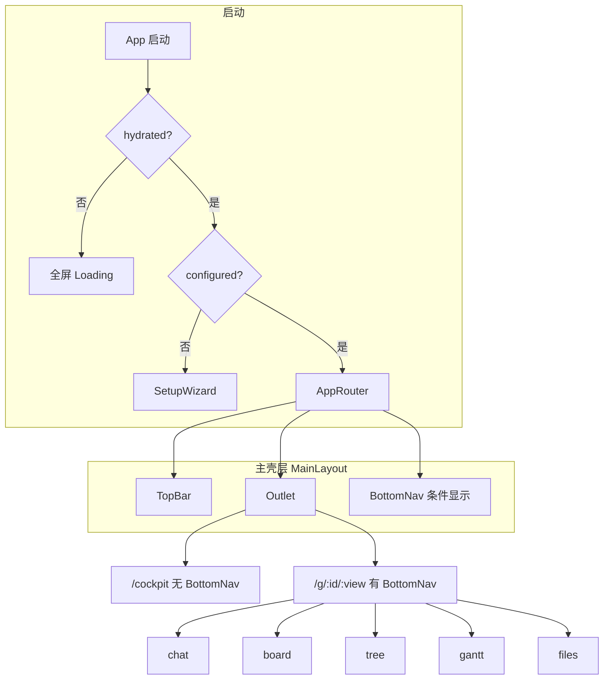
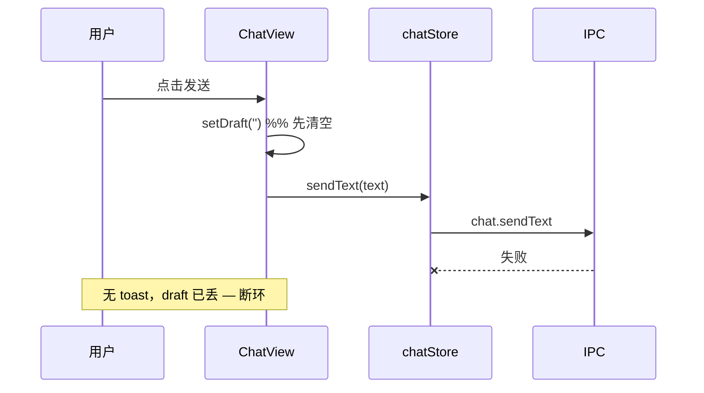
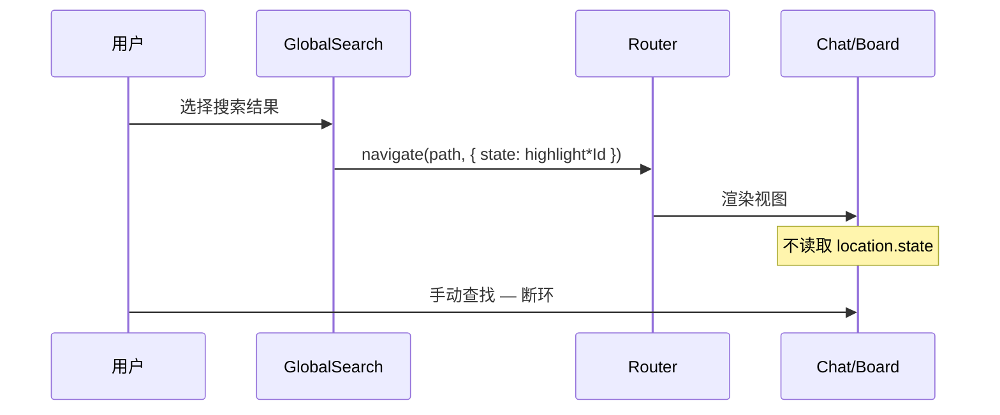
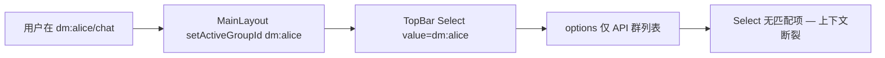

# LanPM UX 操作路径与交互闭环审查

> **已归档**（2026-05-29）。**唯一任务真源**：[../todo.md](../todo.md)。审查记录；任务只维护在 todo（§UX 操作路径：UX-X / UX-W / UX-PATH / UX-FLOW / UX-DEV）。

> **评估日期**：2026-05-29  
> **评估范围**：渲染层全部用户可触达操作（Setup → 主界面 → 五视图 → 驾驶舱 → 全局搜索）  
> **评估方法**：静态代码追踪（路由、`onClick`/`navigate`、Store、Modal 开闭、toast/错误处理）  
> **关联文档**：[20260529_095839_UI设计审查_ui.md](./20260529_095839_UI设计审查_ui.md)（视觉、无障碍、i18n 等静态 UI 问题）

---

## 1. 评估框架

每条操作路径按以下维度审查：

| 维度 | 含义 |
|------|------|
| **入口** | 用户从哪开始该目标 |
| **步骤** | 最少点击/输入次数 |
| **反馈** | 成功/失败是否有可感知结果（toast、列表更新、Modal 关闭） |
| **出口** | 完成后用户落在哪、能否继续下一任务 |
| **闭环** | ✅ 完整 · ⚠️ 部分（缺反馈或多绕路） · ❌ 断环（失败丢数据或目标未达成） |
| **最短路径** | 当前实现是否等于理论最少步数；若否，说明冗余 |

---

## 2. 全局导航模型



**BottomNav 显示规则**：路径匹配 `/g/:id/*` 时显示；驾驶舱 `/cockpit` **不显示**。

**群类型 → Tab 能力**（`tabRules.ts`）：

| 群类型 | 可用 Tab | 默认 Tab |
|--------|----------|----------|
| project | 全部 5 个 | chat |
| function | chat, files | chat |
| anonymous | chat | chat |
| dm:* | chat | chat |

---

## 3. 操作路径总表（闭环 + 步数）

图例：**步数** = 已处于正确群/视图时的最少操作数；**闭环** = 成功路径是否可感知完成。

### 3.1 启动与身份

| 目标 | 入口 | 步数 | 闭环 | 最短? | 说明 |
|------|------|------|------|-------|------|
| 首次完成身份配置 | App 自动 | 填表 1 + 提交 1 | ✅ | 是 | `SetupWizard` → toast → 进主界面 |
| 再次打开（已配置） | App 自动 | 0 | ✅ | 是 | `getSetupStatus` → 直接 `AppRouter` |
| 身份 API 失败 | App 自动 | — | ❌ | — | `App.tsx` catch 仅 `setHydrated(true)`，与「未配置」混淆，可能误进 Setup 或空身份主界面 |
| 启动后进默认群 | Setup 完成 / `/` | 0 | ⚠️ | 否 | 硬编码 `#/g/demo-project/chat`，群不存在则标题 fallback 为 ID |

### 3.2 群组与导航

| 目标 | 入口 | 步数 | 闭环 | 最短? | 说明 |
|------|------|------|------|-------|------|
| 切换项目群 | TopBar Select | 1 | ✅ | 是 | 保留当前 view（不允许则降级 defaultView） |
| 创建群 | TopBar「创建群组」 | 填表 + 确认 2 | ⚠️ | 是 | 成功跳转；**失败无 toast**（`CreateGroupModal` 无 catch） |
| 五视图切换 | BottomNav | 1 | ✅ | 是 | 禁用 Tab 有 Tooltip |
| 看板 ↔ 树 | 各视图 toolbar 链接 | 1 | ✅ | 是 | 互链闭环 |
| 进驾驶舱 | TopBar「驾驶舱」 | 1 | ✅ | 是 | 进入 `/cockpit` |
| 离开驾驶舱回群 | TopBar Select / Logo | 1–2 | ⚠️ | 否 | **无「返回上次群」**；Logo 回 `activeGroupId/chat`，多一步认知 |
| 进匿名群 | Select 选 anonymous | 1 | ⚠️ | 是 | mount 自动 `enterAnonymous`；**无进入提示** |
| 离匿名群 | 切到其他群 / 卸载 | 1 | ⚠️ | 是 | 自动 `leaveAnonymous`；**无确认、无离开提示** |
| 非法 URL 视图 | 手动改 Hash | 0 | ⚠️ | — | `GroupViewGuard` 静默 redirect，用户不知原因 |
| DM 会话 | 成员列表 DM 图标 | 1 | ✅ | 是 | → `dm:…/chat` |
| 从 DM 回群聊 | DmSessionBar「返回群聊」 | 1 | ✅ | 是 | → `lastOriginGroupId/chat` |
| DM 时 TopBar 群 Select | — | — | ❌ | — | `activeGroupId=dm:…` **不在 options**，Select 显示异常；无法从 TopBar 看出「当前在 DM」 |

### 3.3 聊天

| 目标 | 入口 | 步数 | 闭环 | 最短? | 说明 |
|------|------|------|------|-------|------|
| 发文本 | Composer + 发送 / ⌘↵ | 输入 + 1 | ❌ | 是* | **先 `setDraft('')` 再 `sendText`**；失败无 toast、内容丢失（`ChatView` L184-185） |
| 发代码 | 代码按钮 → Modal | 2 + 发送 | ⚠️ | 是 | 失败 Modal 不关但 **无 error toast**（`CodeSendModal` 无 catch） |
| `/task 标题` | Composer | 输入 + 1 | ✅ | 是 | 直接建任务并发 task_ref 消息 |
| `/task` 无标题 | Composer | 输入 + Modal | ⚠️ | 可更短 | 必须开 Modal，合理 |
| 点按钮建任务 | 「任务」→ Modal | 2 | ✅ | 是 | |
| @ 提及 | 输入 @ 或点成员 | 2–3 | ⚠️ | 是 | 仅鼠标点选；**无键盘确认** |
| 从成员发起 DM | 成员行 DM 图标 | 1 | ✅ | 是 | |
| 标已读 | 自动（可见 300ms） | 0 | ⚠️ | 是 | 失败静默；UI 仅自己消息旁 emoji |
| 点 task_ref 进看板 | 消息内链接 | 1 | ✅ | 是 | → board |
| 加载消息失败 | 进 chat | 0 | ❌ | — | `loadMessages` 无 error UI，仅 loading 结束 |

### 3.4 看板

| 目标 | 入口 | 步数 | 闭环 | 最短? | 说明 |
|------|------|------|------|-------|------|
| 新建任务 | 「新建任务」Modal | 2 | ✅ | 是 | success toast |
| 拖拽改状态 | 拖卡片 | 1 | ✅ | 是 | |
| 拖入 OTHER | 拖 + 填原因 Modal | 2 | ✅ | 是 | Cancel 关闭 Modal，卡片回原列 |
| 删除任务 | 卡片删除 + 确认 | 2 | ✅ | 是 | |
| 空看板首次使用 | 进 board | 0 | ⚠️ | — | 四列空列，**无整体引导/CTA** |

### 3.5 任务树

| 目标 | 入口 | 步数 | 闭环 | 最短? | 说明 |
|------|------|------|------|-------|------|
| 建根任务 | toolbar 输入 + 按钮 | 2 | ✅ | 是 | |
| 建子任务 | 选中节点 + 输入 + 按钮 | 3 | ✅ | 是 | 需先选中父节点 |
| 改进度（叶子） | 选中叶子 + 输入 + 保存 | 3 | ✅ | 是 | toolbar 第二行出现 |
| 改进度（有子节点） | 选中父节点 | — | ❌ | — | `editingProgress` 清空，**无说明**为何不能改 |

### 3.6 甘特图

| 目标 | 入口 | 步数 | 闭环 | 最短? | 说明 |
|------|------|------|------|-------|------|
| 拖 bar 改期 | 拖拽 | 1 | ✅ | 是 | 失败 toast |
| 加依赖 | 按钮 → Modal | 3 | ✅ | 是 | |
| 切换里程碑 | 双击 bar | 1 | ⚠️ | 是 | **无 discoverability**（用户不知可双击） |
| 导出 PNG/PDF | toolbar | 1 | ✅ | 是 | 空图按钮 disabled |

### 3.7 文件

| 目标 | 入口 | 步数 | 闭环 | 最短? | 说明 |
|------|------|------|------|-------|------|
| 上传 | 「上传」→ 系统对话框 | 2 | ✅ | 是 | 失败 toast |
| 加书签 | Modal url/title | 3 | ✅ | 是 | 成功后切到 bookmark 分类 |
| 导入/导出书签 | toolbar | 1 | ✅ | 是 | |
| 预览文件 | 点击表格行 | 1 | ⚠️ | 是 | 失败仅侧栏文案；书签仅外链 |
| 空文件列表 | 进 files | 0 | ⚠️ | — | Ant Table 默认 empty，非 i18n |

### 3.8 驾驶舱

| 目标 | 入口 | 步数 | 闭环 | 最短? | 说明 |
|------|------|------|------|-------|------|
| 看指标 | TopBar 驾驶舱 | 1 | ⚠️ | 是 | 加载失败仍显示 **0 指标**（假空态） |
| 项目进看板 | 项目行「查看」 | 1 | ✅ | 是 | |
| 生成 AI 报告 | 三个报告按钮 | 1 | ✅ | 是 | 报告卡片 + toast |
| 配 AI Key | API Key 按钮 / 用户菜单 | 2 | ⚠️ | 是 | 保存失败 **无 toast**（`AiConfigModal` 无 catch） |
| 加载失败重试 | — | — | ❌ | — | **无重试 UI** |

### 3.9 全局搜索

| 目标 | 入口 | 步数 | 闭环 | 最短? | 说明 |
|------|------|------|------|-------|------|
| 搜任务并定位 | TopBar 搜索 → 选任务 | 2 | ❌ | 否 | 能到 board/tree，但 **`highlightTaskId` 无人消费**，用户仍需肉眼找 |
| 搜消息并定位 | 搜索 → 选消息 | 2 | ❌ | 否 | 同上 **`highlightMsgId`** |
| 搜索 API 失败 | 输入查询 | — | ❌ | — | 与「无结果」相同，静默 |

### 3.10 TopBar 快捷

| 目标 | 入口 | 步数 | 闭环 | 最短? | 说明 |
|------|------|------|------|-------|------|
| 切换主题 | 日月图标 | 1 | ✅ | 是 | 即时 |
| 切换语言 | locale Select | 1 | ✅ | 是 | 即时 |
| 个人设置 | 用户菜单 | 1 | ❌ | — | **永久 disabled**，死胡同 |
| API Key | 用户菜单 | 1 | ✅ | 是 | → cockpit（与驾驶舱内按钮重复，多入口合理） |

---

## 4. 闭环状态汇总

### 4.1 ✅ 已闭环（主要 happy path）

- Setup 提交 → 主界面  
- BottomNav 五 Tab 切换（允许范围内）  
- 看板：创建 / 拖拽 / OTHER 原因 / 删除  
- 树：根/子任务创建、叶子改进度  
- 甘特：改期、依赖、导出  
- 文件：上传、书签 CRUD、导入导出  
- DM：发起 → 会话 → 返回群聊  
- 聊天：task_ref 跳转看板、/task 带标题、任务 Modal 创建  
- 主题 / 语言切换  

### 4.2 ❌ 断环（必须修复）

| ID | 路径 | 断点 | 文件 |
|----|------|------|------|
| **X-01** | 搜索 → 定位任务/消息 | 跳转后无 scroll/highlight，**目标未达成** | `GlobalSearch.tsx` → 各视图未读 `location.state` |
| **X-02** | 发送纯文本 | draft 已清空 + 无 error → **内容丢失** | `ChatView.tsx` L184-185 |
| **X-03** | 驾驶舱加载 | 失败仍显示 0 → **误判为无数据** | `CockpitView.tsx` L53-55, L126+ |
| **X-04** | App 身份拉取 | 失败无区分 → **错误引导** | `App.tsx` L37-41 |
| **X-05** | 搜索 API | 失败静默 → **与空结果混淆** | `GlobalSearch.tsx` L64-65 |
| **X-06** | TopBar 个人设置 | disabled 可点菜单项 → **死胡同** | `TopBar.tsx` L83 |
| **X-07** | DM 会话时 TopBar | Select 无当前项 → **上下文丢失** | `TopBar.tsx` + `navigationStore` |
| **X-08** | 树：选中有子节点任务改进度 | 无 UI 反馈 → **用户以为坏了** | `TaskTreeView.tsx` L90-96 |

### 4.3 ⚠️ 弱闭环（有结果但反馈不足或多绕路）

| ID | 路径 | 问题 |
|----|------|------|
| W-01 | 创建群组 | 失败无 toast |
| W-02 | 发代码 / 存 AI 配置 | 失败无 toast |
| W-03 | markRead | 失败静默 |
| W-04 | loadMessages / loadGroups | 失败无 UI |
| W-05 | 驾驶舱 ↔ 群 | 无 BottomNav、无「返回」 |
| W-06 | 匿名群进/退 | 无 toast/确认 |
| W-07 | 非法 view URL | 静默 redirect |
| W-08 | 甘特里程碑 | 双击无提示 |
| W-09 | 默认路由 demo-project | 可能非用户真实群 |
| W-10 | 聊天 load 失败 | 与空消息难区分 |

---

## 5. 最短路径分析

### 5.1 已是最短或接近最短

| 用户意图 | 理论最少步 | 当前步 | 结论 |
|----------|------------|--------|------|
| 同群内换 Tab | 1 | 1 | 最优 |
| 成员 → DM | 1 | 1 | 最优 |
| DM → 原群 | 1 | 1 | 最优 |
| 拖看板改状态 | 1 | 1 | 最优 |
| 聊天 task_ref → 看板 | 1 | 1 | 最优 |
| 上传文件 | 2（含系统对话框） | 2 | 最优 |

### 5.2 路径偏长或可合并

| 用户意图 | 当前步 | 可优化为 | 节省 | 建议 |
|----------|--------|----------|------|------|
| 驾驶舱 → 继续聊某群 | Select 选群 + 可能再点 chat Tab | 1 步「返回上次群」 | 1–2 | Cockpit 加返回；或 Logo 智能回 `lastNonCockpitPath` |
| 搜索 → 找到消息 | 搜索 + 选 + **手动滚动找** | 搜索 + 选 + 自动高亮 | 若干秒～分钟 | 实现 X-01 |
| 配置 API Key | 用户菜单 → cockpit 或驾驶舱内按钮 | 用户菜单直接开 `AiConfigModal` | 1 | 免跳转驾驶舱 |
| 树：改进度 | 选中 → 等第二 toolbar → 改 → 保存 | 行内 slider / 双击编辑 | 1–2 | 可选增强 |
| 建任务（看板） | 按钮 → Modal → 填 → 确定 | 工具栏 inline 输入（同树） | 1 | 与 tree 对齐 |
| 首次 Setup 后进群 | 完成 → demo-project | 完成 → 第一个真实群 / 刚创建的群 | 0–1 | 改默认路由逻辑 |

### 5.3 冗余入口（非错误，但增加认知负担）

| 能力 | 入口 A | 入口 B |
|------|--------|--------|
| AI 配置 | 驾驶舱「API Key」 | 用户菜单「API Key」→ 先进驾驶舱 |
| 进看板 | BottomNav | 聊天 task_ref / 驾驶舱项目「查看」 / Board↔Tree 链接 |
| 回聊天 | BottomNav | Logo（回 activeGroupId chat，DM 时行为特殊） |

---

## 6. 关键路径时序（断环示意）

### 6.1 发送文本（断环）



**修复**：`await sendText` 成功后再清 draft；catch 中 `message.error` + 恢复 draft。

### 6.2 全局搜索（断环）



**修复**：目标视图 `useEffect` 读 state → `scrollIntoView` + 3s 高亮动画。

### 6.3 DM 与 TopBar 不同步



**修复**：Select 增加「私聊：{name}」option，或 DM 时用只读 Badge 替代 Select。

---

## 7. 孤儿操作与无出口状态

| 状态/操作 | 现象 | 用户困境 |
|-----------|------|----------|
| 用户菜单「个人设置」 | disabled | 点击无反应，信任下降 |
| 驾驶舱加载失败 | 全 0 仪表盘 | 以为没有项目，不会重试 |
| 在 DM 中点 Logo | 回 `activeGroupId/chat` 即 DM 自身 | 若期望回项目群，需再点「返回群聊」 |
| 职能群点禁用 Tab | disabled + Tooltip | 无「去了解为什么」的深层引导 |
| 浏览器打开 :5173 | `installLanpmBridge` 桩 | 与 Electron 行为不一致（开发专用） |

---

## 8. 跨视图协作路径

| 路径 | 是否打通 | 备注 |
|------|----------|------|
| 聊天 → 看板（task_ref） | ✅ | 一键 |
| 看板 ↔ 树 | ✅ | toolbar 互链 |
| 驾驶舱 → 看板 | ✅ | 项目「查看」 |
| 搜索 → 聊天/看板 | ❌ | 无高亮 |
| 看板任务 → 聊天讨论 | ❌ | 无「在聊天中提及任务」反向链 |
| 文件 → 聊天分享 | ❌ | 无「发到群聊」 |
| 甘特任务 → 看板卡片 | ❌ | 无互跳（需经 tree 或搜索） |

---

## 9. 修复优先级（UX 闭环导向）

### P0 — 断环 / 丢数据
1. **X-02** 发送文本：成功后清 draft + 失败 toast/恢复  
2. **X-01** 搜索高亮：`highlightTaskId` / `highlightMsgId` 消费  
3. **X-03** 驾驶舱：load 错误页 + 重试，禁止假 0  

### P1 — 误导 / 上下文丢失
4. **X-04** App 启动失败态  
5. **X-05** 搜索失败 toast  
6. **X-07** DM 时 TopBar 上下文展示  
7. **X-06** 移除或实现个人设置  

### P2 — 弱闭环补全
8. **W-01** 创建群失败 toast  
9. **W-02** CodeSend / AiConfig 失败 toast  
10. **X-08** 树父任务改进度说明  
11. **W-05** 驾驶舱「返回上次群」  
12. **W-09** 默认路由改为首个真实群  

### P3 — 最短路径优化
13. 用户菜单 API Key 直接开 Modal（免进驾驶舱）  
14. 看板 inline 快速建任务  
15. 甘特里程碑「双击切换」tooltip 提示  

---

## 10. 结论

| 维度 | 结论 |
|------|------|
| **主流程闭环** | Setup、Tab 切换、看板/树/甘特/文件核心 CRUD、DM 往返 — **主 happy path 基本闭环** |
| **断环** | 搜索定位、发送失败、驾驶舱/启动错误、DM+TopBar 同步 — **8 处明确断环** |
| **最短路径** | 群内操作多数已最优；**驾驶舱往返、搜索定位、Setup 默认群** 存在可量化冗余 |
| **协作链** | 聊天↔看板单向打通；**搜索、文件、甘特↔聊天** 仍缺反向或定位能力 |

建议与 UI 审查第一批修复合并实施（见 [todo.md](../todo.md)）：**UX-X-01、UX-X-02、UX-X-03** 对闭环收益最高。

---

## 附录：路径追踪关键文件

```
src/renderer/src/
├── App.tsx                    # 启动门控、身份 hydrate
├── app/AppRouter.tsx          # 路由、默认重定向
├── layout/
│   ├── MainLayout.tsx         # activeGroupId 同步、BottomNav 条件
│   ├── TopBar.tsx             # 群切换、创建、驾驶舱、搜索
│   ├── BottomNav.tsx          # 五 Tab
│   └── GlobalSearch.tsx       # 搜索 navigate + state
├── views/
│   ├── GroupView.tsx          # 匿名 enter/leave、视图容器
│   └── CockpitView.tsx        # 驾驶舱 load/报告
├── features/
│   ├── setup/SetupWizard.tsx
│   ├── chat/ChatView.tsx      # 发送、composer
│   ├── board/BoardView.tsx
│   ├── tree/TaskTreeView.tsx
│   ├── gantt/GanttView.tsx
│   └── files/FilesView.tsx
├── stores/
│   ├── chatStore.ts           # sendText 无 catch
│   ├── navigationStore.ts     # 群列表、fallback
│   └── dmStore.ts             # DM 会话持久化
└── routes/GroupViewGuard.tsx  # 非法 view 重定向
```
