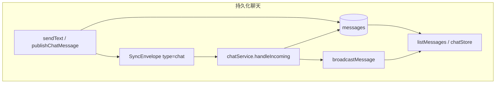

# LanPM 数据 CRUD 与产销路径审计（根目录迁出快照）

> **迁出日期**：2026-05-29 · **原路径**：`/数据.md`  
> **现行策略**：产品数据生命周期见 [docs/03 §12](../../docs/03_数据模型与协议草案.md)；实现以代码与 `verify:schema-*` 为准。  
> **审计日期**：2026-05-29  
> **工作目录**：`/home/jwzhou/workspace/lanpm`  
> **范围**：SQLite 持久化、本地文件、内存缓存、P2P `SyncEnvelope`、渲染层 Zustand / localStorage  
> **结论摘要**：核心业务（项目/职能群聊天、任务、文件元数据）在「写入 → 落库/落盘 → 同步 → UI 读取」上**基本闭环**；存在多处**只增不删**、**协议未消费**、**真网与 Stub 行为不一致**，会产生存储孤岛、UI 孤岛与逻辑空转。

---

## 1. 数据域与 CRUD 矩阵

| 数据域 | 存储位置 | Create | Read | Update | Delete | 闭环评价 |
|--------|----------|--------|------|--------|--------|----------|
| `users` | SQLite | `upsertUser` | `getUserById` / setup | `upsertUser` | **无** | 半闭环 |
| `devices` | SQLite | `upsertDevice` | `getDeviceById` | `upsertDevice` | **无** | 半闭环 |
| `groups` | SQLite | `insertGroup` | `listGroups` / `getGroupById` | — | **无** | 群记录永不删 |
| `group_members` | SQLite | `insertGroupMember` | `listGroupMembers` | `INSERT OR REPLACE` | `removeGroupMember`（仅匿名 leave） | 半闭环 |
| `messages` | SQLite | `insertMessage` | `listMessagesByGroup`（默认 LIMIT 200） | `updateDeliveryStatus` | **无** | **只增不减** |
| `read_receipts` | SQLite | `upsertReadReceipt` | badge / 已读逻辑 | upsert | **无** | 半闭环 |
| `tasks` | SQLite | `insertTask` | `listTasksByGroup` | `updateTaskRow` | `softDeleteTask` | 较完整 |
| `task_dependencies` | SQLite | `upsertDependency` | `listDependenciesByGroup` | upsert | `removeDependency`（单条） | 删任务后行残留 |
| `files` | SQLite + `userData/files/` | `insertFile` | `listFilesByGroup` 等 | preview 路径 | **无 API** | **磁盘可孤岛** |
| `file_transfers` | SQLite | `insertTransfer` | list / history | progress / finish | **无 purge** | **历史堆积** |
| `ai_config` | SQLite | `saveAiConfig` | `getAiConfig` | save | **无** | 单例行，可接受 |
| `sync_meta` | SQLite | `setMeta` | `getMeta` | upsert | `deleteMeta`（少量 key） | `group_key_*` 会累积 |
| 匿名群消息 | 内存 `anonymousChatStore` | `appendAnonymousMessage` | `listAnonymousMessages` | — | `clearAnonymousSession` | **设计内闭环** |
| 发现群广告 | 内存 `discoverGroupRegistry` | `rememberPeerGroups` | `listCachedDiscoverGroups` | — | TTL 60s 惰性删除 | 闭环 |
| 设备在线状态 | 内存 `presenceRegistry` | touch* | `getAggregatedUserPresence` | — | `pruneStaleDevices` | 闭环 |
| 信封去重 | 内存 `MessageDedup` | `remember` | `has` | — | FIFO 上限 1 万 | 闭环 |
| DM 会话元数据 | localStorage `dmStore` | `openSession` | `getSession` | `touchSession` | `pruneDisallowedOrigins` | 与 SQLite 消息**双轨** |

**全库 `DELETE` 语句分布（main 层）**：

- `files`：仅 `upsertRemoteFileMeta` LWW 替换时 `DELETE` 单行
- `tasks`：远端 LWW 合并前 `DELETE` 单行
- `group_members`：`removeGroupMember`
- `task_dependencies`：`removeDependency`
- `sync_meta`：`deleteMeta`
- **不存在**：`DELETE FROM messages` / `files`（业务删除）/ `file_transfers` / `groups` / `users` / `devices` / `read_receipts`

---

## 2. 已闭环的生产 / 消费路径

### 2.1 持久化聊天（project / function / DM）

- **生产**：`publishChatMessage` → `insertMessage`（非匿名）→ `transport.publish`
- **消费**：`handleIncoming` → 去重 `messageExists` → `insertMessage` → `broadcastMessage`
- **渲染**：`chatStore.loadMessages` / `upsertMessage`（IPC push）
- **DM**：`groupId` 形如 `dm:{userA}__{userB}`，消息同样进 `messages`；订阅在 `listGroupMessages` / `publishChatMessage` 时 **懒注册** `ensureSubscribed`

### 2.2 匿名群聊天（内存）

- **生产/消费**：`anonymousChatStore`，不经 SQLite
- **清理**：`leaveAnonymousGroup` / `enterAnonymousGroup` 调用 `clearAnonymousSession`（对齐 M5-02）
- **网络**：仅 `text` 类型；入站非 text 丢弃

### 2.3 任务

- **生产**：`taskService` CRUD → `publishTaskUpsert` / `publishTaskDelete`
- **消费**：`taskSyncService.handleTaskPatch` → `upsertTaskFromRemote` / `applyRemoteTaskDelete`（LWW）
- **通知**：`TASK_PUSH_CHANNEL` → `taskStore` 刷新

### 2.4 文件

- **本地上传**：`uploadFileFromPath` → 磁盘 `userData/files/{groupId}/` + `insertFile` + `publishFileMeta`
- **远端元数据**：`file_meta` → `upsertRemoteFileMeta`（占位路径 `REMOTE_PENDING`）
- **拉取正文**：`pullRemoteFile` → `file_pull_request` → 对端 `file_chunk` → 写盘 + `UPDATE files.storage_path`
- **消费展示**：`listGroupFiles` / preview protocol / `downloadFileToDisk`

### 2.5 离线补同步（7 天 TTL）

- **请求**：启动时 `requestOfflineSync` → 各群 `chat_sync_request`（`sinceLamportTs` + `minCreatedAt`）
- **响应**：`handleChatSyncRequest` → `chat_sync_batch`
- **入站过滤**：`handleChatSyncBatch` 丢弃 `createdAt < cutoff` 的消息
- **注意**：TTL **仅过滤入站同步**，**不删除本地已有旧消息**

### 2.6 身份

- **Setup**：`completeSetup` → `upsertUser` + `upsertDevice` + `sync_meta.local_device_id`
- **重置**：`resetIdentity` 仅 `deleteMeta(LOCAL_DEVICE_ID_KEY)`，**不删** `users` / `devices` 行

---

## 3. SyncEnvelope 类型产销对照

| `type` | 生产方 | 消费 handler | 状态 |
|--------|--------|--------------|------|
| `chat` | `chatService` | `chatService.handleIncoming` | ✅ 闭环 |
| `chat_sync_request` | `offlineSyncService` | `handleChatSyncRequest` | ✅ 闭环 |
| `chat_sync_batch` | `offlineSyncService` | `handleChatSyncBatch` | ✅ 闭环（入站 TTL） |
| `read_receipt` | `readReceiptService` | `handleIncomingReadReceipt` | ⚠️ **仅 NetworkStub.subscribeAll** |
| `task_patch` | `taskSyncService` | `taskSyncService` | ✅ 闭环 |
| `task_crdt` | — | — | ❌ post-RC，无 handler |
| `file_meta` | `fileSyncService` | `handleFileMeta` | ✅ 闭环 |
| `file_pull_request` | `fileSyncService` | `handleFilePullRequest` | ✅ 闭环 |
| `file_chunk` | `fileSyncService` | `handleFileChunk` | ✅ 闭环 |
| `group_key_rotate` | `groupKeyService` | `chatService` → `handleGroupKeyRotate` | ✅ 闭环 |
| `member_event` | — | — | ❌ post-RC，无 handler |
| `heartbeat` | transport | `presenceRegistry` | transport 级 |
| `discovery` | UDP / Stub | peer 目录、发现缓存 | transport 级 |

静态门禁：`npm run verify:sync-handlers`（`tests/static/verify-sync-handlers.ts`）对 `task_crdt`、`member_event` 等允许仅出现在 transport/文档。

---

## 4. 问题清单（孤岛 / 空转 / 断环）

### 4.1 P0 — 真网联调断环

#### 已读回执在 `RealNetworkTransport` 下不被消费

**现象**：对端发送的 `read_receipt` 无法更新本机 `messages.delivery_status` 为 `read`。

**根因**：`initReadReceiptService` 仅当 transport 存在 `subscribeAll` 时注册 handler（`NetworkStub` 专有）；`RealNetworkTransport` 只有按 `groupId` 的 `subscribe`。

**相关代码**：

- `src/main/chat/readReceiptService.ts` — `initReadReceiptService`
- `src/main/network/real/RealNetworkTransport.ts` — `deliver` 按 `groupId` 分发
- `src/main/network/stub/NetworkStub.ts` — `subscribeAll` + `globalHandlers`

**影响**：真网双机联调时，发送方永远看不到「已读」状态（Stub 联调正常）。

---

### 4.2 P1 — 存储只增不减

| 问题 | 说明 |
|------|------|
| **messages 无 DELETE** | 本地历史永久增长；`listMessagesByGroup` 默认 `LIMIT 200`，库内更早消息成为**冷数据孤岛** |
| **read_receipts 无 DELETE** | 随消息永久保留 |
| **files 无删除 API** | `LanpmApi.file` 无 `deleteFile`；磁盘 `userData/files/` 只增不减 |
| **file_transfers 无清理** | 每次上传 `insertTransfer`，完成后仍保留；`listTransferHistory` 仅 LIMIT 100 展示 |
| **badge 未读计数** | `countUnreadMessages` 对全表未读消息计数，**不受 7 天离线 TTL 影响** |

**离线 TTL 不对称**：

- 入站：`handleChatSyncBatch` 使用 `offlineSyncCutoffIso`（默认 7 天，`sync_meta.message_ttl_days`）
- 本地：**无**定时 prune 任务删除超 TTL 的 `messages` / `read_receipts`

---

### 4.3 P1 — 业务逻辑孤岛

#### 软删父任务后，子任务在树视图不可达

- `listTasksByGroup` 过滤 `deleted_at IS NULL`，父任务消失
- 子任务仍带 `parentTaskId` 指向已删父节点
- `TaskTreeView.buildTreeData` 仅从 `__root__` 递归；挂在已删父 key 下的子节点**无法从根遍历到**（UI 孤岛，库内仍在）

**相关代码**：`src/renderer/src/features/tree/TaskTreeView.tsx`

#### `task_dependencies` 删任务后仍留库

- `listDependenciesByGroup` 通过 JOIN `deleted_at IS NULL` 隐藏
- `softDeleteTask` **不**删除依赖行 → DB 孤岛

#### 远端文件占位 `REMOTE_PENDING`

- `upsertRemoteFileMeta` 写入占位 `storagePath`
- 用户若不调用 `pullRemoteFile`，元数据与聊天 `file` 消息引用长期悬空

#### 私聊 `dm:*` 双轨与离线同步缺口

| 维度 | 行为 |
|------|------|
| 消息存储 | SQLite `messages`，`group_id = dm:...` |
| 群元数据 | **无** `groups` 表记录 |
| 离线补同步 | `requestOfflineSync` 只遍历 `listUserGroups()`，**不含 DM** |
| 会话列表 | `dmStore`（localStorage `lanpm.dm.sessions`，最多 20 条） |
| 网络订阅 | 首访聊天时 `ensureSubscribed` 懒注册 |

#### `resetIdentity` 后库内残留

- 仅清除 `sync_meta.local_device_id`
- 历史 `users` / `devices` 行保留，换身份后可能多设备行共存

#### `sync_meta` 群组密钥 key 累积

- `group_key_version:{groupId}`、`group_key_rotated_at:{groupId}` 只写不删

---

### 4.4 P2 — 协议 / 实现层「空转」

| 项 | 说明 |
|----|------|
| **`task_crdt` / `member_event`** | 协议已定义，main 无 handler；若发出则被丢弃（见 `docs/06` §6 post-RC） |
| **本地上传 `runChunkedUpload`** | `fromDeviceId === toDeviceId`，按 chunk 延迟模拟进度，**不经过** `file_chunk` 网络；真传依赖 `file_meta` + 对端 pull |
| **Network Stub `bus.jsonl`** | `appendFileSync` 无轮转（`tmpdir/lanpm-stub/bus.jsonl`），长期联调可膨胀 |
| **渲染层 `chatStore.messagesByGroup`** | 访问过的群消息常驻内存，无 eviction |
| **外键** | 已落地 **DATA-SCHEMA-FK**：不启用 `ON DELETE CASCADE`；`referentialCleanup` + 业务删路径（见 `docs/03` §12） |

---

### 4.5 按设计闭环（非缺陷）

| 项 | 说明 |
|----|------|
| 匿名群消息 | 内存-only，退出/重进清理 |
| 发现缓存 | `discoverGroupRegistry` TTL 60s |
| presence | `PEER_TTL_MS`（15s）prune |
| MessageDedup | 上限 10_000，FIFO 淘汰 |
| 任务同步 | RC 使用 `task_patch` + LWW，非 Yjs（见 `docs/06` §2.3） |

---

## 5. 渲染层与 Main 数据分工

| 层 | 组件 | 持久化 | 与 Main 关系 |
|----|------|--------|--------------|
| Main | SQLite + 文件 | 是 | SSOT |
| Renderer | `chatStore` | 否（内存） | IPC `listMessages` + push 合并 |
| Renderer | `taskStore` | 否 | IPC + `TASK_PUSH_CHANNEL` |
| Renderer | `fileStore` | 否 | IPC + 传输 push |
| Renderer | `dmStore` | localStorage | 会话元数据；消息仍在 Main SQLite |
| Renderer | `identityStore` 等 | 部分 | 随 setup IPC |

**IndexedDB**：文档 `docs/03` 提及可选热缓存；当前代码路径以 SQLite + Zustand 为主。

---

## 6. 关键代码索引

| 主题 | 路径 |
|------|------|
| Schema | `src/main/storage/schema.sql` |
| Repositories | `src/main/storage/repositories/*.ts` |
| 聊天 | `src/main/chat/chatService.ts`、`offlineSyncService.ts`、`readReceiptService.ts` |
| 匿名聊天 | `src/main/chat/anonymousChatStore.ts` |
| 任务 | `src/main/task/taskService.ts`、`taskSyncService.ts` |
| 文件 | `src/main/file/fileService.ts`、`fileSyncService.ts` |
| 群组 | `src/main/group/groupService.ts` |
| 网络 Stub | `src/main/network/stub/NetworkStub.ts` |
| 网络真网 | `src/main/network/real/RealNetworkTransport.ts` |
| IPC 契约 | `src/shared/lanpm-api.ts`、`src/preload/index.ts` |
| 离线 TTL 常量 | `src/shared/chat/offlineSync.ts` |
| post-RC 说明 | `docs/06_验收与里程碑计划.md` §2.3、§6 |

---

## 7. 修复建议（按优先级）

### P0 — 真网已读闭环

**目标**：`RealNetworkTransport` 与 Stub 行为一致，对端 `read_receipt` 能更新 `delivery_status`。

**方案（二选一或组合）**：

1. 在 `RealNetworkTransport` 增加 `subscribeAll`，`deliver` 时分发给 global handlers（与 Stub 对齐）。
2. 在 `initReadReceiptService` 中，对 `listUserGroups()` 及活跃 DM `groupId` 逐个 `transport.subscribe(groupId, handleIncomingReadReceipt)`；DM 列表可从 `dmStore` 同步到 Main 或从 `messages` 去重 `group_id`。

**验收**：双机 `LANPM_NETWORK=real` 联调，发送方消息状态变为 `read`；可扩展现有 `verify-read-receipt` 或新增 real 集成测。

---

### P1 — 消息与已读生命周期

1. 启动或定时任务：`DELETE FROM messages WHERE created_at < ?`（与 `OFFLINE_SYNC_TTL_DAYS` 一致）。
2. 同步 `DELETE FROM read_receipts WHERE msg_id NOT IN (SELECT msg_id FROM messages)` 或按 `read_at` TTL。
3. 可选：暴露「清理 N 天前消息」设置，写入 `sync_meta.message_ttl_days`。

---

### P1 — 任务删级联

1. `softDeleteTask` 时：
   - 将子任务 `parent_task_id` 置 `NULL`（或递归 soft delete，产品定稿）；
   - `DELETE FROM task_dependencies WHERE from_task_id = ? OR to_task_id = ?`。
2. 树视图兜底：`buildTreeData` 将父已删的子任务挂到 `__root__`（防御性）。

---

### P1 — 文件与传输 GC

1. 新增 `deleteFile(fileId)`：删 SQLite 行 + 磁盘 `storage_path` / `preview_path`。
2. `file_transfers`：保留最近 N 条或 30 天，定时 purge。
3. `REMOTE_PENDING`：超过 T 天未 pull 的元数据标记失败或提供「放弃下载」。

---

### P1 — 私聊离线同步

1. `requestOfflineSync` 增加 DM `groupId` 来源：
   - Main 侧维护「活跃 DM 列表」meta，或
   - `SELECT DISTINCT group_id FROM messages WHERE group_id LIKE 'dm:%'`。
2. 文档补充：DM 无 `groups` 行属预期，但消息走同一 `messages` 表。

---

### P2 — 其它

| 项 | 建议 |
|----|------|
| `resetIdentity` | 可选清理旧 device 行或标记 inactive |
| `group_key_*` sync_meta | 退群时 delete 对应 key |
| Stub bus | 轮转或 truncate `bus.jsonl` |
| `task_crdt` / `member_event` | 保持 post-RC 文档登记，勿在未实现前发送 |
| badge | 未读统计仅计 TTL 内消息，或与 UI 列表窗口一致 |

---

## 11. 产品定稿（2026-05-29 · PM 选择题）

> 与 §4–§7 工程审计配套；实现与验收以本节为准。

### 11.1 双时间窗（已确认，无冲突）

| 策略 | 键名 | 默认值 | 含义 |
|------|------|--------|------|
| **联机补拉窗口** | `syncWindowDays` | **7（固定，不可配）** | 离线后重新登录，向局域网对端请求的历史下限：仅 **最近连续 7 天**（例：第 10 天登录 → 只能补拉第 4–10 天）。对齐 `chat_sync_*` / 任务·文件元数据对账。 |
| **本机保留期** | `localRetentionDays` | **90** | 本机 SQLite/文件保留与 UI「加载更早」上限；**可自定义天数**，校验 **7～365**（含端点）。 |

**话术**：7 天 = **多端补拉一致**；90 天 = **本机可查档案**（若某段从未在本机或 peer 补拉到，则本机也没有）。

### 11.2 设置 · 数据与存储

| 项 | 定稿 |
|----|------|
| 本机保留 | 默认 90 + **自定义天数**（**7～365**）；设置页说明：补拉仍仅近 **7** 天 |
| 补拉窗口 | 固定 7 天（设置页只读说明） |
| 存储占用 | **展示各分类占用 + 可配阈值提醒清理**（超限提醒，非 v1 磁盘配额） |
| 立即清理 | **多级确认**；弹窗 **勾选类型**：聊天 / 文件 / 传输 / **任务垃圾**（见 §11.9） |
| 注销身份 | **不删除**该账号目录；切换账号 = 换 profile |

### 11.3 聊天

| 项 | 定稿 |
|----|------|
| 清空本群（仅本机，不广播） | **两档**：① 删该群早于 `localRetentionDays` 的消息；② 删该群本机全部消息（更高危，单独确认级） |
| 自动清理 | 按 `localRetentionDays` 后台 prune；与「立即清理」一致 |
| 展示范围 | 仅已加入群 + 相关 DM |

### 11.4 任务

| 项 | 定稿 |
|----|------|
| 删父任务 | 确认框 **无默认**，须主动选择：**级联删除** 或 **子任务上浮**；同步 `task_patch` |
| 树兜底 | 父已删子任务仍挂 `__root__`（防御） |

### 11.5 文件

| 项 | 定稿 |
|----|------|
| 删文件（仅本机） | **保留元数据**，标记「本地已移除」，可从局域网 **重新 pull** |
| 对端 | v1 不广播「全网删文件」 |

### 11.6 多账号目录（类微信）

| 项 | 定稿 |
|----|------|
| 隔离键 | **`userId`**（稳定路径，改显示名不影响） |
| 布局建议 | `userData/profiles/{userId}/` → `lanpm.db`、`files/` 等 |
| 注销 | 仅解除当前绑定，**保留**该 `userId` 目录 |

### 11.7 单群导入 / 导出（v1）

| 项 | 定稿 |
|----|------|
| 范围 | v1 **导出 + 导入**，**加密包**（`.lanpm-bundle` 类，口令 KDF + AES-GCM）；含聊天、任务、文件元数据 |
| 文件本体 | 导出时 **可选勾选**「包含文件本体」（默认 **不含**，避免误导出超大包） |
| ID 冲突 | 导入前 **用户选择**：跳过 / 生成新 ID / 覆盖（危险） |
| 与联机 | 导入仅写本机；**不**替代 P2P 补拉真理源 |

### 11.8 加密分层

1. **传输**：P2P 信封 / 群密钥（现有 `group_key_rotate` 方向）  
2. **导出包**：v1 必须加密  
3. **整库 at-rest**：post-RC 可选  

### 11.9 实现细则（已定稿）

| 细则 | 定稿 |
|------|------|
| **保留天数边界** | `localRetentionDays` 输入校验 **7～365**（含）；默认 90 |
| **导出文件本体** | 导出向导 **可选**「包含文件本体」；默认 **关** |
| **任务垃圾** | 「立即清理」勾选项：仅清理 **`deleted_at` 早于 `localRetentionDays` 的软删任务**及其可安全移除的 `task_dependencies` 行；**不**动未删除任务 |

---

## 8. 与文档 / 发版的关系

- **已知限制 / post-RC SSOT**：`docs/06_验收与里程碑计划.md` §2.3、§6（Yjs、断点续传、发现目录等）
- **数据模型 SSOT**：`docs/03_数据模型与协议草案.md`
- **本文件**：代码实现层面的 CRUD / 产销 / 孤岛审计，**不替代** `docs/03` / `docs/06`
- 发版前仍执行：`npm run verify:release-gate`（见 `docs/06` §2.6）

---

## 9. 审计任务记录与 todo 对照

| 状态 | 项 |
|------|-----|
| ✅ 已完成 | 11 个 Repository、main 服务、IPC、`SyncEnvelope` 类型、内存缓存、渲染 Store 全路径梳理 |
| ✅ 已完成 | 问题分级（P0–P2）与修复建议写入本文 |
| ✅ 已完成 | 产品定稿 §11 + [archive/todo/20260529_221500_todo非手验项全量归档_rc57.md](../todo/20260529_221500_todo非手验项全量归档_rc57.md) §数据产销闭环 对照表（下表） |
| ⬜ 未执行 | 代码修复与测试 → 以下 `DATA-*` 勾选 |

### 9.1 本审计 → `DATA-*` / todo 映射（历史 SSOT，2026-05-29 已闭环）

| 本节 § | todo ID | 说明 |
|---------|---------|------|
| §4.1 真网已读 | DATA-RR-REAL, DATA-RR-VERIFY | |
| §4.2 messages/read_receipts prune | DATA-MSG-TTL, DATA-MSG-SCHEDULER | |
| §4.2 LIMIT 200 | DATA-MSG-LIMIT | |
| §4.2 badge | DATA-BADGE-TTL | 对齐 `localRetentionDays` |
| §4.2 files 无删 API | DATA-FILE-DELETE | §11.5 保留元数据 |
| §4.2 file_transfers | DATA-XFER-PURGE | 自动策略；手动见 DATA-CLEAN-UX |
| §4.2 入站 7 天 vs 本地保留 | DATA-SYNC-7D, DATA-RETENTION-META | |
| §4.3 删父任务/依赖 | DATA-TASK-CASCADE, DATA-TASK-TREE | |
| §4.3 REMOTE_PENDING | DATA-FILE-PENDING | |
| §4.3 DM 离线/双轨 | DATA-DM-OFFLINE, DATA-DM-DUAL | |
| §4.3 resetIdentity | DATA-RESET-ID, DATA-PROFILE-DIR, DATA-PROFILE-MIGRATE | |
| §4.3 group_key meta | DATA-GK-META | |
| §4.3 groups 无删 | DATA-GROUP-NODEL | |
| §4.4 xfer 模拟 | DATA-XFER-SIM | |
| §4.4 chatStore 内存 | DATA-CHATSTORE-EVICT | |
| §4.4 外键 | DATA-SCHEMA-FK | |
| §4.4 Stub bus | DATA-STUB-BUS | |
| §4.4 task_crdt/member_event | todo 跟踪行 | post-RC，不实现 |
| §4.5 设计内闭环 | — | **不列入 todo** |
| §1 ai_config 单例 | — | 审计接受，无 todo |
| §11.2 设置页 | DATA-SETTINGS | |
| §11.2 立即清理勾选 | DATA-CLEAN-UX | 聊天/文件/传输/任务垃圾 |
| §11.3 清空本群两档 | DATA-CLEAR-GROUP | |
| §11.6 多账号目录 | DATA-PROFILE-DIR | |
| §11.7 导入导出加密 | DATA-BUNDLE-IO | |
| §11.8 传输加密 | — | 沿用 `group_key_rotate`；无新增 todo |
| §11.8 整库 at-rest | — | post-RC |
| §7 docs/03 | DATA-DM-DOC, DATA-DOCS-LIFECYCLE | DM 专条 + 生命周期总章 |
| §5 IndexedDB 可选 | — | 未纳入 v1 |

### 9.2 对齐结论

- **§4.1–§4.4、§7、§11 可执行项**：均已映射并完成（归档见 `archive/todo/` 中 `DATA-*` 条目）（§4.5 / §1 可接受项除外）。
- **刻意不拆 todo**：post-RC 协议（`task_crdt`）、整库加密、IndexedDB 热缓存。

---

## 10. 修订历史

| 日期 | 说明 |
|------|------|
| 2026-05-29 | 初版：Agent 全量数据路径审计 |
| 2026-05-29 | §11 产品定稿：7 天补拉 + 90 天本机保留 + PM 选择题 |
| 2026-05-29 | §11.9 关闭：保留 7～365、导出可选文件本体、任务垃圾定义 |
| 2026-05-29 | §9.1 增加与 todo.md 完整映射表；补 DATA-MSG-SCHEDULER 等缺口项 |
