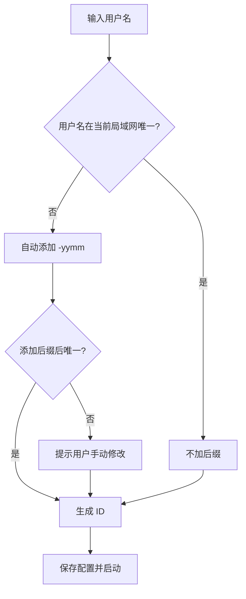

# 01_产品需求文档

> 产品需求文档（PRD）v2.0 拆分件。历史单体版本见 Git 标签 `v0.2.2-prd-v2-full-refresh`。索引见 [00_文档导航.md](./00_文档导航.md)。

---

> 基于 Electron 的局域网/VPN 协作工具 | 融合即时通讯 + 项目管理 + 文件共享

---

## 1. 产品概述

### 1.1 产品定位

一款**分布式局域网协作客户端**，对标飞秋/飞鸽传书的即时通讯能力，同时融合项目管理（看板/任务树/甘特图）与企业级功能（驾驶舱/AI 评估）。**无中心服务器**，所有数据在群组内点对点同步。

### 1.2 核心理念

```
┌─────────────────────────────────────────────────────────────┐
│                                                             │
│   即时通讯（飞秋/飞鸽体验） + 项目管理（看板/树/甘特）           │
│                          +                                  │
│              文件共享 + 领导驾驶舱 + AI 辅助                   │
│                                                             │
│   核心业务数据在局域网内同步，不出域（AI 等可选能力可脱敏外呼）   │
│                                                             │
└─────────────────────────────────────────────────────────────┘
```

### 1.3 技术栈（目标选型）

| 层级   | 技术选型                            | 理由            |
| ---- | ------------------------------- | ------------- |
| 桌面框架 | Electron                        | 成熟稳定，支持插件扩展   |
| 前端框架 | React 18 + TypeScript           | 生态成熟、工程化完善、便于后续多端迁移与后端对接 |
| UI 组件库 | Ant Design 5.x + CSS Modules   | 企业协作密集型界面；见 `docs/05` §8 |
| 客户端状态 | Zustand                        | 跨视图/群组状态管理 |
| 甘特图组件 | `gantt-task-react`             | M4 集成；与任务数据同源 |
| 本地存储 | IndexedDB + SQLite              | 支持大量离线数据      |
| 网络通信 | WebRTC (P2P) + UDP 广播           | 局域网发现 + 点对点传输 |
| 数据同步 | CRDT (Yjs)                      | 分布式最终一致性      |
| 加密   | Node.js Crypto (AES-256-GCM)    | 局域网传输加密       |
| 文件预览 | LibreOffice 本地转换 | Office 文件本地预览，数据不出域 |

#### 1.3.1 RC 实现现状（`1.0.0`）

> **当前 RC 已落地**与 **post-RC / v1.1** 以 [06_验收与里程碑计划](./06_验收与里程碑计划.md) §2 为准。对外表述：**`npm run verify:m7` 通过** ≠ **PRD P0 100%** ≠ **1.0.0 发布门禁已满足**。

| 能力域 | 目标（PRD） | RC 现状 |
|--------|-------------|---------|
| 桌面壳层 / 路由 / 群组 Tab | Electron + React | ✅ 已落地 |
| 聊天 / 任务 / 文件 / 驾驶舱 | 全模块 P0 路径 | ✅ 主路径可用；剩余缺口见 [06](./06_验收与里程碑计划.md) §2.3 |
| 全局搜索 | 任务 + 消息 + 成员(P1) | ✅ 任务 + 消息 + 成员 |
| 局域网发现 | UDP 节点 + 可发现群组 | ✅ 顶栏「发现」：群组加入 + 成员私聊（`autoDiscover` 广播） |
| P2P / Yjs / WebRTC | 目标栈 | 任务/文件 `task_patch`、分片拉取已 RC；Yjs/WebRTC 为 v1.1 可选（[06](./06_验收与里程碑计划.md) §6） |
| IndexedDB 热缓存 | 与 SQLite 并用 | ⏳ **RC 以 SQLite 为唯一持久化层**（**ARCH-05** post-v1.1） |
| SQLite 库级加密 | 可加密存储 | ⏳ **RC 未启用**；传输层 AES-GCM + ECDH（**ARCH-08**） |
| 7 天离线补同步 | 原 P0 表述 | ✅ RC：`chat_sync_request` / `chat_sync_batch`（**ARCH-07**） |

---

## 2. 用户场景与角色


| 角色    | 典型场景           | 核心需求      |
| ----- | -------------- | --------- |
| 团队成员  | 日常沟通、任务跟进、文件分享 | 聊天、看板、文件  |
| 项目经理  | 进度跟踪、任务分配      | 任务树、甘特图   |
| 部门主管  | 跨项目监控、汇报       | 驾驶舱、周报/月报 |
| 多设备用户 | 办公本+笔记本同时使用    | 同一身份多端登录  |
| 开发人员  | 分享代码片段         | 代码高亮分享    |


---

## 3. 用户标识与身份

### 3.1 唯一标识规则

> **核心原则**：同一用户可在多台电脑登录，视为同一人


| 字段    | 说明           | 示例                  |
| ----- | ------------ | ------------------- |
| 用户名   | 显示名称         | 张三                  |
| 后缀    | 可选，用于区分同名用户  | `-87`、`-93`、`-2401` |
| 完整显示名 | 用户名 + 后缀（如有） | 张三 / 张三-87          |
| 设备列表  | 该用户的所有登录设备   | 办公本、笔记本             |
| 在线状态  | 任一设备在线即为在线   | ✅ / ❌               |


### 3.2 后缀生成规则


| 场景           | 处理方式                               |
| ------------ | ---------------------------------- |
| 首次注册时用户名未被占用 | 不加后缀                               |
| 首次注册时用户名已存在  | 自动添加 `-yymm`（如 `-2401` 表示 2024年1月） |
| 用户手动修改       | 允许，但需保证群组内唯一                       |


### 3.3 ID 结构示例

```javascript
{
  "userId": "zhangsan",                    // 唯一标识（含后缀）
  "displayName": "张三-87",                 // 显示名称
  "suffix": "-87",                         // 后缀（可选）
  "devices": [
    { "deviceId": "office-pc", "name": "办公本", "lastSeen": "2026-01-10" },
    { "deviceId": "laptop", "name": "笔记本", "lastSeen": "2026-01-09" }
  ],
  "online": true                           // 任一设备在线
}
```

---

## 4. 首次启动配置

> 首次打开客户端时弹出配置向导，必须完成后方可使用

### 4.1 配置步骤

```
┌─────────────────────────────────────────┐
│           欢迎使用 LanPM                │
├─────────────────────────────────────────┤
│                                         │
│  用户名： [张三            ]            │
│                                         │
│  设备名称：[办公本           ]           │
│                                         │
│  部门（可选）：[研发部          ]        │
│                                         │
│  头像：  [🎨 随机生成]  [📁 上传]        │
│                                         │
│         [    完成    ]                  │
└─────────────────────────────────────────┘
```

### 4.2 配置字段


| 字段   | 必填  | 说明            |
| ---- | --- | ------------- |
| 用户名  | ✅   | 显示名称，2-20 个字符 |
| 设备名称 | ✅   | 用于区分自己的多台电脑   |
| 部门   | ❌   | 用于驾驶舱的部门视图    |
| 头像   | ❌   | 自动生成或上传       |


### 4.3 生成 ID 流程




---

## 5. 主界面布局

### 5.1 整体结构

```
┌─────────────────────────────────────────────────────────────────┐
│  [Logo]  [项目▼]  [驾驶舱]   🔍 全局搜索...   [🌙] [🌐] [👤 张三] │ ← 顶部栏
├─────────────────────────────────────────────────────────────────┤
│                                                                 │
│                        主内容区域                                │
│                                                                 │
│   第一维度：项目 / 职能群组 / 匿名群组 / 驾驶舱                    │
│   第二维度：聊天 | 看板 | 任务树 | 甘特图 | 文件                   │
│                                                                 │
├─────────────────────────────────────────────────────────────────┤
│   💬 聊天   📋 看板   🌲 任务树   📊 甘特图   📁 文件              │ ← 底部导航
└─────────────────────────────────────────────────────────────────┘
```

### 5.2 顶部栏详解


| 元素   | 功能                 | 交互         |
| ---- | ------------------ | ---------- |
| Logo | 返回默认视图（上次使用的项目+聊天） | 点击         |
| 项目下拉 | 切换项目/职能群组/匿名群组     | 下拉选择       |
| 发现   | 局域网可加入群组 + 在线成员（点成员进私聊） | 点击打开发现面板 |
| 创建群组 | 新建项目/职能/匿名群         | 点击         |
| 驾驶舱  | 快捷进入领导驾驶舱          | 点击         |
| 全局搜索 | P0：任务/消息；P1：成员；文件搜索在文件模块内 | 输入关键词，实时过滤 |
| 主题切换 | 亮色/暗色模式            | 点击切换，记住偏好  |
| 语言切换 | 中文/英文              | 下拉选择       |
| 个人信息 | 头像+用户名             | 点击弹出配置面板   |


### 5.3 底部导航（5 大视图）


| 图标  | 视图  | 功能定位         |
| --- | --- | ------------ |
| 💬  | 聊天  | 即时通讯，群聊/私聊   |
| 📋  | 看板  | 任务状态流转       |
| 🌲  | 任务树 | 层级任务结构       |
| 📊  | 甘特图 | 任务时间轴与进度     |
| 📁  | 文件  | 群组文件库 + 网址书签 |


---

## 6. 聊天模块

### 6.1 界面布局

```
┌─────────────────────┬───────────────────────────────────────────┐
│     成员列表         │              聊天消息区域                  │
│                     │                                           │
│  🟢 张三            │  ┌─────────────────────────────────────┐  │
│  🟢 张三-87         │  │ [10:30] 张三：这个任务我来做         │  │
│  🟡 李四            │  │                                     │  │
│  ⚪ 王五            │  │ [10:32] 李四：收到，需要协助吗       │  │
│                     │  │                                     │  │
│  ─────────────────  │  │ ```javascript                      │  │
│  在线: 2/4          │  │ function hello() {                 │  │
│                     │  │   console.log("code")              │  │
│                     │  │ }                                  │  │
│                     │  │ ```                                │  │
│                     │  │                                     │  │
│                     │  │ [📎 附件] [💻 代码] [✅ 创建任务]     │  │
│                     │  │                                     │  │
│                     │  │ 输入框...                    [发送]  │  │
│                     │  └─────────────────────────────────────┘  │
└─────────────────────┴───────────────────────────────────────────┘
```

### 6.2 成员列表


| 功能     | 说明                            |
| ------ | ----------------------------- |
| 显示所有成员 | 显示完整显示名（含后缀）                  |
| 在线状态   | 🟢 在线（至少一台设备在线）/ 🟡 离开 / ⚪ 离线 |
| 多设备标识  | 鼠标悬停显示该用户的所有设备                |
| 右键菜单   | 发起私聊、@提及、查看资料                 |


### 6.3 聊天消息


| 功能     | 说明                    |
| ------ | --------------------- |
| 文本消息   | 支持表情、@提及              |
| 代码分享   | 支持语法高亮（自动识别语言）        |
| 文件发送   | 拖拽或点击上传，局域网点对点传输      |
| 快捷创建任务 | 输入框内输入 `/task` 快速创建任务 |
| 消息已读回执 | ✅ 显示双灰勾（已发送）/ 双蓝勾（已读） |
| 桌面通知   | 新消息/@提及 时弹出通知         |


### 6.4 代码分享详解

```javascript
// 发送代码块示例
const codeBlock = {
  language: 'javascript',  // 自动检测或手动选择
  code: `function hello() {
  console.log("Hello LanPM");
}`,
  theme: 'dark'            // 跟随编辑器主题
}
```

**支持的语言**：JavaScript/TypeScript/Python/Java/Go/Rust/HTML/CSS/JSON/Shell 等主流语言

### 6.5 消息已读回执


| 状态  | 图标  | 说明       |
| --- | --- | -------- |
| 发送中 | ⏳   | 正在传输     |
| 已发送 | ✅   | 已送达对方客户端 |
| 已读  | ✅✅  | 对方已阅读消息  |

#### 已读判定与冲突规则（补充）

- 同一 `userId` 下任意一台设备读到消息，即判定该用户“已读”。
- 客户端只对“本人已读状态”做回滚兜底，不影响其他用户消息状态。
- 冲突处理遵循“最新事件优先”（按 Lamport 时间戳或本地逻辑时钟，取更晚事件；无中心服务器）。
- 已读状态跨设备同步，允许最终一致性短暂延迟。


---

## 7. 看板模块（Kanban）

### 7.1 状态列


| 列名  | 英文          | 说明        |
| --- | ----------- | --------- |
| 待办  | TODO        | 未开始的任务    |
| 进行中 | IN PROGRESS | 正在处理的任务   |
| 已完成 | DONE        | 已完成的任务    |
| 其他  | OTHER       | 阻塞/待评审/搁置 |

> **存储值**：列状态在库中存为 `todo` / `doing` / `done` / `other`（见 `docs/04` §2.2）；上表为 UI 展示文案。

### 7.2 卡片信息

```
┌─────────────────┐
│ 📋 任务标题      │
│ 👤 张三         │
│ 📅 2026-01-15   │
│ 🏷️ 标签         │
└─────────────────┘
```

### 7.3 交互功能


| 功能   | 说明                       |
| ---- | ------------------------ |
| 拖拽移动 | 跨列拖拽改变状态                 |
| 新增卡片 | 每列底部有「+ 添加任务」按钮          |
| 编辑卡片 | 双击卡片编辑详情（标题/负责人/截止日期/标签） |
| 删除卡片 | 右键菜单或拖拽至垃圾桶              |
| 实时同步 | 任何操作立即同步至群组所有成员          |


### 7.4 拖拽规则


| 来源          | 目标          | 结果                 |
| ----------- | ----------- | ------------------ |
| TODO        | IN PROGRESS | 状态改为 `doing`       |
| TODO        | DONE        | 状态改为 `done`        |
| IN PROGRESS | DONE        | 状态改为 `done`        |
| DONE        | TODO        | 重新打开任务             |
| ANY         | OTHER       | 状态改为 `other`，需填写原因 |


---

## 8. 任务树模块

### 8.1 界面示例

```
📁 项目：LanPM 开发
├── 📋 M1：基础框架 (张三 · 100%) ✅
│   ├── 📋 搭建 Electron 项目 (张三 · 100%) ✅
│   ├── 📋 实现主布局 (李四 · 80%) 🔄
│   └── 📋 首次配置向导 (王五 · 0%) ⏳
├── 📋 M2：聊天模块 (张三 · 50%) 🔄
│   ├── 📋 成员列表 (李四 · 100%) ✅
│   ├── 📋 消息收发 (王五 · 30%) 🔄
│   └── 📋 代码高亮 (赵六 · 0%) ⏳
└── 📋 M3：看板模块 (未开始) ⏳
```

### 8.2 功能清单


| 功能    | 说明                           |
| ----- | ---------------------------- |
| 树形展示  | 展示父子层级关系                     |
| 展开/折叠 | 点击箭头展开或折叠子任务                 |
| 进度显示  | 子任务完成比例自动汇总到父任务              |
| 状态标识  | ✅ 完成 / 🔄 进行中 / ⏳ 待办 / ⚠️ 阻塞 |
| 右键菜单  | 新增子任务、编辑、删除、移动               |
| 搜索高亮  | 全局搜索结果在树中高亮显示                |


### 8.3 任务详情面板（点击后右侧弹出）

```
┌─────────────────────────────────┐
│ 任务：搭建 Electron 项目        │
├─────────────────────────────────┤
│ 负责人：[张三 ▼]                │
│ 状态：  [已完成 ▼]              │
│ 优先级：[高 ▼]                  │
│ 截止日期：[2026-01-10]          │
│ 描述：                          │
│ ┌─────────────────────────────┐ │
│ │ 使用 Electron Forge 初始化   │ │
│ │ 配置打包和更新              │ │
│ └─────────────────────────────┘ │
│ 子任务：3个 (全部完成)           │
│ 关联文件：[📄 package.json]      │
│                                 │
│ [保存] [删除] [关闭]             │
└─────────────────────────────────┘
```

---

## 9. 甘特图模块

### 9.1 界面示例

```
┌────────────┬──────────┬──────────┬──────────┬──────────┬──────────┐
│ 任务名称    │ 负责人   │ 开始日期  │ 结束日期  │ 进度    │ 时间轴   │
├────────────┼──────────┼──────────┼──────────┼──────────┼─────────────────▶
│ M1 基础框架 │ 张三     │ 01-01    │ 01-10    │ 100%    │ ████████░░  │
│ M2 聊天模块 │ 李四     │ 01-05    │ 01-20    │ 50%     │ ████░░░░░░  │
│ M3 看板     │ 王五     │ 01-10    │ 01-25    │ 20%     │ ██░░░░░░░░  │
│ M4 任务树   │ 赵六     │ 01-15    │ 01-30    │ 0%      │ ░░░░░░░░░░  │
└────────────┴──────────┴──────────┴──────────┴──────────┴─────────────────▶
              01-01      01-08      01-15      01-22      01-29
```

### 9.2 功能清单


| 功能   | 说明                   |
| ---- | -------------------- |
| 时间轴  | 日/周/月 视图切换           |
| 拖拽调整 | 拖拽任务条调整起止时间          |
| 进度显示 | 进度百分比 + 视觉填充         |
| 依赖连线 | 任务间依赖关系（FS/SS/FF/SF） |
| 里程碑  | 标记关键节点（菱形图标）         |
| 缩放   | 时间轴缩放（Ctrl+滚轮）       |
| 导出   | 导出为 PNG/PDF          |


### 9.3 依赖类型


| 类型  | 含义    | 示例             |
| --- | ----- | -------------- |
| FS  | 完成-开始 | 任务A完成后，任务B才能开始 |
| SS  | 开始-开始 | 任务A开始时，任务B同时开始 |
| FF  | 完成-完成 | 任务A完成时，任务B才完成  |
| SF  | 开始-完成 | 任务A开始时，任务B才完成  |

#### 实现选型（补充）

- UI 框架：Ant Design 5.x（见 `docs/05` §8）。
- 甘特渲染：**`gantt-task-react`**，与看板/任务树共用 `docs/04` 任务数据源。


---

## 10. 文件模块

### 10.1 界面布局

```
┌──────────┬─────────────────────────────────────────────────────┐
│  类型筛选 │                 文件列表                            │
├──────────┼─────────────────────────────────────────────────────┤
│ 📁 全部   │ 📄 需求文档.docx   张三  01-10   [预览] [下载]       │
│ 📄 文档   │ 📊 项目计划.xlsx   李四  01-09   [预览] [下载]       │
│ 🖼️ 图片   │ 🖼️ 架构图.png      王五  01-08   [预览] [下载]       │
│ 🎬 视频   │ 🔗 内网 Wiki      系统  01-07   [打开] [编辑]       │
│ 🔗 网址   │ 💻 code.js         赵六  01-06   [预览] [复制]       │
│ 💻 代码   │                                                     │
├──────────┼─────────────────────────────────────────────────────┤
│          │ [上传文件] [添加网址]                                │
└──────────┴─────────────────────────────────────────────────────┘
```

### 10.2 文件类型与预览


| 类型        | 扩展名                    | 预览方式                                  |
| --------- | ---------------------- | ------------------------------------- |
| Office 文档 | .docx, .xlsx, .pptx    | LibreOffice 本地转换后内嵌预览 |
| PDF       | .pdf                   | 内嵌 PDF.js 查看器                         |
| 图片        | .png, .jpg, .gif, .svg | 内嵌图片查看器                               |
| 视频        | .mp4, .webm            | 内嵌视频播放器                               |
| 文本/代码     | .txt, .js, .py, .json  | 内嵌代码编辑器（含高亮）                          |
| 网址        | http://, https://      | 内嵌 WebView（不跳转外部浏览器）                  |

#### Office 预览策略（补充）

- 默认且主链路：本地转换链路（LibreOffice headless / 本地转换服务），满足“数据不出域”。
- 当前阶段不启用外部 Office Web Viewer 通道。
- 对敏感级文件，强制本地预览。
- 预览失败默认回退到“下载后本地打开”。


### 10.3 网址书签


| 功能   | 说明                       |
| ---- | ------------------------ |
| 添加网址 | 输入 URL + 标题，保存到群组        |
| 内嵌访问 | 点击后在内嵌 WebView 中打开，不离开应用 |
| 组织分类 | 支持文件夹分类                  |
| 导入导出 | 从浏览器导入书签                 |


### 10.4 文件传输


| 特性   | 说明                      |
| ---- | ----------------------- |
| 传输协议 | WebRTC DataChannel（P2P） |
| 断点续传 | 支持                      |
| 传输队列 | 同时最多 3 个文件传输            |
| 限速   | 可配置上传/下载限速              |
| 传输记录 | 历史传输记录可查                |


---

## 11. 群组系统

### 11.1 群组类型


| 类型   | 项目管理能力           | 成员可见性         | 使用场景     |
| ---- | ---------------- | ------------- | -------- |
| 项目群组 | ✅ 完整（看板/任务树/甘特图） | 显示真实姓名+后缀     | 具体项目协作   |
| 职能群组 | ❌ 无              | 显示真实姓名+后缀     | 部门/职能沟通  |
| 匿名群组 | ❌ 无              | 匿名代号（访客1、访客2） | 敏感讨论、跨部门 |


### 11.2 群组创建

```javascript
// 创建群组 API
{
  "type": "project" | "function" | "anonymous",
  "name": "LanPM 开发组",
  "members": ["zhangsan", "lisi", "wangwu"],  // 邀请成员
  "autoDiscover": true  // 是否允许局域网自动发现
}
```

### 11.3 匿名群组规则


| 规则    | 说明                     |
| ----- | ---------------------- |
| 匿名代号  | 自动分配（访客1、访客2...），不可自定义 |
| 无法追溯  | 无法查看代号与真实身份的映射         |
| 无文件共享 | 仅支持文本聊天                |
| 无历史同步 | 退出后重新加入，看不到历史消息        |


---

## 12. 领导驾驶舱

### 12.1 界面布局

```
┌─────────────────────────────────────────────────────────────────┐
│  📊 驾驶舱                              [周报] [月报] [API Key]  │
├─────────────────────────────────────────────────────────────────┤
│                                                                 │
│  ┌─────────────┐ ┌─────────────┐ ┌─────────────┐               │
│  │ 项目总数: 8  │ │ 进行中: 5   │ │ 延期: 2     │               │
│  └─────────────┘ └─────────────┘ └─────────────┘               │
│                                                                 │
│  📁 项目列表                                                    │
│  ┌─────────────────────────────────────────────────────────┐   │
│  │ LanPM      ████████░░ 80%  🟢 正常    [查看]            │   │
│  │ 内部OA     ████░░░░░░ 40%  🟡 风险    [查看]            │   │
│  │ 数据平台   ██░░░░░░░░ 20%  🔴 延期    [查看]            │   │
│  └─────────────────────────────────────────────────────────┘   │
│                                                                 │
│  👥 部门完成率                                                  │
│  ┌─────────────────────────────────────────────────────────┐   │
│  │ 研发部 ██████████ 95% │ 产品部 ████████░░ 78%            │   │
│  │ 设计部 ██████░░░░ 60% │ 市场部 ████░░░░░░ 40%            │   │
│  └─────────────────────────────────────────────────────────┘   │
│                                                                 │
│  🤖 AI 评估：项目 LanPM 进度正常，建议关注 M3 模块风险...       │
│                                                                 │
└─────────────────────────────────────────────────────────────────┘
```

### 12.2 报表生成


| 报表类型 | 内容                | 格式                  |
| ---- | ----------------- | ------------------- |
| 周报   | 本周完成任务、进行中任务、下周计划 | Markdown / PDF / 文本 |
| 月报   | 本月里程碑、进度对比、风险汇总   | Markdown / PDF / 文本 |


### 12.3 API-Key 配置

```javascript
// 支持的 AI 服务
{
  "provider": "openai" | "anthropic" | "custom",
  "apiKey": "sk-xxx",
  "baseUrl": "https://api.openai.com/v1",  // 可配置代理
  "model": "gpt-4",
  "enabled": true,                          // 是否启用外部 AI 功能
  "dataPolicy": "desensitized-only"         // 仅允许脱敏字段外发
}
```

#### AI 能力


| 功能   | 输入        | 输出          |
| ---- | --------- | ----------- |
| 任务审核 | 任务标题+描述   | 评分 + 改进建议   |
| 进度评估 | 项目任务列表+进度 | 风险识别 + 建议   |
| 周报生成 | 一周任务变更    | 结构化的周报文本    |
| 阻塞预警 | 延期任务      | 高亮提醒 + 建议方案 |


> **隐私保护**：API 调用仅发送脱敏数据（任务标题、状态、进度），不发送完整聊天记录或文件内容

#### AI 分阶段策略（补充）

- P0：提供 API-Key 配置、手动触发 AI 审核/评估能力。
- P1：增加自动化评估（定时巡检、阻塞预警推送）。
- 即使设备可联网，默认仍遵循“最小外发”原则，只传审核所需脱敏数据。

---
