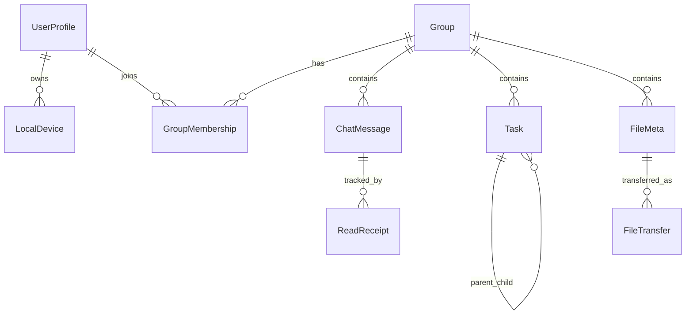

# 03_数据模型与协议

> 版本：v0.2（开发基线）  
> 对齐文档：`docs/00_文档导航.md`、`docs/01_产品需求文档.md`、`docs/02_技术实现建议.md`、`docs/06_验收与里程碑计划.md`  
> 目标：为 M0-M2 开发提供统一实体定义、字段约束、同步报文与状态机基线。M0 起提供 NetworkStub，M6 切换真实网络实现。

---

## 1. 设计原则

| 原则 | 说明 |
|------|------|
| 无中心服务器 | 所有业务实体带 `groupId`，在群组内 P2P 同步 |
| ID 全局唯一 | 采用 `前缀_时间戳_随机串` 或 UUID v4，禁止业务层自增 |
| 用户 vs 设备 | `userId` 表示人，`deviceId` 表示终端；在线/已读按 `userId` 聚合 |
| 冲突策略 | 默认 LWW（最新事件优先）；任务正文走 Yjs CRDT |
| 数据不出域 | 聊天/任务/文件元数据仅在局域网同步；AI 外发仅脱敏字段 |
| 可演进 | 所有报文带 `version`；新增字段向后兼容 |

---

## 2. 标识与枚举

### 2.1 ID 命名约定

| 实体 | 字段 | 示例 | 生成规则 |
|------|------|------|----------|
| 用户 | `userId` | `zhangsan-2401` | 用户名 + 可选后缀，群组内唯一 |
| 设备 | `deviceId` | `dev_a1b2c3` | 首次配置时生成，本机持久化 |
| 群组 | `groupId` | `grp_01HXYZ` | 创建时生成 |
| 消息 | `msgId` | `msg_01HXYZ` | 发送端生成 |
| 任务 | `taskId` | `task_01HXYZ` | 创建端生成 |
| 文件 | `fileId` | `file_01HXYZ` | 上传端生成 |
| 传输会话 | `transferId` | `xfer_01HXYZ` | 传输发起时生成 |

### 2.2 通用枚举

```typescript
/** 群组类型 */
type GroupType = 'project' | 'function' | 'anonymous';

/** 看板列 / 任务状态（存储值） */
type TaskStatus = 'todo' | 'doing' | 'done' | 'other';

/** 任务优先级 */
type TaskPriority = 'low' | 'medium' | 'high';

/** 消息类型 */
type MessageType = 'text' | 'code' | 'file' | 'task_ref' | 'system';

/** 消息投递状态（发送方视角） */
type MessageDeliveryStatus = 'sending' | 'sent' | 'read';

/** 用户聚合在线状态 */
type UserPresence = 'online' | 'away' | 'offline';

/** 文件类型分类（列表筛选） */
type FileCategory = 'document' | 'image' | 'video' | 'code' | 'bookmark' | 'other';

/** 文件传输状态 */
type FileTransferStatus = 'queued' | 'transferring' | 'paused' | 'completed' | 'failed' | 'cancelled';

/** 同步报文类型 */
type SyncMessageType =
  | 'discovery'      // UDP 节点发现
  | 'heartbeat'      // 在线心跳
  | 'chat'           // 聊天消息
  | 'chat_recall'    // 撤回
  | 'read_receipt'   // 已读回执
  | 'task_patch'     // 任务增量（非 Yjs 元数据）
  | 'task_dep_patch' // 任务依赖边增量（FS/SS/FF/SF）
  | 'task_sync_request' // 任务离线补拉请求
  | 'task_sync_batch'   // 任务离线补拉批次
  | 'task_crdt'      // Yjs 更新帧（RC：**协议保留**；main 无 handler；`publish` 拒绝）
  | 'file_meta'      // 文件索引
  | 'file_pull_request' // 文件拉取请求
  | 'file_chunk'     // 文件分片
  | 'member_event'   // 成员事件（dissolve 可发送 TASK-146；handler TASK-147）
  | 'group_key_rotate'  // 群组密钥轮换通知
  | 'chat_sync_request' // 聊天离线补拉请求
  | 'chat_sync_batch'; // 聊天离线补拉批次
  | 'read_receipt_sync_request' // 已读离线补拉请求（TASK-151）
  | 'read_receipt_sync_batch'; // 已读离线补拉批次
```

> **RC 发送守卫**：仅 `task_crdt` 仍在 `UNIMPLEMENTED_SYNC_TYPES`（`member_event` 已解禁，见 TASK-146 / [06](./06_验收与里程碑计划.md) §2.3）。

---

## 3. 核心实体模型

### 3.1 用户与设备（本地 + 广播）

```typescript
/** 本机用户档案（首次配置后写入 SQLite） */
interface UserProfile {
  userId: string;           // 含后缀的唯一 ID，如 zhangsan-2401
  displayName: string;      // 展示名，如 张三-2401
  baseName: string;         // 用户名本体，如 张三
  suffix?: string;          // 如 -2401
  department?: string;
  avatarUrl?: string;       // 本地路径或 data URL
  createdAt: string;        // ISO8601
  updatedAt: string;
}

/** 本机设备信息 */
interface LocalDevice {
  deviceId: string;
  deviceName: string;       // 如 办公本
  userId: string;
  lastSeenAt: string;
}

/** 群组内可见的成员视图（由心跳聚合） */
interface GroupMember {
  userId: string;
  displayName: string;
  department?: string;
  presence: UserPresence;   // 按 userId 聚合
  devices: RemoteDevice[];  // 该用户各设备明细（悬停展示）
}

interface RemoteDevice {
  deviceId: string;
  deviceName: string;
  presence: UserPresence;
  lastHeartbeatAt: string;
  ip?: string;              // 可选，仅局域网展示
  port?: number;
}
```

**已读聚合规则（已拍板）**

- `ReadReceipt` 以 `userId` 为粒度：任一 `deviceId` 上报已读，即该用户已读。
- 冲突：同一 `(msgId, userId)` 多条回执取 `readAt` 最大者（LWW）。
- 回滚：仅允许本机撤销“本人已读”记录，不向群组广播删除他人状态。

---

### 3.2 群组

```typescript
interface Group {
  groupId: string;
  type: GroupType;
  name: string;
  createdBy: string;        // userId
  createdAt: string;
  autoDiscover: boolean;
  /** 项目群组才有 */
  projectMeta?: {
    description?: string;
    status?: 'normal' | 'risk' | 'delayed';
    progressPercent?: number; // 0-100，驾驶舱汇总
  };
}

/** 匿名群组成员对外展示 */
interface AnonymousMember {
  alias: string;            // 访客1、访客2… 系统分配，不可自定义
  joinedAt: string;
}

interface GroupMembership {
  groupId: string;
  userId: string;
  role: 'owner' | 'member';
  joinedAt: string;
  /** 匿名群：对外 alias；项目/职能群：用 displayName */
  displayAlias?: string;
}
```

**匿名群组约束（数据层）**

- 不持久化 `userId ↔ alias` 映射到可被其他成员读取的结构。
- 匿名群：`fileMeta`、`task` 相关表禁止写入（仅 `chat` 文本/代码）。

---

### 3.3 聊天消息

```typescript
interface ChatMessage {
  msgId: string;
  groupId: string;
  senderUserId: string;
  senderDeviceId: string;
  type: MessageType;
  content: MessageContent;
  lamportTs: number;        // 逻辑时钟，全群有序
  createdAt: string;          // 客户端物理时间
  replyToMsgId?: string;
  mentions?: string[];        // userId 列表
  /** 发送方本地投递状态 */
  deliveryStatus: MessageDeliveryStatus;
}

type MessageContent =
  | { kind: 'text'; text: string }
  | { kind: 'code'; language: string; code: string; theme?: 'light' | 'dark' }
  | { kind: 'file'; fileId: string; fileName: string; size: number }
  | { kind: 'task_ref'; taskId: string; title: string }
  | { kind: 'system'; event: string; payload?: Record<string, unknown> };
```

```typescript
/** 已读回执（独立事件，可后于消息到达） */
interface ReadReceipt {
  msgId: string;
  groupId: string;
  readerUserId: string;
  readerDeviceId: string;
  readAt: string;           // ISO8601，冲突取最大
}
```

离线补拉：重连时 `read_receipt_sync_request`（`sinceReadAt` + `minReadAt`）→ 对端 `read_receipt_sync_batch`（按 `readAt` 分页，`hasMore` 续传）；本地 `upsert` 取较大 `readAt`。

---

### 3.4 任务（看板 / 任务树 / 甘特 共用）

```typescript
interface Task {
  taskId: string;
  groupId: string;
  parentTaskId?: string;    // 任务树父子关系
  title: string;
  description?: string;
  status: TaskStatus;
  otherReason?: string;     // status=other 时必填
  priority: TaskPriority;
  assigneeUserId?: string;
  tags?: string[];
  progressPercent: number;  // 0-100；叶子任务手填，父任务可聚合子任务
  /** 甘特图 */
  startDate?: string;       // YYYY-MM-DD
  endDate?: string;
  /** 依赖：存储为有向边 */
  dependencies?: TaskDependency[];
  milestone?: boolean;
  sortOrder: number;        // 同列/同级排序
  createdBy: string;
  createdAt: string;
  updatedAt: string;
  deletedAt?: string;       // 软删除
}

interface TaskDependency {
  fromTaskId: string;
  toTaskId: string;
  type: 'FS' | 'SS' | 'FF' | 'SF';
}

/** 看板列与 status 映射 */
const KANBAN_COLUMN_MAP = {
  todo: 'TODO',
  doing: 'IN PROGRESS',
  done: 'DONE',
  other: 'OTHER',
} as const;
```

**同步策略**

- 任务字段增量：非并发敏感字段（`assigneeUserId`、`dates`）走 `task_patch` + LWW（`updatedAt`）。
- 依赖边：`task_dep_patch` + LWW（`updatedAt`）；软删边可复现。
- 离线补拉：重连时 `task_sync_request`（`sinceUpdatedAt` + `minUpdatedAt`）→ 对端 `task_sync_batch`（任务与依赖按 `updatedAt` 合并分页，`hasMore` 续传）。
- 任务协同编辑（描述、标题并发编辑）：使用 Yjs `Y.Doc`，文档 ID = `task:{groupId}`（每项目群组单文档，见 §10；RC 未启用）。

**父任务进度聚合（计算规则）**

```text
parent.progressPercent = round( avg( children.progressPercent ) )
若子任务全为 done，父任务 status 可自动提升为 done（可选，P0 建议仅提示不自动改）
```

**M3 实现说明（v0.7.0-m3）**

| 主题 | 实现 |
|------|------|
| 类型与列映射 | `src/shared/task/types.ts`、`kanban.ts`、`validation.ts`、`progress.ts` |
| 持久化 | `taskRepository` → 表 `tasks`（`schema.sql`） |
| 业务 | `taskService`：CRUD、`moveTask`、`createFromChat`；写前 `assertTaskWritable` |
| 列表读 | `listGroupTasks` 返回前 `applyAggregatedProgress`（父进度仅内存） |
| 渲染 API | IPC `task:*` + 推送 `task:changed`（见 `shared/task/channels.ts`） |
| 看板列数据 | **全部任务平铺**进四列（不展示父子层级；`parentTaskId` 仅在任务树维护） |
| 同步 | **实时** `task_patch` / `task_dep_patch`（LWW）；**离线补拉** `task_sync_request` → `task_sync_batch`（7 天窗，含软删）；Yjs `task_crdt` 仍为 post-RC |

详见 [05_测试与联调发布.md](./05_测试与联调发布.md) §7。

---

### 3.5 文件与网址书签

```typescript
interface FileMeta {
  fileId: string;
  groupId: string;
  name: string;
  ext: string;
  category: FileCategory;
  size: number;
  mimeType?: string;
  uploadedBy: string;       // userId
  uploadedAt: string;
  sha256: string;             // 完整性校验
  storagePath: string;        // 本机缓存路径（各节点独立）
  previewStatus: 'none' | 'ready' | 'failed';
  previewPath?: string;       // LibreOffice 转换后的本地 HTML/PDF
  isBookmark: boolean;
  bookmarkUrl?: string;       // 网址书签
  bookmarkTitle?: string;
  folderId?: string;
  updatedAt: string;          // LWW 冲突字段
}

interface FileTransfer {
  transferId: string;
  fileId: string;
  groupId: string;
  direction: 'upload' | 'download';
  fromDeviceId: string;
  toDeviceId: string;
  status: FileTransferStatus;
  totalBytes: number;
  transferredBytes: number;
  chunkSize: number;          // 默认 256KB
  checksum: string;
  startedAt: string;
  finishedAt?: string;
  errorMessage?: string;
}
```

**预览策略（已拍板）**

- 主链路：`LibreOffice` 本地转换，产物仅存本机 `previewPath`。
- 禁止默认走外部 Office Web Viewer。

---

### 3.6 驾驶舱与 AI（脱敏外发）

```typescript
interface ProjectDashboardItem {
  groupId: string;
  name: string;
  progressPercent: number;
  status: 'normal' | 'risk' | 'delayed';
  inProgressCount: number;
  delayedCount: number;
}

interface DepartmentStats {
  department: string;
  completionPercent: number;
}

/** 本地存储，密钥不明文上传局域网 */
interface AiProviderConfig {
  provider: 'openai' | 'anthropic' | 'custom';
  apiKey: string;             // 仅本机加密存储
  baseUrl: string;
  model: string;
  enabled: boolean;
  dataPolicy: 'desensitized-only';
}

/** 允许外发到 AI 的 DTO（禁止含聊天正文、文件内容） */
interface AiTaskAuditPayload {
  taskId: string;
  title: string;
  status: TaskStatus;
  progressPercent: number;
  priority: TaskPriority;
  startDate?: string;
  endDate?: string;
  /** 描述可选截断脱敏 */
  descriptionSummary?: string;
}
```

**AI 阶段（已拍板）**

- P0：用户手动触发审核/评估/周报生成。
- P1：定时巡检、阻塞预警自动推送。

---

## 4. 实体关系（ER 简图）



---

## 5. 本地存储分工（SQLite + IndexedDB）

| 数据 | 存储 | 说明 |
|------|------|------|
| UserProfile、LocalDevice、AiProviderConfig | SQLite | 体量小、需加密字段 |
| Group、GroupMembership | SQLite | 关系查询、启动加载 |
| ChatMessage、ReadReceipt | SQLite + 索引 | 按 groupId + lamportTs 查询 |
| Task | SQLite + Yjs 持久化 | 结构化字段 SQLite，协同层 Yjs |
| FileMeta、FileTransfer | SQLite | 元数据与传输进度 |
| 大文件二进制块 | 本地文件系统 | 按 `storagePath` 分目录 |
| 消息/任务热缓存、UI 草稿 | IndexedDB | 可选，减轻渲染层压力 |

**建议表名（SQLite）**

- `users`、`devices`、`groups`、`group_members`
- `messages`、`read_receipts`
- `tasks`、`task_dependencies`
- `files`、`file_transfers`
- `ai_config`、`sync_clock`

---

## 6. 同步报文封装（局域网 P2P）

### 6.1 通用信封

```typescript
interface SyncEnvelope {
  version: 1;
  type: SyncMessageType;
  msgId: string;              // 信封级 ID，用于去重
  senderUserId: string;
  senderDeviceId: string;
  groupId?: string;
  ts: string;                 // ISO8601
  lamportTs?: number;
  keyVersion?: number;        // 群组密钥版本
  payload: unknown;           // 见各类型定义
  nonce: string;
  authTag: string;
}
```

### 6.2 各类型 payload 示例

```typescript
// discovery（UDP 明文广播，不含业务密文）
interface DiscoveryPayload {
  deviceId: string;
  userId: string;
  displayName: string;
  listenPort: number;
  capabilities: string[];     // 如 ['chat','file','task']
  host?: string;              // 来源 IP（TCP 建链）
  groups?: {                  // RC：autoDiscover 群组广播（发现面板）
    groupId: string;
    name: string;
    type: 'project' | 'function' | 'anonymous';
  }[];
}

interface HeartbeatPayload {
  userId: string;
  deviceId: string;
  presence: UserPresence;
}

interface ChatPayload {
  message: ChatMessage;
}

interface ReadReceiptPayload {
  receipt: ReadReceipt;
}

type TaskPatchAction = 'upsert' | 'delete';

interface TaskPatchPayload {
  action: TaskPatchAction;
  task: Task;                 // groupId 在信封；task 含 taskId 与字段
}

type TaskDepPatchAction = 'upsert' | 'delete';

interface TaskDepPatchPayload {
  action: TaskDepPatchAction;
  groupId: string;
  dependency: TaskDependency; // fromTaskId, toTaskId, type
  updatedAt: string;            // ISO8601 — 同边并发 LWW
}

/** 聊天离线补拉（ARCH-07 / TASK-132） */
interface ChatSyncRequestPayload {
  sinceLamportTs: number;
  minCreatedAt: string;         // 7 天 cutoff ISO8601
}

interface ChatSyncBatchPayload {
  messages: ChatMessage[];
  hasMore?: boolean;            // 分页续传
}

/** 任务离线补拉（TASK-134） */
interface TaskSyncRequestPayload {
  sinceUpdatedAt: string;       // 排他下界；空串=从 epoch
  minUpdatedAt: string;         // 7 天 cutoff ISO8601
}

interface TaskSyncBatchPayload {
  tasks: Task[];                // 含 soft-delete（deletedAt）
  dependencies: TaskDepPatchPayload[];
  hasMore?: boolean;
}

/** 已读离线补拉（TASK-151） */
interface ReadReceiptSyncRequestPayload {
  sinceReadAt: string;          // 排他下界；空串=从 epoch
  minReadAt: string;            // 7 天 cutoff ISO8601
}

interface ReadReceiptSyncBatchPayload {
  receipts: ReadReceipt[];
  hasMore?: boolean;
}

interface FileChunkPayload {
  transferId: string;
  fileId: string;
  chunkIndex: number;
  totalChunks: number;
  dataBase64: string;         // 或 ArrayBuffer 二进制帧
}

/** 成员事件（TASK-146）；本 Sprint 出站以 dissolve 为主 */
type MemberEventAction = 'dissolve' | 'join' | 'leave';

interface MemberEventPayload {
  action: MemberEventAction;
  groupId: string;
  at: string;                 // ISO8601
  actorUserId: string;
}
```

### 6.3 网络参数（与 docs/02 一致）

| 参数 | 默认值 |
|------|--------|
| UDP 广播端口 | 43123 |
| 广播间隔 | 3s |
| 心跳间隔 | 5s |
| 离线超时 | 15s |
| 文件并发 | 3 |
| 分片大小 | 256KB |

### 6.4 NetworkStub（M0–M5）

> M6 之前业务层仅依赖统一传输接口，不直接耦合 UDP/WebRTC。

```typescript
interface NetworkTransport {
  publish(envelope: SyncEnvelope): Promise<void>;
  subscribe(groupId: string, handler: (envelope: SyncEnvelope) => void): () => void;
  discoverPeers(): Promise<DiscoveryPayload[]>;
}
```

- **Stub 实现**：本机内存总线或 loopback，支持双实例联调。
- **Real 实现**：M6 替换为 UDP 发现 + WebRTC DataChannel，接口保持不变。

---

## 7. 状态机

### 7.1 消息投递（发送方）

```text
sending -> sent -> read
         \-> (超时重发仍保持 sending，成功后转 sent)
```

- `read`：由对方 `ReadReceipt` 触发，按 `readerUserId` 聚合，不按 device 拆分展示。

### 7.2 任务状态

```text
todo <-> doing <-> done
  |       |         |
  +-------+----> other (需 otherReason)
  any <-> todo (重开)
```

### 7.3 文件传输

```text
queued -> transferring -> completed
   |          |
   +-> paused +-> failed / cancelled
```

---

## 8. 与后续后端对接预留

> 当前 P2P 为主；若未来增加可选中心节点，建议 REST/WS 与本地模型字段保持一致。

| 本地实体 | 建议 API 资源 | 备注 |
|----------|---------------|------|
| UserProfile | `GET/PUT /users/{userId}` | 后缀唯一性校验可服务端化 |
| Group | `GET/POST /groups` | |
| ChatMessage | `GET/POST /groups/{id}/messages` | 分页按 `lamportTs` |
| Task | `GET/PATCH /groups/{id}/tasks/{taskId}` | |
| FileMeta | `GET/POST /groups/{id}/files` | 二进制走对象存储 |
| ReadReceipt | `POST /messages/{id}/read` | body 仅 `userId` |

**DTO 兼容原则**

- 对外 API 字段名与本文档保持一致，减少 Electron 端双套映射。
- 增加字段只增不改，废弃字段标记 `deprecated` 保留两版。

---

## 9. P0 实现优先级（开发顺序）

1. `UserProfile` / `LocalDevice` / `Group` / `GroupMembership`
2. `ChatMessage` / `ReadReceipt` / `SyncEnvelope`（chat + heartbeat）
3. `Task` 基础 CRUD + 看板 status — **M3 已完成（本机）**，见 [05](./05_测试与联调发布.md) §7
4. `FileMeta` + `FileTransfer` 分片
5. `AiProviderConfig` + `AiTaskAuditPayload` 手动调用
6. Yjs 任务协同（M3 迭代）

---

## 10. Yjs 协同文档粒度（已拍板）

| 方案 | 说明 | 结论 |
|------|------|------|
| 每群单文档 `task:{groupId}` | 一个项目群组一个 Y.Doc，任务为 Y.Map 子结构 | **P0 采用** |
| 每任务单文档 `task:{taskId}` | 连接数随任务增长 | P1 评估（超大项目再拆） |

**理由**：降低 WebRTC 连接与同步开销；看板/树/甘特共享同一 CRDT 源，避免双写。

---

## 11. SQLite 表结构基线（M0 可直接建表）

```sql
-- 用户与设备
CREATE TABLE users (
  user_id TEXT PRIMARY KEY,
  display_name TEXT NOT NULL,
  base_name TEXT NOT NULL,
  suffix TEXT,
  department TEXT,
  avatar_url TEXT,
  created_at TEXT NOT NULL,
  updated_at TEXT NOT NULL
);

CREATE TABLE devices (
  device_id TEXT PRIMARY KEY,
  user_id TEXT NOT NULL REFERENCES users(user_id),
  device_name TEXT NOT NULL,
  last_seen_at TEXT NOT NULL
);

-- 群组
CREATE TABLE groups (
  group_id TEXT PRIMARY KEY,
  type TEXT NOT NULL, -- project|function|anonymous
  name TEXT NOT NULL,
  created_by TEXT NOT NULL,
  created_at TEXT NOT NULL,
  auto_discover INTEGER NOT NULL DEFAULT 1,
  project_meta_json TEXT
);

CREATE TABLE group_members (
  group_id TEXT NOT NULL,
  user_id TEXT NOT NULL,
  role TEXT NOT NULL,
  joined_at TEXT NOT NULL,
  display_alias TEXT,
  PRIMARY KEY (group_id, user_id)
);

-- 聊天
CREATE TABLE messages (
  msg_id TEXT PRIMARY KEY,
  group_id TEXT NOT NULL,
  sender_user_id TEXT NOT NULL,
  sender_device_id TEXT NOT NULL,
  type TEXT NOT NULL,
  content_json TEXT NOT NULL,
  lamport_ts INTEGER NOT NULL,
  created_at TEXT NOT NULL,
  delivery_status TEXT NOT NULL
);
CREATE INDEX idx_messages_group_lamport ON messages(group_id, lamport_ts);

CREATE TABLE read_receipts (
  msg_id TEXT NOT NULL,
  group_id TEXT NOT NULL,
  reader_user_id TEXT NOT NULL,
  reader_device_id TEXT NOT NULL,
  read_at TEXT NOT NULL,
  PRIMARY KEY (msg_id, reader_user_id)
);

-- 任务
CREATE TABLE tasks (
  task_id TEXT PRIMARY KEY,
  group_id TEXT NOT NULL,
  parent_task_id TEXT,
  title TEXT NOT NULL,
  description TEXT,
  status TEXT NOT NULL,
  other_reason TEXT,
  priority TEXT NOT NULL,
  assignee_user_id TEXT,
  progress_percent INTEGER NOT NULL DEFAULT 0,
  start_date TEXT,
  end_date TEXT,
  milestone INTEGER NOT NULL DEFAULT 0,
  sort_order INTEGER NOT NULL DEFAULT 0,
  created_by TEXT NOT NULL,
  created_at TEXT NOT NULL,
  updated_at TEXT NOT NULL,
  deleted_at TEXT
);
CREATE INDEX idx_tasks_group_parent ON tasks(group_id, parent_task_id);

CREATE TABLE task_dependencies (
  from_task_id TEXT NOT NULL,
  to_task_id TEXT NOT NULL,
  dep_type TEXT NOT NULL,
  updated_at TEXT NOT NULL,
  deleted_at TEXT,
  PRIMARY KEY (from_task_id, to_task_id)
);

-- 文件
CREATE TABLE files (
  file_id TEXT PRIMARY KEY,
  group_id TEXT NOT NULL,
  name TEXT NOT NULL,
  ext TEXT NOT NULL,
  category TEXT NOT NULL,
  size INTEGER NOT NULL,
  mime_type TEXT,
  uploaded_by TEXT NOT NULL,
  uploaded_at TEXT NOT NULL,
  sha256 TEXT NOT NULL,
  storage_path TEXT NOT NULL,
  preview_status TEXT NOT NULL,
  preview_path TEXT,
  is_bookmark INTEGER NOT NULL DEFAULT 0,
  bookmark_url TEXT,
  bookmark_title TEXT,
  folder_id TEXT,
  updated_at TEXT NOT NULL
);

CREATE TABLE file_transfers (
  transfer_id TEXT PRIMARY KEY,
  file_id TEXT NOT NULL,
  group_id TEXT NOT NULL,
  direction TEXT NOT NULL,
  from_device_id TEXT NOT NULL,
  to_device_id TEXT NOT NULL,
  status TEXT NOT NULL,
  total_bytes INTEGER NOT NULL,
  transferred_bytes INTEGER NOT NULL,
  chunk_size INTEGER NOT NULL,
  checksum TEXT NOT NULL,
  started_at TEXT NOT NULL,
  finished_at TEXT,
  error_message TEXT
);

-- AI 配置（本地加密字段由应用层处理）
CREATE TABLE ai_config (
  id INTEGER PRIMARY KEY CHECK (id = 1),
  provider TEXT NOT NULL,
  api_key_enc TEXT NOT NULL,
  base_url TEXT NOT NULL,
  model TEXT NOT NULL,
  enabled INTEGER NOT NULL DEFAULT 0,
  data_policy TEXT NOT NULL DEFAULT 'desensitized-only'
);

-- 同步时钟 / 去重
CREATE TABLE sync_meta (
  key TEXT PRIMARY KEY,
  value TEXT NOT NULL
);
```

---

## 12. 数据生命周期（本机 vs 补拉）

| 维度 | 策略 | 配置 / 代码 |
|------|------|-------------|
| **P2P 补拉窗口** | 固定 **7 天**；过滤入站 `chat_sync_batch` / `task_sync_batch` / `read_receipt_sync_batch`，不删本机旧数据 | `SYNC_WINDOW_DAYS`、`offlineSyncService`、`taskOfflineSyncService`、`readReceipt` 离线补拉 |
| **聊天历史 UI** | 初始最近 **200** 条；上滑 `chat:loadOlderMessages` 续载 | `CHAT_HISTORY_PAGE_SIZE`、`listRecentMessagesPage` |
| **本机消息保留** | 默认 **90 天**，可调 **7～365**；启动 + 每日 prune | `sync_meta.local_retention_days`、`messageRetentionService` |
| **未读角标** | 仅统计保留窗内消息 | `badgeService.countUnreadMessages` |
| **立即清理** | 本机勾选：聊天 / 文件磁盘 / 传输历史 / 软删任务垃圾 | `data:runCleanup` |
| **单群清空** | 仅本机：早于保留期 / 全部；不广播 | `data:clearGroupMessages` |
| **多账号目录** | `userData/profiles/{userId}/`；注销保留目录 | `profilePaths.ts` |
| **单群备份** | AES-256-GCM + scrypt 口令；可选含文件本体 | `bundleService`、`.lanpm-bundle.json` |
| **引用完整性** | `foreign_keys=ON`，**不用** `ON DELETE CASCADE`；孤儿 `task_dependencies` / `file_transfers` 由应用层清理 | `referentialCleanup.ts`（随 `messageRetentionService` 启动与每日）；`verify:schema-fk` |

---

## 12.1 私聊（DM）数据路径

| 项 | 说明 |
|----|------|
| `groupId` | `dm:{userA}__{userB}`（字典序），**无** `groups` 表行 |
| 消息存储 | 与群聊相同，写入 `messages` |
| 会话元数据 | Renderer `dmStore`（localStorage）；Main 以 `messages` 中 `dm:%` 去重补全会话列表 |
| 离线补拉 | `requestOfflineSync` 包含 DB 中出现的 DM `groupId` |
| 非法会话 | 匿名群等不允许私聊的来源在 `pruneDisallowedOrigins` 清理 |

---

## 12.2 群组退群与可见性（定稿）

| 类型 | 策略 |
|------|------|
| 项目/职能群 | v1 **不删除** `groups` / `group_members` 行；退群=移除成员关系（匿名群 `leaveAnonymous`） |
| 列表展示 | 以本机 `group_members` 与 seed 为准；post-RC 可做「隐藏群」 |
| 密钥元数据 | 退匿名群时删除 `sync_meta` 中 `group_key_version:*` / `group_key_rotated_at:*` |

---

## 13. 运行时默认策略（历史参数）

| 项 | 默认策略 |
|----|----------|
| 离线补拉 | **7 天**（见 §12，不再使用可配的 `message_ttl_days` 作为补拉窗） |
| 群组密钥轮换失败 | 指数退避重试（1s/2s/4s，上限 20s），与 `group_key_rotate` 报文联动 |
| 匿名群历史 | **不入库**；退出群组后本地会话缓存清除，重进无历史 |

---

## 14. 文档索引

| 文档 | 内容 |
|------|------|
| `docs/00_文档导航.md` | 索引与追溯矩阵 |
| `docs/01_产品需求文档.md` | 产品功能与交互 |
| `docs/02_技术实现建议.md` | 网络、加密、非功能 |
| `docs/06_验收与里程碑计划.md` | P0 验收与排期 |
| `docs/03_数据模型与协议草案.md` | 本文档 |
| `docs/04_交互与UI约定.md` | 布局、主题、组件约定 |
| `docs/05_测试与联调发布.md` | 测试分层、联调、视觉手验、RC 自动化 |
