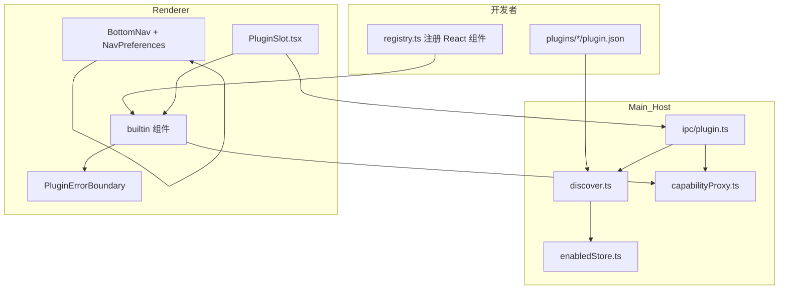
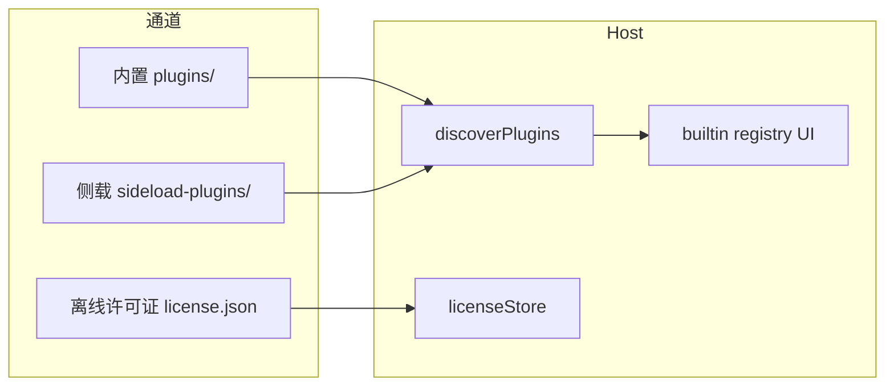

# 07_插件与扩展

> **状态**：SSOT（2026-08-01）· 上编插件架构 · 中编离线分发 · 下编运维协作  
> **产品金句**：**聊着聊着就把事干了** · 北极星：**像聊天一样运维**  
> **关联**：[06_ROADMAP](./06_ROADMAP.md) · [01_产品需求文档](./01_产品需求文档.md) · [04_交互与UI约定](./04_交互与UI约定.md) · [02_技术实现建议](./02_技术实现建议.md) §15.3  
> **代码真源**：`src/shared/plugin/` · `src/main/plugin/` · `src/renderer/src/plugin/` · `plugins/` · `src/main/ops/` · `tools/lanpm-agent/` · `tools/lanpm-gateway/`

---

## 0. 文档结构

| 编 | 章 | 内容 | 主要读者 |
|----|-----|------|----------|
| **上编** | §1–§12 | 插件开发：Slot · Capability · manifest · Extension API · Sprint | 架构 / 插件作者 / 前端 |
| **中编** | §13–§26 | 离线分发：侧载 · 签名 · 离线许可 · OEM · **无应用商店** | IT / 集成商 / 运维 |
| **下编** | §27–§42 | 运维协作：Ops Agent · `lanpm.ops` · Gateway · 斜杠命令 | PM / 架构 / 运维 |

**阅读顺序**：上编 → 中编（要交付插件包时）→ 下编（要做运维扩展时）。

---

## 上编 · 插件开发（架构 · 规范 · 规划）

## 1. 定位

### 1.1 一句话

LanPM 插件体系 = **VS Code 式「扩展中心 + 贡献点（Slot）」**：用户在 **Profile → 扩展** 启停插件；日常在 **业务场景** 消费 Slot 挂载的 UI；数据经 Host **能力白名单** 代理。产品主轴是 **人（聊天）· 事（任务）** — 一切扩展围绕二者加厚，而非替代。

### 1.2 与 VS Code 对照

| VS Code | LanPM |
|---------|-------|
| Extensions 视图（安装 / 启停 / 配置） | Profile → **扩展** Tab（`PluginsPanel`） |
| `contributes.*`（views / menus / commands） | `plugin.json` → **`slots[]`** + **`contributions.views[]`**（Layer C · ✅ v1.74.0）+ **`commands[]`**（命令面板 · ✅ v1.78.0）+ **`menus[]`**（UI 菜单 · ✅ v1.78.8） |
| Extension API | `window.lanpm.plugin.invokeCapability`（preload 暴露） |
| `activate()` 跑扩展代码 | **builtin registry** 映射 React 组件（见 §3.2） |
| Command Palette | **✅** Ctrl/Cmd+K（v1.78.0 POC · v1.78.3 handler 真执行） |
| Marketplace | **不做**（无盈利不投 · 仅离线侧载/部署/分发 · 本篇 **§13** 起） |

### 1.3 核心 vs 扩展

| 类别 | 示例 | 规则 |
|------|------|------|
| **永远核心（主轴）** | 聊天、任务实体、`/task` 引用、任务详情、至少一种任务主视图 | **不可关停** · 不可拆卖 |
| **任务透镜（核心 Tab）** | 看板、任务树、甘特、日历 | 同一批「事」的不同看法；**可藏 Tab、可排序**（§3.7） |
| **协作附件 Tab** | 白板、文件 | 围绕项目上下文；**可藏 Tab** |
| **免费扩展模块** | `lanpm.example`、表情包包（规划） | `pricing: free` |
| **可购扩展** | `lanpm.formjs`、`lanpm.meeting`（体验深化中） | `pricing: paid`；离线许可证闸 ✅ v1.75–1.76（`license.feature`） |
| **核心内置 + manifest** | AI 助手 UI（顶栏） | UI 在核心；manifest 用于展示/未来 Slot 对齐 |

收费边界详见 [06_ROADMAP](./06_ROADMAP.md) §6.3：**主路径高频能力必须免费**；小众/重资源可购。

### 1.4 产品原则：人 · 事主轴（拍板）

```
        人（聊天）              事（任务）
            │                      │
            └──────────┬───────────┘
                       │
                一切扩展挂在这上面
                       │
       ┌───────────────┼───────────────┐
       ▼               ▼               ▼
   主题/表情      详情区/工具条      辅助 Tab
  （核心定制）    （插件 Slot）    （可藏可排序）
```

| 层级 | 含义 | 能否关停 |
|------|------|----------|
| **主轴** | 聊天（人）· 任务（事）：群聊、DM、`/task`、任务引用、任务详情、改任务 | **不能关** |
| **任务透镜** | 看板 / 树 / 甘特 / 日历 — 看同一批任务的不同方式 | 可藏 **Tab**，**事仍在**（聊天里仍能 @任务、进详情） |
| **协作附件** | 文件、白板、脑图 | 默认 **聊天 Composer 抽屉** 为主入口；底栏 Tab 可藏（`hiddenViews` / `hiddenContributedRoutes`） |
| **定制 & 扩展** | 主题、表情包、详情插件、聊天工具条、会议按钮… | 在主轴上**加厚**，不替代主轴 |

**硬约束（实现与文档须一致）**

1. **`chat` Tab 永远可见**（匿名群仍仅聊天；DM 仅聊天）。  
2. **任务不可从产品中移除**：至少保留「能看任务、能改任务、聊天能引用任务」— 通常 = **看板或任务树至少保留一个入口**（或未来合并为单一「任务」Tab 再分子视图）。  
3. **插件不注册「第二聊天中心 / 第二任务中心」** — 扩展进 Slot，不抢底栏主轴。  
4. **关 Tab ≠ 关能力**：藏起甘特后，任务排期仍可通过其他透镜或聊天上下文访问；深链 `/g/:id/gantt` 须回落默认 Tab 或提示「已在设置中隐藏」。  
5. **群类型约束优先于用户偏好**：职能群、匿名群等 `tabRules` 锁定规则 **不可**被用户设置绕过。

**定制举例（应支持的方向）**

| 用户想要 | 机制 | 不是 |
|----------|------|------|
| 换主题 | 核心亮/暗 + 未来主题令牌 | 可购插件卡脖子 |
| 表情包 | `chat.composer.action` 或内置库 + 可选表情插件 | 新 Tab |
| 任务详情加表单 | `task.detail.section`（已有） | 替代任务详情 |
| 聊天加会议 | `chat.toolbar.media`（✅ 紧凑工具条 v1.78.4） | 群顶堆满图标 |
| 不用甘特/白板/脑图底栏 | **导航偏好** `hiddenViews` / `hiddenContributedRoutes`（v1.96.0 默认已藏 files·whiteboard·mindmap） | 删掉任务数据 |
| 看板放第一个 | **导航偏好** `order` | 插件 |

### 1.5 统一扩展中心 vs 贡献点

| 层 | 用户/开发者入口 | 作用 |
|----|-----------------|------|
| **扩展中心（Hub）** | Profile → **扩展** | 发现、启停、权限；**离线导入**侧载包与许可证（无在线商店） |
| **贡献点（Slot）** | `plugin.json` → `slots[]` | 运行时 UI 挂在聊天/任务/看板等场景 |
| **导航偏好** | Profile → **导航与视图**（✅ v1.77.0） | Tab 隐藏与排序 — **不是插件** |

开发者心智：**扩展中心管生命周期；manifest 管出现在哪；导航设置管核心 Tab 布局。**

---

## 2. 架构总览



### 2.1 三层职责

| 层 | 负责方 | 职责 |
|----|--------|------|
| **Manifest** | 插件作者 | 声明 `id`、版本、`slots`、`capabilities`、`pricing` |
| **Slot Host** | LanPM 核心 | 在任务详情 / 聊天 / 看板等视图挂载 `<PluginSlot />` |
| **Capability** | LanPM 核心 | `invokePluginCapability` 白名单代理；插件 **禁止** 直连 DB / `ipcMain` |

### 2.2 三层定制模型（灵活性的关键）

| 层 | 名称 | 解决什么 | 典型能力 | 状态 |
|----|------|----------|----------|------|
| **Layer A** | **导航偏好** | 我用哪些核心 Tab、什么顺序 | `hiddenViews` · `order` · 每群覆盖 | ✅ 全局 v1.77.0 · 每群 v1.78.7 |
| **Layer B** | **Tab 内 Slot** | 在聊天/任务/看板/甘特 **内部** 加功能 | 会议、表情、表单、导出… | ✅ 多视图已接（§3.5.3）；ViewHost 类型 ✅ |
| **Layer C** | **贡献新 Tab** | 整页插件视图（思维导图、报表…） | `contributions.views[]` | ✅ v1.74.0 |

**不要混用：**

- 用插件「关掉甘特 Tab」→ ❌ 应用 Layer A。  
- 用导航设置「加会议按钮」→ ❌ 应用 Layer B Slot。  
- 用 Layer C 注册 `chat` / `board` 路由取代主轴 → ❌ 违反 §1.4。  
- 在 `ChatView` 里硬编码会议按钮 → ❌ 应挂 `chat.toolbar.media` Slot（§3.5）。

**Tab 内开放性原则（Layer B）**：每个底栏视图 = **薄宿主（ViewHost）** + **若干固定 Slot 区**；业务逻辑进插件，宿主只负责布局、上下文与启停。详见 §3.5。

### 2.3 安全模型（必须遵守）

常量：`PLUGIN_SECURITY_RULES`（`src/shared/plugin/types.ts`）

| 规则 | 含义 |
|------|------|
| `no-renderer-node-integration` | 渲染进程隔离 |
| `no-plugin-ipcMain` | 插件不得注册 IPC |
| `no-direct-sqlite` | 不得直连数据库 |
| `capabilities-via-host-only` | 仅 `invokeCapability` |
| `no-unsigned-remote-code` | 禁止未签名远程代码（市场阶段 enforce） |

**Renderer 不执行 `plugins/` 目录内任意 JS**。UI 须在 `src/renderer/src/plugin/builtins/` 实现并在 `registry.ts` 注册（见 `plugins/README.md`）。

### 2.4 发现与启停

| 路径 | 说明 |
|------|------|
| 内置插件根 | 开发：`仓库/plugins/`；打包：`resources/plugins/` |
| 用户启停状态 | `userData/plugin-enabled.json` |
| 默认策略 | **未配置 → 默认关闭**；官方白名单默认开（`enabledDefaults.ts`） |

当前默认启用：`lanpm.formjs`、`lanpm.ai-assistant`（偏好）。

启停链路：`PluginsPanel` → `setEnabled` → 持久化 → `PLUGIN_ENABLED_CHANGED_EVENT` → `PluginSlot` 重拉。**对已接线 Slot 基本 OK**（`verify:plugin-enable-ui`）。**未接线 Slot 启停无可见效果**。`paid` 插件受 **离线许可证** 闸（`license.feature` · v1.75+）；无有效许可时能力调用失败。

---

## 3. 贡献点（Slot）· Layer B

### 3.1 已定义 Slot（types 真源）

| Slot | 用途 | 接线状态 |
|------|------|----------|
| `task.detail.section` | 任务详情内嵌区 | ✅ `TaskDetailPanel` |
| `chat.toolbar.media` | 聊天输入区媒体工具 | ✅ 紧凑工具条 v1.78.4 |
| `files.preview.action` | 文件预览操作 | ✅ 宿主已接 |
| `topbar.menu` | 顶栏跨群工具 | ✅ `TopBar` · `PluginGlobalSlot` |
| `group.tab.overflow` | 群级「更多」 | ✅ `BottomNav` More（⋯）下拉 |
| `profile.tab` | 扩展设置 Tab | ✅ `ProfileModal` 动态 Tab（末尾追加） |

### 3.2 按视图扩展地图（Slot 清单 · 与 `viewSlotMap` 对齐）

围绕 **人（聊天）** 与 **事（任务）** 扩能力，**不新增主轴 Tab**（Layer C 整页插件视图见 §3.6）。

| 视图 | Slot | 扩什么 | 主轴关系 |
|------|-----------|--------|----------|
| **聊天** | `chat.toolbar.media` | 会议、语音、投屏 | 人 |
| | `chat.composer.action` | 表情包、模板、机器人 | 人 |
| | `chat.message.action` | 消息菜单：翻译、转任务 | 人 → 事 |
| **任务树** | `task.detail.section` | 右侧详情插件区（与看板共用） | 事 |
| | `tree.toolbar` | 树筛选、批量、视图切换 | 事 |
| **任务详情** | `task.detail.section` | 表单、验收、评审 | 事 |
| **看板** | `board.toolbar` | 筛选、WIP、批量 | 事 |
| | `board.card.footer` | 卡片小部件 | 事 |
| **甘特** | `gantt.toolbar` | 导出、基线 | 事 |
| | `gantt.bar.context` | 条右键扩展 | 事 |
| **日历** | `calendar.toolbar` | 视图切换、导出 | 事 |
| | `calendar.event.action` | 日程条右键 / 快捷操作 | 事 |
| **白板** | `whiteboard.toolbar` | 导出、模板、协作工具 | 附件 |
| **文件** | `files.preview.action` | 预览旁操作 | 附件 |
| | `files.toolbar` | 上传、排序、批量 | 附件 |

### 3.3 Slot 组件契约

```typescript
export type PluginSlotComponentProps = {
  plugin: PluginView
  groupId: string
  taskId: string   // 群级 Slot：PluginGroupSlot 演进后 optional
}
```

`PluginSlot.tsx`：`listSlotPlugins` → `registry` → `PluginErrorBoundary`。

### 3.4 与底栏 Tab 的关系

- 底栏 **主轴** Tab 由 **`VIEW_TABS`**（`paths.ts`）+ **`isViewAllowedForGroup`**（`tabRules.ts`）+ **`navPreferences`** 驱动；**v1.96.0** 起 `files` / `whiteboard` 与贡献 `mindmap` **默认隐藏**，主入口为聊天 **`ChatCollaborationDrawer`**。  
- 插件 **不替代** BottomNav；在 Tab **内部** 或 **聊天抽屉** 挂 Slot / 整页视图。  
- 用户隐藏甘特 Tab ≠ 卸载甘特插件；插件关闭 ≠ 隐藏核心 Tab。  
- **Tab 内部**的灵活开放见 §3.5；**整页新 Tab** 见 §3.6（Layer C）。

---

## 3.5 Tab 视图宿主与内部开放性（规范）

> **目标**：每个 BottomNav Tab 对应一个 **View Host** — 核心只提供布局骨架与 Slot 锚点；功能增强走插件 Slot，避免在 `ChatView` / `BoardView` 等文件里堆 `if (feature)` 硬编码，方便后续为任意 Tab 接插件。

### 3.5.1 设计原则

| # | 原则 | 说明 |
|---|------|------|
| 1 | **薄宿主、厚 Slot** | 视图负责路由、群上下文、空态/权限；按钮、侧栏、卡片脚标等优先 `<PluginSlotHost />` |
| 2 | **Slot 命名空间** | `{viewId}.{zone}.{语义}`，与 `AppView` 对齐；立项时同步入 `types.ts` |
| 3 | **统一上下文** | `ViewPluginContext` 传递 `groupId` + `view` + 可选 `selection`（见 §3.5.2） |
| 4 | **新 Tab 必带锚点** | 新增核心 Tab 须完成 §3.5.4 检查表，**不得**「先上线再补 Slot」 |
| 5 | **Layer C 底栏合并** | `BottomNav` 在核心 `VIEW_TABS` 之后合并 `contributions.views`（§3.6 · v1.74.0） |

### 3.5.2 视图内区域（Zone）模型

| Zone | 典型 UI 位置 | 挂载方式 | 示例 Slot |
|------|--------------|----------|-----------|
| `toolbar` | 主内容顶栏 / 工具条 | 横向 `PluginSlotHost` 容器 | `board.toolbar` · `gantt.toolbar` |
| `composer` | 输入区附属（聊天等） | 输入框旁图标组 | `chat.composer.action` |
| `detail` | 详情抽屉 / 侧栏 / Modal 内 | 与 `task.detail.section` 同模式 | `task.detail.section` |
| `card` | 看板卡片 / 列表项 chrome | 卡片底部或角标区 | `board.card.footer` |
| `context` | 右键 / 长按菜单（虚拟 Slot） | Host 收集贡献项渲染菜单 | `gantt.bar.context` · `chat.message.action` |
| `preview` | 预览器工具区 | 预览头/尾操作条 | `files.preview.action` |

```typescript
// 真源：src/shared/plugin/viewHost.ts
export type ViewPluginZone =
  | 'toolbar' | 'composer' | 'detail' | 'card' | 'context' | 'preview'

export type ViewPluginContext = {
  groupId: string
  view: AppView | string
  zone?: ViewPluginZone
  selection?: {
    taskId?: string
    fileId?: string
    messageId?: string
  }
}

export type PluginSlotHostProps = {
  slot: PluginSlotId
  context: ViewPluginContext
}
```

**契约**：`ViewPluginContext` + `PluginZoneHost` / `PluginSlotHost`；`PluginZoneHost` 向 context 注入 `zone`；插件按 `context.zone` 区分同视图多挂载点。`PluginTaskSlot` / `PluginGroupSlot` 为薄封装。地图 SSOT：`src/renderer/src/plugin/viewSlotMap.ts`。

### 3.5.3 各 Tab 宿主 Slot 清单（SSOT）

| `AppView` | 视图组件（真源） | 应接 Slot（zone） | 接线状态 |
|-----------|------------------|-------------------|----------|
| `chat` | `ChatView` | `chat.toolbar.media`（toolbar）· `chat.composer.action`（composer）· `chat.message.action`（context） | ✅ 文本/语音各一处 toolbar zone；composer/context 已接 |
| `board` | `BoardView` | `board.toolbar`（toolbar）· `board.card.footer`（card）· `task.detail.section`（detail · Modal） | ✅ toolbar/card/detail 已接 |
| `tree` | `TreeView` | `tree.toolbar`（toolbar）· `task.detail.section`（detail） | ✅ toolbar · 详情面板已接 |
| `gantt` | `GanttView` | `gantt.toolbar`（toolbar）· `gantt.bar.context`（context） | ✅ toolbar/context 已接 |
| `calendar` | `CalendarView` | `calendar.toolbar`（toolbar）· `calendar.event.action`（context） | ✅ toolbar/context 已接 |
| `whiteboard` | `WhiteboardView` | `whiteboard.toolbar`（toolbar） | ✅ toolbar 已接 |
| `files` | `FilesView` | `files.toolbar`（toolbar）· `files.preview.action`（preview） | ✅ toolbar/preview 已接 |

**反模式（禁止）**

- 在 `ChatView` 直接写「会议」「表情」按钮而不走 Slot — 应迁到 `chat.toolbar.media` / `chat.composer.action`。  
- 同一 Slot 在文本/语音模式 **双挂载**（重复 `PluginZoneHost` 或混用已废弃的 `PluginGroupSlot`）— 须按输入模式单路径接线（`ChatVoiceMediaPanel` 仅 `PluginZoneHost`）。
- 看板 `TaskEditModal` 与任务树详情 **能力不一致** — 两处都应挂 `task.detail.section`。  
- 每个视图复制一套 `listSlotPlugins` + 错误边界 — 统一用 `PluginSlotHost`。

### 3.5.4 新 Tab / 视图扩展检查表（开发者）

立项或 PR 时勾选：

- [ ] `paths.ts` 注册 `AppView` + 路由常量  
- [ ] `tabRules.ts` 补充群类型可见性  
- [ ] 视图内至少预留 **toolbar** zone 的 `PluginSlotHost` 锚点（无插件时容器为空即可）  
- [ ] 若有详情/预览/输入区，对应 zone 一并预留  
- [ ] `types.ts` 新增 `PluginSlotId`；本文 §3.1 / §3.5.3 同步  
- [x] `viewSlotMap.ts` 登记 `view → zones → slotIds`（`src/renderer/src/plugin/viewSlotMap.ts`）  
- [x] verify 脚本断言锚点存在（`verify:view-slot-hosts`）

### 3.5.5 代码结构（已落地）

```
src/shared/plugin/viewHost.ts          # ViewPluginZone · ViewPluginContext
src/renderer/src/features/*/…View.tsx  # 各 Tab 挂 PluginZoneHost
src/renderer/src/plugin/
  PluginSlot.tsx · PluginZoneHost.tsx
  viewSlotMap.ts                       # view ↔ zones ↔ slotIds
  builtins/                            # 插件 UI 注册
```

**现状**：七核心 Tab + 任务详情 + 三全局 Slot 已接线；命令 invoke 真执行 ✅ v1.78.3；会议工具条 UX ✅ v1.78.4；zone 上下文 + 聊天 toolbar 单路径 ✅ v1.78.5。

---

## 3.6 插件贡献新 Tab · Layer C（✅ v1.74.0）

在 Layer B（Tab **内** Slot）之上，允许插件通过 manifest 声明 **整页新 Tab**，出现在底栏（受 Layer A 排序/隐藏与群类型约束）。

### 3.6.1 manifest 扩展（建议）

```json
{
  "id": "lanpm.mindmap",
  "contributions": {
    "views": [{
      "id": "mindmap",
      "route": "mindmap",
      "titleKey": "nav.mindmap",
      "icon": "apartment",
      "groupTypes": ["project"],
      "pricing": "paid"
    }]
  },
  "slots": ["mindmap.toolbar"]
}
```

| 字段 | 说明 |
|------|------|
| `contributions.views[].id` | 稳定视图 id；**不可**占用主轴：`chat` · `board` · `tree` |
| `route` | 与 `paths.ts` 风格一致；深链 `/g/:groupId/mindmap` |
| `groupTypes` | 可选；默认继承 `tabRules` 校验 |
| 视图组件 | 仍在 `builtins/` + `registry.ts` 注册（与 Slot 相同，M1 无 drop-in） |

### 3.6.2 底栏合并规则

```
BottomNav 最终列表 =
  核心 VIEW_TABS（Layer A 过滤排序）
  ∪ 已启用插件的 contributions.views（去重、校验 route）
  → 再应用 tabRules ∩ NavPreferences
```

- 插件 Tab **不能**插入在 `chat` 之前或替代任务主入口。  
- 用户可在 Layer A 隐藏插件 Tab（与藏甘特同理），不等于卸载插件。  
- 插件 Tab 内部仍遵守 §3.5：须自带 `toolbar` 等 zone 锚点。

### 3.6.3 与主轴的关系

| 允许 | 禁止 |
|------|------|
| 思维导图、报表、自定义看板透镜 | 第二聊天中心、第二任务中心 |
| 围绕 `groupId` 的整页工具 | 绕过 `tabRules` 的匿名群全功能 Tab |
| `pricing: paid` + 许可证闸 | 未签名远程整页加载 |

---

## 3.7 导航与 Tab 定制 · Layer A（✅ 全局 v1.77.0 · 每群 v1.78.7）

### 3.7.1 配置粒度

| 粒度 | 场景 | 存储 |
|------|------|------|
| **用户全局** | 「我从不用白板」 | `userData/nav-preferences.json` → `global` ✅ |
| **每群覆盖** | 「本群只要聊天+看板」 | 同文件 `byGroup[groupId]` 整包 `NavPreferences` ✅ v1.78.7 |

### 3.7.2 数据模型（已实现）

```typescript
type NavPreferencesDocument = {
  global: NavPreferences
  byGroup: Record<string, NavPreferences>
}

type NavPreferences = {
  /** 隐藏的核心 Tab（仍受 §1.4 与群类型约束） */
  hiddenViews: AppView[]
  /** 可见核心 Tab 的显示顺序 */
  order: AppView[]
  /** 隐藏的插件贡献路由（Layer C `views[].route`） */
  hiddenContributedRoutes: string[]
  /** 贡献 Tab 在核心 Tab 之后的显示顺序 */
  contributedOrder: string[]
}
```

### 3.7.3 渲染规则

```
BottomNav 最终列表 =
  核心：群类型允许 ∩ 主轴约束 ∩ !hiddenViews → 按 order
  + 插件贡献：groupTypes ∩ !hiddenContributedRoutes → 按 contributedOrder（核心之后）
```

| Tab | 用户可隐藏？ | 备注 |
|-----|--------------|------|
| `chat` | **否** | 人 · 主轴 |
| `board` / `tree` | **至少保留其一** | 事 · 主入口（产品可合并为一个「任务」Tab） |
| `gantt` / `calendar` | 是 | 任务透镜 |
| `whiteboard` / `files` | 是 | 附件（职能群 files 仍受群类型约束） |
| 插件贡献 Tab | 是 | 段内排序；不与核心混排 · v1.77.0 |

### 3.7.4 设置入口（产品）

- Profile → **「导航与视图」**：核心 Tab + 已发现插件贡献 Tab（拖拽排序 + 开关）。  
- **全局 / 当前群** Segmented（有活跃群时）：编辑 `global` 或本群 `byGroup` 覆盖；**恢复跟随全局** 删除覆盖。  
- 深链落到已隐藏 Tab：重定向默认视图或 Toast 说明（含 `PluginViewGuard`）。

**代码现状**：`NavPreferences` MVP ✅（核心 v1.x · 插件贡献 **v1.77.0** · 每群覆盖 **v1.78.7**）。

---

## 4. 能力（Capability）· Extension API

### 4.1 已实现白名单

| Capability | 参数 | 说明 |
|------------|------|------|
| `task.get` | `{ taskId }` | 单任务 |
| `task.list` | `{ groupId }` | 群任务列表 |
| `group.get` | `{ groupId }` | 群元数据 |
| `file.listMeta` | `{ groupId }` | 文件元数据（无内容） |
| `chat.listMessages` | `{ groupId, beforeLamportTs? }` | 最近一页聊天；可选更早分页 |
| `task.getChecklist` | `{ groupId, taskId }` | 任务验收清单 + 进度 |
| `member.list` | `{ groupId }` | 群成员（含 presence） |
| `chat.sendTaskRef` | `{ groupId, taskId }` | 受控发送任务引用消息 |
| `task.patch` | `{ groupId, taskId, patch }` | 白名单更新任务字段（title · status · progressPercent · priority · tags） |
| `board.moveTask` | `{ groupId, taskId, status, sortOrder?, otherReason? }` | 看板列移动（等同 UI 拖拽） |

```typescript
await getLanpmApi().plugin.invokeCapability(plugin.id, 'task.get', { taskId })
```

Host 校验：插件存在 → 已启用 → manifest 已声明 capability。

#### 写操作人审（v0.4）

| 步 | 行为 |
|----|------|
| 1 | `invokeCapability('task.create' \| 'task.patch' \| 'board.moveTask', …)` → `{ status: 'pending_confirm', pendingId, … }`（**不写库**） |
| 2 | UI：`invokeCapabilityWithHumanConfirm` 弹窗，或直接 `confirmCapability(pluginId, pendingId)` |
| 3 | Host 校验 pending 归属后执行写路径，返回 `Task` |

`chat.sendTaskRef` **不**走人审（仍直写）。

### 4.2 规划中的能力（按视图 · 立项入 types）

| 层级 | 视图 | 候选 Capability | 风险 |
|------|------|-----------------|------|
| 读 | 任务 | `task.getChecklist` | 低 · **v0.2 ✅** |
| 读 | 聊天 | `chat.listMessages` | 低 · **v0.2 ✅** |
| 读 | 成员 | `member.list` | 低 · **v0.2 ✅** |
| 写 | 任务 | `task.patch` · `task.create` · `board.moveTask` | 中 · **v0.4 人审 ✅** |
| 写 | 聊天 | `chat.sendText` · `chat.sendTaskRef` · `chat.sendMarkdown` | 中高 · **`sendTaskRef` v0.2 ✅** · **`sendText` v0.5 人审 ✅** · **`sendMarkdown` v0.6 人审 ✅** |
| 写 | 文件 | `file.upload` | 中高 · **v0.5 人审 ✅** |
| AI | — | `ai.streamChat` · `ai.getThread` | 中 · **`getThread` v0.6 读 ✅** · **`streamChat` v0.6 人审 ✅** · [02](./02_技术实现建议.md) §15.3 |
| 媒体 | 聊天 | `media.signal.*` · `media.captureDesktop` | 高 · Main 代理 |
| 授权 | — | `license.feature` | 产品 · 拦 `paid` |

**原则**：不开放完整 `LanpmApi`；写操作默认确认/人审；返回值逐步类型化（少 `unknown`）。

### 4.3 新增 Capability 流程

1. `types.ts` + `PLUGIN_CAPABILITY_IDS`  
2. `capabilityProxy.ts` 实现  
3. 更新本文 §4 + verify  
4. manifest 声明后方可调用  

### 4.4 Extension API 版本路线

| 版本 | 范围 | 状态 |
|------|------|------|
| **v0.1** | 4 个只读 capability + `task.detail.section` | ✅ M1 |
| **v0.2** | 聊天/看板读 + `chat.sendTaskRef`；`chat.toolbar.media` | ✅ v1.72.0 · `verify:extension-api-v0.2` |
| **v0.3** | `task.patch` · `board.moveTask` 写白名单 | ✅ v1.78.6 · `verify:extension-api-v0.3` |
| **v0.4** | 写操作人审（`pending_confirm` + `confirmCapability`）· `task.create` | ✅ v1.80.0 · `verify:extension-api-v0.4` |
| **v0.5** | `chat.sendText` · `file.upload` 人审 | ✅ v1.82.0 · `verify:extension-api-v0.5` |
| **v0.6** | `chat.sendMarkdown` 人审 · `ai.getThread` 读 · `ai.streamChat` 人审 | ✅ v1.99.0 · `verify:extension-api-v0.6` |
| — | `license.feature` · 侧载格式（历史交付，勿再称「v0.4」） | ✅ v1.75–1.76（**无商店 UI** · 离线分发 SSOT §8.2） |
| **v1.0** | 市场 + 签名目录 + 命令面板深化 | 📋 P2（`commands[]` POC ✅ v1.78.0） |

---

## 5. `plugin.json` 规范

### 5.1 Schema

| 字段 | 必填 | 说明 |
|------|------|------|
| `id` | ✅ | 稳定 id，如 `lanpm.formjs` |
| `name` · `version` | ✅ | 展示名 · semver |
| `slots` | 条件 | `PluginSlotId[]`；可与 `contributions.views` / `commands` / `menus` 任一非空组合（四者不能全空） |
| `capabilities` | ✅ | 可为 `[]` |
| `pricing` | ✅ | `free` \| `paid` |
| `engines.lanpm` | 可选 | 宿主 semver |
| `commands` | 可选 | `{ id, titleKey }[]` — 命令面板贡献（POC · Ctrl/Cmd+K） |
| `menus` | 可选 | `{ location, items: [{ command }] }[]` — 将同插件 `commands` 挂到 UI 锚点（POC · v1.78.8） |
| `contributions.views` | 可选 | Layer C 整页 Tab |

非法 manifest **静默跳过**（`validateManifest.ts`）。

#### `commands[]`（v1.78.0）

- Host 扁平化为 `pluginId:id`；核心命令为 `core:*`
- IPC：`plugin:listCommands` · `plugin:invokeCommand`（main 返回 `action`；renderer `applyCommandAction` + builtin handler registry）
- UI：`CommandPalette`（Ctrl/Cmd+K）
- 样例：`plugins/lanpm.example` → `hello` / `command.example.hello`
- 验收：`npm run verify:command-palette`

#### `menus[]`（v1.78.8）

- `items[].command` 须引用**同 manifest** 已声明的 `commands[].id`
- 锚点：`topbar.user`（顶栏用户菜单）· `chat.message.context`（消息右键）
- **v1.83.0+**：聊天页经 `ChatPluginMenusProvider` 按 `listMenus('chat.message.context')` 拉取（`pluginMenusCache` 按 location 缓存）；`MessageBubble` 用 `useChatPluginMenuItems`，**勿**在气泡内直接 `usePluginMenus`
- IPC：`plugin:listMenus`（可选 `location` 过滤，无参仍全量）；点击 → `plugin:invokeCommand` → `applyCommandAction`
- 样例：`plugins/lanpm.example` → 用户菜单 + 消息右键 `hello`
- 验收：`npm run verify:plugin-menus` · `npm run verify:chat-perf`（聊天列表性能防回归）

### 5.2 最小示例

见 `plugins/lanpm.example/plugin.json`。

### 5.3 官方插件清单

| id | Slot | pricing | 默认启用 | UI |
|----|------|---------|----------|-----|
| `lanpm.example` | `task.detail.section` | free | 否 | `ExampleStub` |
| `lanpm.formjs` | `task.detail.section` | paid | 是 | `FormJsPoc` |
| `lanpm.meeting` | `chat.toolbar.media` | paid | 否 | `MeetingStub` |
| `lanpm.mindmap` | `mindmap.toolbar` · `contributions.views` | paid | 否 | `MindmapStub` |
| `lanpm.ai-assistant` | （manifest 含未白名单 cap，发现跳过） | free | 是 | 核心 `AiAssistantShell` |
| `lanpm.ops` | `files.toolbar` · `chat.composer.action` | paid | 否 | `OpsStub` |

---

## 6. 开发者流程

### 6.1 合入式插件（当前唯一路径）

```
plugins/<dir>/plugin.json
→ builtins/<Name>.tsx
→ registry.ts
→ i18n · verify:plugin-*
→ PR
```

### 6.2 选型检查表

- [ ] 符合 §1.4 主轴（不替代聊天/任务）  
- [ ] Slot 匹配 §3.2 视图地图 · 新视图完成 §3.5.4 检查表  
- [ ] capabilities 最小权限  
- [ ] 仅 `getLanpmApi().plugin.*`  
- [ ] 已注册 `registry.ts`  

### 6.3 IPC 面

`listPlugins` · `listSlotPlugins` · `setEnabled` · `invokeCapability` — 见 `shared/plugin/channels.ts`。

---

## 7. 用户消费路径

### 7.1 插件三步

| 步骤 | 动作 |
|------|------|
| 拿到 | 随客户端 / 未来市场安装 |
| 打开 | Profile → **扩展** 启停 |
| 使用 | 进入场景（任务详情、聊天工具栏…）自动出现 |

### 7.2 定制三步（含 Layer A）

| 步骤 | 动作 |
|------|------|
| 主题 | 顶栏/设置切换亮暗（核心）；未来主题包 |
| Tab 布局 | Profile → **导航与视图**（✅ v1.77.0）：藏甘特/白板、排序 |
| 扩展能力 | Profile → **扩展**：会议、表单、表情… |

### 7.3 示例

- **form-js**：任务树 → 详情 → 「扩展（插件）」区块  
- **AI**：顶栏「AI 助手」（核心 Shell）  
- **会议**：聊天输入旁 → `chat.toolbar.media`（紧凑工具条 ✅ v1.78.4）  
- **表情（规划）**：输入区 → `chat.composer.action`  
- **命令面板**：Ctrl/Cmd+K（`commands[]` POC · v1.78.0）  


---

## 8. 生态与成熟度

### 8.1 阶段路线

| 阶段 | 能力 | 状态 |
|------|------|------|
| **M1** | 发现 · 单 Slot · 只读 capability · Profile 插件启停 | ✅ |
| **M1.5** | **ViewHost**（§3.5）· `viewSlotMap` · 各 Tab Slot 锚点 · `verify:view-slot-hosts` | ✅（残余加固见 §12） |
| **M1.6** | **导航偏好** · 多视图 Slot 接线 · 看板详情 PluginSlot | ✅ v1.77.0 + §3.5.3 |
| **M2** | `chat.toolbar.media` · 会议 stub/mesh/LiveKit · Extension API v0.2 | ✅ v1.67–1.72（会议体验深化 📋） |
| **M3** | API v0.3 写白名单（`task.patch` · `board.*`） | ✅ v1.78.6 |
| **M4** | `contributions.views`（Layer C）· 命令面板 · `commands[]` | Layer C ✅ · 命令面板 POC ✅ v1.78.0 |
| **M5** | **插件离线分发** · 侧载 · 签名 · 离线许可证 | ✅ v1.75–1.76 · **应用商店明确不做**（§8.2） |

### 8.2 插件分发（离线侧载 · 非应用商店）

对齐 [06_ROADMAP](./06_ROADMAP.md) §2。产品形态：**离线加载、离线部署、离线分发** — 不靠在线商店。

| 形态 | 说明 |
|------|------|
| **离线侧载** | `{userData}/sideload-plugins/<dir>/` · `plugin.json` + `signature.json` |
| **离线许可证** | Profile 导入 · `plugin-licenses.json` · `tools/lanpm-license/` |
| **内置合入** | `plugins/` + `builtins/` + `registry.ts` PR |
| ~~应用商店 / 私有源 / 在线更新~~ | **Out of scope**（2026-08-01 拍板） |

阶段：**侧载 + 签名 + 离线许可 ✅**（`verify:plugin-market-spike`）→ 详见本篇 **§19–§20**。

### 8.3 当前缺口

| 缺口 | 影响 |
|------|------|
| ~~无 ViewHost / `viewSlotMap`~~ | ✅ `viewHost.ts` · `viewSlotMap.ts` · 七 Tab 锚点 |
| ~~无 `NavPreferences`~~ | ✅ 全局 MVP v1.77.0；**每群覆盖** ✅ v1.78.7 |
| ~~多视图 Slot 未接~~ | ✅ §3.5.3；全局 Slot ✅ v1.78.2；zone 上下文 + 聊天 toolbar 去重 ✅ v1.78.5 |
| 写 capability 不足 | API v0.2 读+`chat.sendTaskRef`；**v0.3** 写白名单 ✅；**v0.4** 人审+`task.create` ✅；**v0.5** `chat.sendText`/`file.upload` ✅ |
| 命令 `invoke` 真执行 | ✅ v1.78.3 · `CommandAction` · `commandEffects` · handler registry |
| 会议体验深化 | 工具条/许可闸 ✅ v1.78.4；录制/日程 MVP ✅ v1.81.0；**产品化**（i18n · 通知深链 · join CTA）✅ v1.89.0 |
| 须合入 registry | 第三方不能 drop-in；**离线侧载**可不经 PR（§8.2.1）；无在线商店 |
| ai-assistant manifest 与 types 不一致 | 需对齐 |

### 8.4 当前成熟度自检

| 维度 | 结论 |
|------|------|
| **是否「最灵活」终态？** | **否** — 底座到 **M2/M4 POC**；**不做商店**；写 API 持续演进 |
| **插件启停** | ✅ Profile 开关 + 持久化 + Slot 刷新（已接线处） |
| **Tab 启停/排序** | ✅ Layer A 全局（v1.77.0）；每群覆盖 ✅ v1.78.7 |
| **Tab 内开放性** | ✅ 七核心视图已按 Zone 接线（`verify:view-slot-hosts`） |
| **按视图扩展** | ✅ `viewSlotMap` SSOT + Host 锚点 |
| **插件贡献新 Tab** | ✅ Layer C · `verify:contributions-views` · v1.74.0 |
| **命令面板** | ✅ `commands[]` POC · Ctrl/Cmd+K · v1.78.0 |
| **第三方自助** | 侧载目录 ✅ · 合入 registry 仍须 PR；**无在线市场** |

---

## 9. 验收与守护

| 脚本 | 用途 |
|------|------|
| `verify:plugin-spike` | 安全基线 |
| `verify:plugin-loader` | loader · Slot |
| `verify:plugin-enable-ui` | Profile 启停 |
| `verify:meeting-spike` | 会议架构 |
| `verify:meeting-plugin` | 会议 stub · 媒体 capability · 语音面板 Slot |
| `verify:meeting-ux` | 会议工具条 · 许可闸 · Profile 深链 |
| `verify:meeting-mesh-poc` | Lite mesh POC · `media_signal` · RTCPeerConnection · 投屏代理 |
| `verify:media-signal` | 媒体信令房间注册表 · inbox 往返 |
| `verify:view-slot-hosts` | §3.5 各 Tab Slot 锚点 |
| `verify:nav-preferences` | Layer A 导航偏好 MVP |
| `verify:nav-per-group` | Layer A 每群导航覆盖 |
| `verify:extension-api-v0.2` | Extension API v0.2 capability |
| `verify:extension-api-v0.3` | Extension API v0.3 write capabilities |
| `verify:extension-api-v0.4` | Extension API v0.4 human review + `task.create` |
| `verify:extension-api-v0.5` | Extension API v0.5 `chat.sendText` + `file.upload` |
| `verify:extension-api-v0.6` | Extension API v0.6 `chat.sendMarkdown` + `ai.getThread` + `ai.streamChat` |
| `verify:command-palette` | `commands[]` · 命令面板 POC |
| `verify:plugin-menus` | `menus[]` · UI 菜单 POC |
| `verify:plugin-market-spike` | 侧载 · 签名 · 离线许可证 POC |
| `verify:offline-license-cli` | 签名许可证 · CLI · 试用/永久策略 |
| `verify:ops-gateway-spike` | SPIKE HTTP 网关 · path 白名单 · ✅ v1.93.2 |
| `verify:ops-agent` | Ops Phase 1 · agent CLI · P2P 入站/出站 · 斜杠命令 · ✅ v1.94.0–v1.94.1 |
| `verify:ops-p2` | Ops Phase 2 · 机器 UX · 扩展命令 · 审计 · L3 · `/help` · 任务挂包 · Profile · ✅ v1.95.0 |
| `verify:ops-p2-remaining` | Ops 助手 Bot · 出站 watch · 任务挂包深化 · ✅ v1.101.0 |

---

## 10. 相关文档

| 文档 / 篇章 | 内容 |
|-------------|------|
| 本篇 **§13–§26** | 离线侧载 · 签名 · 离线许可（中编） |
| 本篇 **§27 起** | 运维协作 · `lanpm.ops`（下编） |
| [06_ROADMAP](./06_ROADMAP.md) | 排期 SSOT · §6 收费边界 |
| [04_交互与UI约定](./04_交互与UI约定.md) §2 | BottomNav |
| [02_技术实现建议](./02_技术实现建议.md) §15.3 | AI Capability |

---

## 11. 文档维护

- §1.4 主轴原则变更须产品确认。  
- Slot / Capability / ViewHost：**同步** `types.ts` 与 §3–§4。  
- 导航偏好变更：**更新** §3.7 与 `04` §2。  
- 新增核心 Tab：**必须**更新 §3.5.3 并完成 §3.5.4 检查表。  
- 离线分发变更：**同步** 中编 §13–§26 与 `sideloadFormat.ts`。  
- 运维扩展变更：**同步** 下编 §27–§42 与 `06` ROADMAP。  
- Sprint 候选：**§12**；`plan.md` 只链本文。  
- 离线分发 / 运维扩展：分别维护 **§13–§26**、**§27–§42**；全篇 SSOT 为 `07_插件与扩展.md`。

---

## 12. Sprint 候选与排期

> **SSOT**：插件与导航扩展相关**未完成** Sprint。`.cursorGrowth/plan.md` 与本节对齐。

### 12.1 候选队列

| 候选 Sprint | Goal | 优先级 |
|-------------|------|--------|
| ~~**ViewHost 标准化**~~ | ✅ `viewHost.ts` · `viewSlotMap` · 七 Tab 锚点 · `verify:view-slot-hosts` | — |
| ~~**导航偏好 MVP**~~ | ✅ 核心 + 插件贡献 Tab（v1.77.0） | — |
| ~~**多视图 Slot 接线**~~ | ✅ §3.5.3 | — |
| ~~**Extension API v0.2**~~ | ✅ v1.72.0 | — |
| ~~**form-js 真库**~~ | ✅ v1.73.0 | — |
| ~~**思维导图插件**~~ | ✅ Layer C · v1.74.0 | — |
| ~~**会议体验下一刀**~~ | 录制+日程 MVP ✅ v1.81.0 | — |
| ~~**Ops Phase 1**~~ | `lanpm-agent` · 入站/出站 · L1 斜杠 · `lanpm.ops` · `verify:ops-agent` | ✅ v1.94.0–v1.94.1 |
| **命令 invoke 真执行** | ✅ v1.78.3 · Host action + renderer handler registry | — |
| ~~**Extension API v0.3**~~ | `task.patch` · `board.moveTask` 白名单 | ✅ v1.78.6 |
| ~~**Extension API v0.4**~~ | 写人审 + `task.create` | ✅ v1.80.0 |
| ~~**每群导航覆盖**~~ | Layer A 按群 `byGroup` | ✅ v1.78.7 |
| ~~**应用商店**~~ | 商店 UI · 私有源 · 在线市场 | **Out of scope**（侧载+离线许可 ✅ §8.2） |

**建议顺序**：会议体验产品化 · Ops Phase 2（助手 · Gateway · L2 同步评估）。**勿**立项应用商店。

### 12.2 导航偏好 MVP（已交付 · 存档纲要）

| 项 | 交付 |
|----|------|
| 模型 | `NavPreferences` · `userData/nav-preferences.json` |
| 规则 | §1.4：`chat` 不可藏；`board`/`tree` 至少留一；`tabRules` 优先 |
| UI | Profile「导航与视图」：列表拖拽 + Switch |
| 宿主 | `BottomNav` 用 `order`/`hiddenViews` 过滤 |
| 验收 | `verify:nav-preferences` ✅ |

### 12.2.1 每群导航覆盖（已交付 · v1.78.7）

| 项 | 交付 |
|----|------|
| 模型 | `NavPreferencesDocument`（`global` + `byGroup`）· 旧 JSON 自动迁移 |
| 解析 | `resolveNavPreferencesForGroup` · 有覆盖用整包，否则回落 `global` |
| UI | Profile Segmented 全局/当前群 ·「恢复跟随全局」 |
| 宿主 | Renderer store 随 `activeGroupId` · BottomNav / `GroupViewGuard` / `PluginViewGuard` |
| 验收 | `verify:nav-per-group` ✅ |

### 12.3 ViewHost 标准化（已交付 · 存档纲要）

| 项 | 交付 |
|----|------|
| 类型 | `src/shared/plugin/viewHost.ts` |
| 地图 | `viewSlotMap.ts`：7 个 `AppView` → zones → slotIds |
| 锚点 | 各核心 `*View.tsx` + `verify:view-slot-hosts` ✅ |
| zone 上下文 | `ViewPluginContext.zone` · `PluginZoneHost` 注入 · 聊天 toolbar 单路径 ✅ v1.78.5 |

**残余**：Extension API v0.3（`task.patch` / `board.*`）等见 §8.3。

### 12.4 会议实现（录制 + 日程 MVP · v1.81.0 · Pro UX v1.97.0）

Goal（已完成基线）：媒体 Slot/capability + `lanpm.meeting` + 聊天 `MeetingToolbar` · mesh/LiveKit · 许可闸 · Profile 深链 · **本地录制** · **群级日程 + 本机提醒**。

**meeting-pro（v1.97.0）**：Popover 内 LiveKit **视频格 · 参会者列表** · Pro **摄像头/投屏**；日程 Join 在 LiveKit 已配置时走 Pro；录制保存对话框 i18n +「仅本机轨」说明。

**meeting-media-v2（v1.98.0）**：`MessageType: voice`（file blob + `durationMs`）· 语音模式 PTT · Lite mesh 选源投屏（无 LiveKit）· Composer 会议单按钮 Popover 收纳。

规格：`.cursorGrowth/specs/012-meeting-pro/spec.md` · `specs/013-meeting-media-v2/spec.md`。

验收：`verify:meeting-ux` · `verify:meeting-recording` · `verify:meeting-schedule` · `verify:meeting-plugin` · `verify:meeting-livekit-pro` · `verify:chat-voice` · `verify:meeting-media-v2` · `verify:i18n-en`（meeting 键）。

**Out of scope（仍暂缓）**：云端录制 · 日程 Sync · 完整日历视图 · 日程 edit。

### 12.5 form-js · 市场 · 思维导图（已交付指针）

- **form-js**：`verify:formjs-plugin` ✅ v1.73.0
- **分发**：侧载+`license.feature` ✅ v1.75–1.76；详见本篇 **§13** 起
- **思维导图**：`lanpm.mindmap` · Layer C · ✅ v1.74.0

### 12.6 Layer C · 贡献新 Tab（✅ v1.74.0）

| 项 | 交付 |
|----|------|
| manifest | `contributions.views[]` 校验 · 保留路由黑名单 |
| 路由 | 动态注册 `/g/:groupId/:pluginView` |
| 底栏 | `BottomNav` 合并已启用插件 views（在 Layer A 之后） |
| 宿主 | 插件整页视图同样遵守 §3.5 Zone 模型 |
| 验收 | `verify:contributions-views` ✅ |

### 12.7 已交付 Sprint（摘要）

| Sprint | 版本 | 验收 |
|--------|------|------|
| PLUGIN-SPIKE | v1.19 | `verify:plugin-spike` |
| form-js-real | v1.73.0 | `verify:formjs-plugin` |
| mindmap-layer-c | v1.74.0 | `verify:contributions-views` |
| plugin-market-spike | v1.75.0 | `verify:plugin-market-spike` |
| offline-license | v1.76.0 | `verify:offline-license-cli` |
| nav-preferences | v1.77.0 | `verify:nav-preferences` |
| nav-per-group | v1.78.7 | `verify:nav-per-group` |
| command-palette | v1.78.0 | `verify:command-palette` |
| plugin-menus | v1.78.8 | `verify:plugin-menus` |
| PLUGIN-ENABLE-UI | v1.23 | `verify:plugin-enable-ui` |
| MEETING-PLUGIN-SPIKE | v1.30.1 | `verify:meeting-spike` |
| OPS-GATEWAY-SPIKE | v1.93.2 | `verify:ops-gateway-spike` |
| OPS-MVP-P1 | v1.94.0 | `verify:ops-agent` |
| OPS-STATUS-PATCH | v1.94.1 | `verify:ops-agent`（`statusSnapshot` 磁盘） |
| OPS-P2 | v1.95.0 | `verify:ops-p2` |


---

## 中编 · 插件离线分发（操作手册）

## 13. 定位与拍板

LanPM **不做应用商店**（无在线浏览、购买、更新 UI；无内网私有源运营）。插件生命周期靠：

| 能力 | 说明 |
|------|------|
| **离线加载** | 启动时扫描本地 `plugins/` 与 `sideload-plugins/` |
| **离线部署** | 安装包内置、U 盘/内网共享目录拷贝、镜像预置 |
| **离线分发** | 侧载包 +（可选）签名 + 离线许可证文件 |

| 拍板 | 结论 |
|------|------|
| 2026-07-31 | 商店暂缓 |
| **2026-08-01** | **明确不立项应用商店**；本节能力为 **终态** |
| 原则 | **无盈利、不单独投研发** → 信创/内网靠 **离线包 + 离线授权**，禁止强制公网商店才能用核心或已购插件 |

架构与 Slot 规范见本篇 **§1–§12**；**中编只写「怎么离线装、怎么授权、怎么交付」**。

---

## 14. 三种分发通道



| 通道 | 路径 | 谁操作 | 作用 |
|------|------|--------|------|
| **内置包** | 开发：`仓库/plugins/`；打包：`resources/plugins/` | 发版 / OEM 打安装包 | 官方与预装插件 manifest |
| **用户侧载** | `{userData}/sideload-plugins/<dirName>/` | IT / 用户拷贝 | 增量 manifest；**须 Ed25519 签名**（生产） |
| **离线许可** | `{userData}/plugin-licenses.json` | 用户 Profile 导入 | `pricing: paid` 插件能力闸 |

**发现顺序**（`discover.ts`）：先扫内置，再扫侧载；**同 `id` 时侧载覆盖内置 manifest**。启停状态独立存于 `userData/plugin-enabled.json`。

---

## 15. 角色与职责

| 角色 | 典型动作 |
|------|----------|
| **LanPM 厂商 / 发版** | 安装包内置 `plugins/`；维护 Host 内置验签公钥；保管 `issuer-private.pem`（**不得入库**） |
| **内网 IT / 集成商** | 批量拷贝侧载目录；代发 `license.json`；可选 OEM 预置 `plugin-licenses.json` |
| **终端用户** | Profile → **扩展**：启停插件、导入许可证 |
| **插件作者** | manifest 与 本篇 §1–§12 对齐；**UI 仍须合入** `builtins/` + `registry.ts`（见 §22） |

---

## 16. 目录与路径

### 4.1 `userData` 位置

与 [05_测试与联调发布.md](./05_测试与联调发布.md) §1 一致：持久数据在 `app.getPath('userData')`，**勿当缓存删除**。

| 平台 | 常见路径（示例） |
|------|------------------|
| Linux | `~/.config/lanpm/` |
| Windows | `%APPDATA%\lanpm\` |
| macOS | `~/Library/Application Support/lanpm/` |

多账号时可为 `userData/profiles/{userId}/`（见 [03_数据模型与协议草案.md](./03_数据模型与协议草案.md) §12）。

### 4.2 插件相关文件

| 文件 / 目录 | 说明 |
|-------------|------|
| `sideload-plugins/<dirName>/` | 侧载插件根；`<dirName>` 为任意目录名，与 manifest `id` 可不同 |
| `sideload-plugins/<dirName>/plugin.json` | **必需** |
| `sideload-plugins/<dirName>/signature.json` | 生产侧载 **必需**（验签失败则 **不发现** 该插件） |
| `plugin-licenses.json` | 导入后的离线许可存储 |
| `plugin-enabled.json` | 用户启停偏好 |

### 4.3 内置插件根

| 环境 | 路径 |
|------|------|
| 开发 | 仓库 `plugins/` |
| 已打包 | `process.resourcesPath/plugins/` |

---

## 17. 侧载包格式

目录布局 **镜像** `plugins/<id>/`：

```
sideload-plugins/
└── acme-custom-form/          # 目录名任意
    ├── plugin.json
    └── signature.json         # 生产必带
```

### 5.1 `plugin.json` 最小示例

```json
{
  "id": "lanpm.formjs",
  "name": "Advanced Form (form-js)",
  "version": "0.2.0",
  "slots": ["task.detail.section"],
  "capabilities": ["task.get"],
  "pricing": "paid"
}
```

字段校验与 Slot / Capability 白名单见 `src/shared/plugin/validateManifest.ts` 与 本篇 §1–§12 §4。

### 5.2 `signature.json`

```json
{
  "algorithm": "ed25519",
  "manifestSha256": "<plugin.json 原文 SHA-256 hex>",
  "signature": "<Ed25519 签名 base64>",
  "publisher": "optional-vendor-id"
}
```

常量真源：`PLUGIN_SIGNATURE_ALGORITHM` · `PLUGIN_SIGNATURE_FILE`（`sideloadFormat.ts`）。

---

## 18. 签名（侧载）

| 项 | 约定 |
|----|------|
| 算法 | Ed25519 |
| 载荷 | `plugin.json` **原文字节**（非 canonical JSON） |
| 公钥 | Host 内置：`src/main/plugin/signatureVerify.ts`（`HOST_TRUSTED_PUBLIC_KEY_PEM`） |
| 失败行为 | 侧载插件 **整包跳过**，不出现在扩展列表 |
| 开发跳过 | `LANPM_PLUGIN_SKIP_VERIFY=1` 或 `NODE_ENV=test`（**勿用于生产**） |

**内置** `plugins/` 不验 `signature.json`（`source === 'builtin'` 时 `signatureValid` 恒为 true）。

---

## 19. 离线许可证

### 7.1 策略摘要

| 项 | 约定 |
|----|------|
| 文件格式 | `SignedPluginLicense`（`version` · `machineId` · `issuedAt` · `term` · `grants[]` · `algorithm` · `signature`） |
| 粒度 | **整插件** — 每 grant 一个 `pluginId`，`features` 含 `license.feature` |
| 试用 | `term: "trial"` → **90 天**（`PLUGIN_LICENSE_TRIAL_DAYS`） |
| 永久 | `term: "perpetual"` → 无 `expiresAt` |
| 机器绑定 | `machineId`（`sha256:` + 平台稳定 ID）；换机须重新 `collect` / `issue` |
| 签发 | Ed25519；Host 内置签发公钥：`src/main/plugin/licenseKeys.ts` |
| 开发跳过 | `LANPM_LICENSE_SKIP_VERIFY=1`（**勿用于生产**） |

### 7.2 CLI 工作流（`tools/lanpm-license`）

**用户机器** — 采集指纹：

```bash
./lanpm-license collect -o machine-request.json
```

**内网签发** — 试用（默认 90 天）：

```bash
./lanpm-license issue --request machine-request.json \
  --plugin lanpm.formjs --plugin lanpm.meeting \
  --term trial --key /secure/issuer-private.pem -o license.json
```

**内网签发** — 永久：

```bash
./lanpm-license issue --request machine-request.json \
  --plugin lanpm.formjs --term perpetual --key /secure/issuer-private.pem -o license.json
```

**验签调试**：

```bash
./lanpm-license verify license.json
```

构建与密钥说明见 `tools/lanpm-license/README.md`。

### 7.3 客户端导入

1. 打开 **Profile → 扩展**
2. 点击 **导入许可证**
3. 粘贴 `license.json` 全文 → 确认
4. 列表中 `pricing: paid` 插件应显示 **已授权**；再打开对应 Switch

存储路径：`{userData}/plugin-licenses.json`。无有效许可时，paid 插件 **能力调用失败**（`assertPaidPluginLicensed`），UI 可启但能力闸拦截。

---

## 20. 端到端交付场景

### 8.1 场景 A — 仅开通已内置的可购插件

适用：安装包已含 `lanpm.formjs` / `lanpm.meeting` 等，客户只需授权。

1. 用户 `collect` → 将 `machine-request.json` 交给 IT
2. IT `issue` → 回传 `license.json`
3. 用户 Profile 导入 → 扩展页启用插件

### 8.2 场景 B — 侧载 manifest（同 id 覆盖/增量）

适用：内网统一 manifest 版本、槽位或 capability 声明，**插件 UI 已在客户端 registry 中存在**。

1. IT 准备 `plugin.json` + 签名 `signature.json`
2. 拷贝到 `{userData}/sideload-plugins/<dir>/`
3. 重启客户端或触发插件列表刷新
4. Profile 扩展页应出现 **侧载** 标签；签名无效则 **不出现**

### 8.3 场景 C — OEM 预装

1. 打安装包时内置 `resources/plugins/`
2. 可选：首次启动脚本写入 `sideload-plugins/` 或 `plugin-licenses.json`
3. 可选：默认 `plugin-enabled.json` 白名单（与 `enabledDefaults.ts` 策略一致）

### 8.4 场景 D — 内网批量分发（无公网）

| 步骤 | 做法 |
|------|------|
| 介质 | U 盘、内网文件共享、配置管理工具推送 |
| 插件包 |  zip 解压到各端 `sideload-plugins/` |
| 许可证 | 批量 `issue` 或按机器单独 `issue` |
| 更新 | **人工覆盖**侧载目录或换安装包；**无**在线自动更新 |

---

## 21. Profile「扩展」界面说明

| UI | 含义 |
|----|------|
| 免费 / 可购 Tag | `pricing` |
| 已授权 / 未授权 | `paid` + `plugin-licenses.json` |
| **侧载** Tag | `source === 'sideload'` |
| 签名无效文案 | 仅当跳过验签或测试态可能列出；**生产无签名包不会出现在列表** |
| Switch | 写入 `plugin-enabled.json`；触发 `PLUGIN_ENABLED_CHANGED_EVENT` |

---

## 22. 能力与边界（必读）

| 能做 | 不能做（当前） |
|------|----------------|
| 离线发现 manifest、启停、许可闸 | **应用商店** / 在线更新源 |
| 侧载 **已支持 id** 的 manifest 变体 | 侧载目录执行任意 JS（安全模型禁止） |
| 离线导入 `SignedPluginLicense` | 无 PR 的 **全新 UI 插件**（须 `builtins/` + `registry.ts`） |
| OEM 内置 `plugins/` | 第三方 **drop-in** 可执行扩展（无 registry 则 Slot 无组件） |

> Renderer **不执行** `plugins/` 或 `sideload-plugins/` 内任意脚本。UI 由 `src/renderer/src/plugin/registry.ts` 按 `pluginId` 映射 React 组件（本篇 §1–§12 §2.3）。

**离线分发的真实含义**：

- **manifest + 许可** 可完全离线闭环；
- **新插件界面** 仍须随客户端版本发布（或未来另立项动态加载，**不在** 2026-08-01 范围）。

---

## 23. 排障

| 现象 | 可能原因 | 处理 |
|------|----------|------|
| 侧载插件不出现在列表 | 无 `signature.json` 或验签失败 | 检查签名与 `manifestSha256`；生产勿开 `LANPM_PLUGIN_SKIP_VERIFY` |
| 列表有插件但 Slot 空白 | `registry.ts` 无该 `id` 组件 | 需客户端版本含对应 builtin |
| paid 显示未授权 | 未导入或 `machineId` 不匹配 / 过期 | 重新 `collect` + `issue` |
| 导入许可证报错 | JSON 非 `SignedPluginLicense` 或验签失败 | `lanpm-license verify` |
| 启用后能力报错 `license required` | 许可未覆盖该 `pluginId` | `issue` 时带上 `--plugin <id>` |
| 与内置 id 冲突 | 侧载覆盖 manifest | 确认侧载 `plugin.json` 是否为预期版本 |

---

## 24. 验收与守护

| 脚本 | 用途 |
|------|------|
| `npm run verify:plugin-market-spike` | 侧载常量 · discover 接线 · 签名跳过开关 |
| `npm run verify:offline-license-cli` | `lanpm-license` CLI 与格式 SSOT |
| `npm run verify:plugin-enable-ui` | Profile 启停与列表 |
| `npm run verify:plugin-loader` | loader · Slot 基础 |

发版前建议与 [05_测试与联调发布.md](./05_测试与联调发布.md) §1 中 `verify:project` 一并执行。

---

## 25. Out of scope

| 项 | 说明 |
|----|------|
| 应用商店 UI | 不做 |
| 内网私有源 / 目录服务 | 不做 |
| 在线自动更新 | 不做；更新 = 新安装包或人工覆盖侧载 |
| 无 registry 的第三方可执行插件 | 不做；见 §10 |
| 盈利后再议商店 | **除非** 单独立项且商业模式成立；默认仍以本节为准 |

---

## 26. 文档维护

- 格式常量变更 → 同步 `sideloadFormat.ts` 与本篇 §17–§19
- 产品拍板变更 → 同步 [06_ROADMAP](./06_ROADMAP.md) §2 · 本篇 §8.2 · [00_文档导航.md](./00_文档导航.md) §4
- 已交付版本叙事 → 根目录 `CHANGELOG.md`


---

## 下编 · 运维协作与远程网关

## 27. 像聊天一样运维（核心主张）

> **不是做一个更好的 FTP，而是把运维动作变成聊天里自然发生的事。**  
> **产品金句：聊着聊着就把事干了** — 聊的是人（与机），干的是事（与物）；不必「聊完再切 FTP/SSH」。

| 传统运维 | 像聊天一样运维 |
|----------|----------------|
| 开终端 → `scp` 传包 | 群里 **拖文件** 或发一句「传上去了」 |
| SSH 上去 `tail -f` 再拷日志 | 群里 **@prod-web-01 取日志**，文件回到时间线 |
| 微信讨论 + 另开 WinSCP | **讨论和传文件同屏** |
| 事后靠记忆「谁传的包」 | 聊天记录即 **审计叙事** |

**机器也是群成员**：`prod-web-01` 在成员列表里在线；对它说话、发文件，和 @同事 一样顺手。

### 27.1 聊天式交互（目标 UX）

| 用户动作 | 系统行为（背后） |
|----------|------------------|
| 拖 `app-v2.3.tar.gz` 进运维群 | → Agent 写入 `inboundDir`；群里显示文件消息 |
| 输入 `/deploy` 或点「部署到…」 | → 选机器 → 最近安装包或附件落盘 |
| `@prod-web-01 取日志` 或点「取日志」 | → Agent 从 `outboundPaths` 打包/推送 → 群文件或文件消息 |
| 发文字：「装完报一下」 | → 纯聊天；可挂任务「升级 v2.3」 |
| 机器 Agent 上线/离线 | → 系统消息：「prod-web-01 已上线」 |

**原则**：用户心智是 **IM**，不是 **运维控制台**；FTP/目录同步是实现细节，不暴露协议名。

### 27.2 与 LanPM 主轴的关系

```
        人（运维工程师）
              │
    ┌─────────┼─────────┐
    ▼         ▼         ▼
  聊天      机器节点     事（任务）
  讨论      @ 可传可取   升级/故障单
    │         │         │
    └─────────┴─────────┘
              │
         物：安装包、日志
         （跟着聊天时间线走）
```

扩展的是 **人·事** 主轴，不是另做一套运维产品；详见 §29.3。斜杠命令与 AI 分层见 §33–§34。

### 27.3 产品金句与验收口诀

**聊着聊着就把事干了** — 扩展场景（含 `lanpm.ops` 运维投递）的体感总结；与核心 **任务 ↔ 聊天 ↔ 文件** 三角一致（见 [01](./01_产品需求文档.md) §1.2 · §13.3）。

| 聊着 | 就把事干了 |
|------|------------|
| 「v2.3 包发群里了」 | 拖文件 → 机器 `inboundDir` |
| 「看下 app 日志」 | `@机器 /logs` → 日志回群时间线 |
| 「是不是磁盘满了？」 | 助手里分析 → **发到群聊** 给团队 |
| 「开个升级任务」 | `/task` 挂包与负责人 |

**功能验收一问**：这一步能否 **不离开本群聊** 办完？若必须跳 FTP/SSH/另一个 App → 再评估是否跑偏。

---

## 28. 背景与动机

LanPM 主轴是 **人（聊天）· 事（任务）**，面向局域网/VPN 内的项目协作。实际使用中浮现一类 **运维场景**：

| 场景 | 传统做法 | 痛点 |
|------|----------|------|
| 向服务器传安装包 | `scp` / `rz` / FTP | 与讨论脱节，无上下文、难追溯 |
| 出问题时取日志 | SSH + `tail` + 再 `scp` 拉回 | 工具链割裂，群里说不清「谁拉了哪份日志」 |
| 跨网访问内网机器 | 单独配穿透/VPN | 与协作产品两套入口 |

**目标体验**（= §27 北极星）：在运维群里，**像发聊天消息一样**把安装包丢进服务器、把日志拉回讨论现场——文件跟着 **人、机、事** 走，而不是另开 FTP 窗口。

---

## 29. 场景定义

### 2.1 典型用户故事

```
┌─────────────┐                    ┌──────────────────┐
│  运维小王    │  「这是 v2.3 安装包」  │  prod-web-01     │
│  (桌面端)   │ ──── 聊天发文件 ────► │  (服务器 Agent)   │
│             │                    │  → /opt/incoming/ │
│             │ ◄─── 「日志在这」──── │  ← /var/log/app/  │
└─────────────┘                    └──────────────────┘
         │                                    │
         └──────── 同一个「运维群」里讨论 ────────┘
                    可挂任务：「升级 v2.3」
```

| 动作 | 期望交互 |
|------|----------|
| **入站** | 群里拖入安装包 → 自动落到服务器配置目录 |
| **出站** | 点「取日志」或 Agent 监听目录变更 → 文件推回群聊/群文件 |
| **讨论** | 安装包、日志与聊天记录、任务在同一时间线 |
| **追溯** | 可查到谁何时向哪台机器传了什么、拉回了什么 |

### 2.2 与 FTP / 同步盘的区别

| 工具 | 强项 | 本扩展要补的 |
|------|------|--------------|
| FTP / scp | 成熟稳定 | 无协作上下文 |
| Syncthing | 双向目录同步 | 无聊天/任务/审计叙事 |
| Magic Wormhole / croc | 临时点对点传文件 | 无群组持久关系 |
| **LanPM 运维扩展** | 文件 + 人 + 事 + 机 同一时间线 | 需服务器 Agent + 目录契约 |

**定位**：不是「最快的传输工具」，而是 **运维协作里自然发生的文件交换**。

### 2.3 主轴扩展：人 · 机 · 事 · 物

```
原主轴：
  人（聊天） + 事（任务/看板）

扩展后：
  人（运维工程师）
    +
  机（服务器节点 — 群成员的一种）
    +
  事（部署 / 故障 / 巡检任务）
    +
  物（安装包、日志、配置 — 跟着事走）
```

与 本篇 §1–§12 §1.4 一致：**加厚主轴，不替代主轴**；不注册「第二聊天中心」。

---

## 30. Server / 浏览器版讨论（收窄范围）

### 3.1 完整 Web PM 版 — 不推荐作为主路径

将看板/甘特/聊天全套搬进浏览器，需重写网络层（UDP 发现、TCP P2P、SQLite），与 PRD「无中心服务器」冲突大，工作量 5+ Sprint。

现有 **`dev:web` + `browserLanpmStub`** 仅作 UI 开发预览，非生产路径（见 `README.zh-CN` 开发者说明）。

### 3.2 收窄后的 Server 能力 — 与运维场景一致

| 能力 | 说明 |
|------|------|
| 文件收发 | 入站落盘 + 出站取回（**Phase 1 已交付**） |
| 目录访问 | 配置映射目录，非全盘暴露 |
| Terminal（可选） | WebSocket + `node-pty` + `xterm.js`；**默认关闭** |
| 不做 | Web 版看板/甘特、替代 P2P 同步、公有云 SaaS |

---

## 31. 产品形态拍板

### 4.1 结论：插件 + 独立 Gateway 模块

| 形态 | 结论 |
|------|------|
| 独立 CLI 单卖（`lanpm-serve`） | ❌ 不作为最终形态；仅 SPIKE 阶段可用来验证技术 |
| 代码全塞 `plugins/` | ❌ HTTP/pty 服务与 Slot UI 职责不同，不宜混写 |
| **`lanpm.ops` 插件 + `src/main/gateway/` 模块 + 服务器 `lanpm-agent`** | ✅ **推荐** |

与 `lanpm.meeting` 同套路：**插件 = 产品入口 + 许可闸；Host 主进程 = 真正干活**。

```
用户操作
  Profile → 扩展 → 启用「LanPM Ops」
       │
       ▼
plugins/lanpm.ops/              manifest · Slot · 设置 UI · pricing: paid
       │
       ▼ capability
src/main/gateway/                 httpServer · terminalServer · auth · audit
       │
       ▼（服务器侧）
lanpm-agent                       无 GUI · 入站目录 · 出站采集 · pairing 入网
       │
       ▼
桌面端 P2P 已有传输面（file_pull 等）
```

### 4.2 与 PRD 边界

| PRD 表述 | 本扩展处理方式 |
|----------|----------------|
| 「联信服务器版」刻意不追 | 不做公有云文件站；做 **可选内网 Agent + 插件** |
| 「投屏/远程」→ 可购插件 | Ops/远程文件/Terminal 同属 **小众、重资源、高安全面** → `pricing: paid`（`lanpm.ops` ✅ Phase 1） |
| 机房/无屏服务器（§11.4.3） | 已有 `lanpm pairing` CLI 叙事；**Agent 是其自然延伸** |

### 4.3 UI 入口

| 入口 | 用途 |
|------|------|
| `files.toolbar` Slot | 「取日志」「打开同步目录设置」 |
| 聊天 composer | 发文件、`/` 斜杠命令（§6）、`@机器` |
| Profile → 扩展 | 启停、许可、Agent 配对说明 |
| 成员列表 | 显示 **机器节点**（如 `prod-web-01`）在线态 |

---

## 32. 同步目录语义

### 5.1 两层模型

| 层级 | 语义 | 复杂度 | 阶段 |
|------|------|--------|------|
| **L1 · 投递箱** | 入站：聊天文件 → 配置目录；出站：指定路径取回/推送到群 | 低 | **Phase 1 ✅** |
| **L2 · 双向镜像** | 两边目录实时同步（类 Syncthing） | 高（冲突、误删） | 后置评估 |

**Phase 1 采用 L1**，入站与出站均已交付（v1.94.0）。

### 5.2 入站（Inbound）

- 桌面端在运维群 **发送文件**（复用 `chat.sendFile` / 群文件协议）
- Agent 收到 P2P 载荷后写入 **`inboundDir`**（默认如 `/opt/lanpm/incoming/`，可配置）
- 可选：与任务绑定（「升级 v2.3」任务挂安装包 `fileId`）

### 5.3 出站（Outbound）

| 方式 | 说明 |
|------|------|
| **手动** | 群里点「取日志」→ 选择 Agent 上预允许的 `logPaths` 通配 → 拉回群文件/聊天 |
| **半自动** | Agent `watch` 目录；新文件/轮转日志触发 **推送到群**（可节流、需权限） |

出站文件在群内可见，便于 **「出问题把日志传回来」** 的讨论闭环。

---

## 33. 内置斜杠命令与群 Bot

> **命令在群里下；机器成员干活；Ops 助手可选答疑。** 与现有聊天 `/task` 同一套心智（见 [01](./01_产品需求文档.md) §6）。

### 6.1 内置命令

> 命令集以 `src/shared/ops/types.ts` · `OPS_COMMAND_NAMES` 为准。

| 命令 | 作用 | 执行方 |
|------|------|--------|
| `/help` | 本群可用命令与在线机器列表（本地回群，无需 Agent 在线） | 桌面端 / Agent |
| `/logs [app\|nginx\|…]` | 取最近日志，以**文件消息**回群 | 目标 Agent |
| `/status` | CPU（核数 + load）· 内存（% + used/total）· Agent `root` 磁盘 · 可选 GPU（`nvidia-smi` 首卡，无则省略） | Agent |
| `/deploy [file]` | 将最近安装包或指定附件写入 `inboundDir` | Agent |
| `/disk` | 磁盘用量快照（只读） | Agent |
| `/ps` | 进程列表快照（只读） | Agent |
| `/tail <path\|key>` | 日志尾部若干行（长度上限 · 路径白名单） | Agent |

**用法示例**：`@prod-web-01 /logs app` 或 composer 内 `/logs` 后选择目标机器。

**安全红线**

| 规则 | 说明 |
|------|------|
| 默认只读 | 不做 `rm` / `restart` / `kill` 等破坏性命令 |
| 路径白名单 | 仅 `outboundPaths` / `inboundDir` 内；禁止任意读 `/` |
| 二次确认 | 若后续开放写操作，须群内显式确认 + 审计 |
| 权限 | 仅群管理员或授权角色可对机器下命令 |

### 6.2 群成员：两种「非人」角色

不建议只做一个模糊聊天机器人，而是 **机器 + 可选助手** 分工：

```
运维群成员示例：
  👤 小王、小李          （人）
  🖥 prod-web-01          （机器 — 执行 /logs、收发包、上下线系统消息）
  🤖 Ops 助手             （Bot — /help、命令补全、可选轻量 @ 问答）
```

| 角色 | 职责 | 默认 |
|------|------|------|
| **机器成员** | Agent 注册；响应 `/logs` 等；入站/出站文件；上线/离线系统消息 | ✅ 每台 Agent 必有 |
| **Ops 助手** | `/help`、参数提示、短答「该用哪条命令」；**不**默认执行 shell | ✅ 运维群可默认启用，可关 |

**机器即 Bot（执行面）**：对用户而言 `@prod-web-01` 就是在跟「会干活的成员」说话；不必再叠一层同名 Bot。

### 6.3 命令回复形态

| 结果类型 | 群内展示 |
|----------|----------|
| 文本/指标 | 系统消息或代码块（`messageType: system` 或专用 ops 卡片） |
| 日志/安装包 | **文件消息**（与 `chat.sendFile` 对称，方向为 Agent→群） |
| 失败 | 可读错误 + 建议 `/help` 或检查 Agent 在线 |

协议扩展（已写入 [03](./03_数据模型与协议草案.md) §6.5.8）：`ops_command` / `ops_command_result` / `ops_inbound` 报文 · `deviceKind: machine` · 命令审计字段。

---

## 34. AI 与大模型分层

> 对齐 [01](./01_产品需求文档.md) §12.4：**群聊 = 协作资产（P2P 同步）**；**顶栏 AI 助手 = 个人外呼（不同步）**，已有 `shareToChat` · `meta.source: ai-assistant`。

**拍板口诀**：**群里下命令、机器回结果；复杂问题去顶栏助手想明白，再发回群里给团队看。**

### 7.1 三层模型

```
┌─────────────────────────────────────────────────────────┐
│ L1 · 群聊（确定性，优先 · 可无 LLM）                        │
│   /logs /status /deploy  →  Agent 执行 → 结果回群          │
│   快、可审计、可离线                                       │
├─────────────────────────────────────────────────────────┤
│ L2 · 群聊 + 轻量 AI（可选 · @Ops 助手）                    │
│   「磁盘满了可能什么原因？」→ 短答 + 建议下一条 / 命令         │
│   回复限长；脱敏；避免刷屏                                 │
├─────────────────────────────────────────────────────────┤
│ L3 · 顶栏 AI 助手（深挖 · 复用现有 AiAssistantShell）      │
│   绑定当前运维群上下文 · 喂入日志摘要/任务                   │
│   多轮根因分析 · 用户点「发到群聊」进时间线                  │
└─────────────────────────────────────────────────────────┘
```

### 7.2 为何不全部放在群聊？

| 若全放群里 | 问题 |
|------------|------|
| 每次 @AI 流式长篇 | 刷屏、P2P 同步大段输出、干扰协作 |
| 日志全文进模型再回群 | 泄露面大、token 成本高、信创审计难 |

### 7.3 为何不全部放在顶栏助手？

| 若只放助手 | 问题 |
|------------|------|
| 与「像聊天一样运维」脱节 | 传包、取日志在群里，分析还要切浮层 |
| 协作叙事断裂 | 同事看不到分析过程，除非手动转发 |

### 7.4 推荐用户动线

1. 群里：`@prod-web-01 /logs app` → 日志文件出现在聊天  
2. 点击日志气泡 **「在助手中分析」**（类比驾驶舱「在助手中继续」）  
3. 助手中多轮：「可能原因？」「下一步排查？」  
4. **「发到群聊」** → 结论进入群时间线（`AI_IPC.shareToChat`）

### 7.5 模型跑在哪里？

| 方案 | 建议 |
|------|------|
| **默认：桌面主进程** 调现有 `ai_config` | ✅ 与顶栏助手同一 Key、门禁、脱敏（[02](./02_技术实现建议.md) §15） |
| **服务器 Agent 内置大模型** | ❌ 默认不做（占资源、密钥难管） |
| **内网 Ollama 等** | ⚠️ 可选；OpenAI 兼容 `baseUrl`，信创/离线后置 |

L2 群内需 LLM 时：由 **发起方桌面** 或 **Ops 助手代理** 调模型，结果 **短答** 回群；**不在每台服务器默认跑推理**。

### 7.6 与现有 AI 能力对接

| 已有（[02](./02_技术实现建议.md) §15） | 运维扩展用法 |
|--------------------------------------|--------------|
| `streamChat` + 打开时绑定 `groupId` | 助手带当前运维群上下文 |
| `shareToChat` | 分析结论发回群 |
| L3 `healthCheck` 流水线 | 扩展 preset：`opsHealthCheck`（规则 + 可选 LLM） |
| `dataPolicy: desensitized-only` | 日志外发前截断/打码路径、IP |
| `lanpm.ai-assistant` · `pricing: free` | Ops 答疑属助手延伸，**不**单独卖聊天 Bot |

### 7.7 L1 / L2 / L3 与阶段

| 层 | 状态 |
|----|------|
| L1 斜杠命令 | ✅ `/help` `/logs` `/status` `/deploy` `/disk` `/ps` `/tail` |
| L2 @Ops 助手短答 | ✅ 群级开关 · `@Ops` 短答 · `meta.source: ops-bot`（依赖已配置 AI） |
| L3 助手分析 + 发到群聊 | ✅ 日志/ops 消息「在助手中分析」→ `AiAssistantShell` |

---

## 35. 现状与差距

### 8.1 已有能力（可复用）

| 能力 | 位置/说明 |
|------|-----------|
| **`lanpm-agent`** | `tools/lanpm-agent/` · headless 守护进程（Linux x64/arm64 优先） |
| **入站落盘** | 聊天/群文件 → `inboundDir`（`ops_inbound`） |
| **出站采集** | `/logs` 等读 `outboundPaths`（`ops_command`） |
| **斜杠命令** | `ops_command` / `ops_command_result` · `commandExecutor.ts` · `readOnlyCommands.ts` |
| **`/status` 指标** | `statusSnapshot.ts` · 磁盘 `statfs` · 可选 GPU `gpuSnapshot.ts` |
| **动态 `/help`** | `opsHelpText.ts` · 本群机器在线列表 |
| **`lanpm.ops` 插件** | `plugins/lanpm.ops/` · Slot · 许可闸 · Profile 设置与审计 Tab |
| **机器成员 UX** | `deviceKind: machine` · 云服务器图标 · 提及 · 离线灰显 |
| **命令审计** | `ops-command-audit.json` · `ops:listAudit` IPC |
| **L3 分析入口** | 日志/ops 文件与 Agent 文本 → 顶栏助手脱敏注入 |
| **验收** | `npm run verify:ops-agent` · `npm run verify:ops-p2` · `npm run verify:ops-gateway-spike` · `verify:ops-p2-remaining` |
| 聊天发文件 | `lanpm-api` · `chat.sendFile` |
| P2P 断点续传 | `file_pull_request` · `src/main/file/fileSyncService.ts` |
| 手动对端 | `host:43124` · [02](./02_技术实现建议.md) §13.6 |
| 6 位连接码 + CLI 配对 | [01](./01_产品需求文档.md) §11.4 · 机房/无屏 |
| 群文件 Tab | 项目交付物 |
| 任务 ↔ 聊天引用 | 可挂部署/故障任务 |
| 顶栏 AI 助手 + `shareToChat` | [01](./01_产品需求文档.md) §12.4 · §7.6 |

### 8.2 未完成（Phase 2+）

| 缺口 | 说明 |
|------|------|
| **目录 ACL 加固** | 更细粒度可读/可写路径策略 |
| ~~**出站 watch**~~ | ✅ v1.101.0 · 目录变更自动推送到群（群级开关 · `verify:ops-p2-remaining`） |
| ~~**Ops 助手 Bot**~~ | ✅ v1.101.0 · 群成员 `deviceKind: bot` · L2 短答 · 命令补全 |
| ~~**任务挂包深化**~~ | ✅ v1.101.0 · deploy/命令结果写入任务 description |

---

## 36. 内网穿透与组网（不自研）

LanPM **不内置穿透引擎**；跨网场景依赖成熟开源方案，与「数据不出域」一致时 **优先自建**。

### 9.1 两类工具

| 类型 | 作用 | 典型项目 |
|------|------|----------|
| **反向代理 / 端口映射** | 暴露内网某个 TCP/HTTP 端口 | frp、rathole、nps、chisel |
| **虚拟组网 / Mesh VPN** | 多设备像同一局域网 | Headscale、WireGuard、Netbird、ZeroTier |

### 9.2 与 LanPM 的配合

```
场景 A：同一办公室局域网
  → 现有 UDP 发现 + P2P，无需穿透

场景 B：异地完整协作（聊天/看板/文件同步）
  → 先 Mesh VPN（推荐 Headscale 自建）
  → LanPM 手动对端填 VPN 内 IP:43124

场景 C：仅远程文件站 + Terminal（Gateway）
  → Ops 插件起 HTTP 服务
  → frp 映射端口，或 VPN 直连
```

### 9.3 开源方案参考（选型用）

**反向代理**

| 项目 | 自托管 | 许可 | 备注 |
|------|--------|------|------|
| [frp](https://github.com/fatedier/frp) | ✅ 需公网机 | Apache-2.0 | 社区最大，国内文档多 |
| [rathole](https://github.com/rapiz1/rathole) | ✅ | Apache-2.0 | Rust 轻量；维护节奏弱于 frp |
| [nps](https://github.com/ehang-io/nps) | ✅ | GPL-3.0 | 带 Web 管理 |
| ngrok / Cloudflare Tunnel | 依赖第三方 | 商业/混合 | 不符合默认「不出域」推荐 |

**虚拟组网**

| 项目 | 自托管 | 许可 | 备注 |
|------|--------|------|------|
| [Headscale](https://github.com/juanfont/headscale) | ✅ | BSD-3 | Tailscale 开源控制面；**信创/政企首选** |
| [WireGuard](https://www.wireguard.com) | ✅ | GPL-2.0 | 性能最佳，运维成本高 |
| [Netbird](https://github.com/netbirdio/netbird) | ✅ | BSD-3 | 全栈开源 mesh |
| Tailscale / ZeroTier 官方云 | 部分 | 混合 | 国内打洞不稳定；仅作个人试用 |

**国内环境**：优先 **frp 自建** 或 **Headscale 自建**；文档/向导可推荐，**不默认依赖国外控制面**。

### 9.4 可借鉴但不嵌入

| 项目 | 借鉴点 |
|------|--------|
| Syncthing | P2P、断点、目录 watch（L2 若做） |
| frp / Headscale | 跨网通道 |
| [FileCodeBox](https://github.com/vastsa/FileCodeBox) | 自托管 Web 上传/分片/断点（Gateway HTTP 层可参考） |
| Magic Wormhole | 极简传文件 UX（无群组上下文） |

传输层借鉴思路；**产品层**（群 + 聊天 + 目录映射 + 任务）须自建。

---

## 37. 安全与合规

| 项 | 要求 |
|----|------|
| 默认状态 | Ops 插件与 Agent **默认关闭** |
| 认证 | 配对码 / 群内授权 / 离线许可证（复用 v1.75+ `license.feature`） |
| 路径 | **白名单** `inboundDir` / `outboundPaths`；禁止任意 `/*` |
| Terminal | 独立 capability；默认关；命令审计日志 |
| 传输 | P2P 既有 AES-GCM；Gateway HTTP 须 HTTPS 或仅 VPN 内访问 |
| 信创 | Agent 可离线安装；插件分发见 本篇 §13 起 |
| 命令 | 只读白名单；破坏性操作默认禁止（§6.1） |
| LLM | 日志外发脱敏；L2 群回复限长；L3 走现有 `ai_config` 门禁 |

---

## 38. 落地节奏

| 阶段 | 内容 | 状态 |
|------|------|------|
| **SPIKE-OPS-001** | `tools/lanpm-gateway/`：目录列表 + 单文件收发 | ✅ v1.93.2 · `verify:ops-gateway-spike` |
| **Phase 1** | `lanpm-agent` + 入站/出站 + L1 命令 + `lanpm.ops` | ✅ v1.94.0–v1.94.1 · `verify:ops-agent` |
| **Phase 2（ops-p2）** | 机器 UX · `/disk` `/ps` `/tail` · GPU `/status` · 审计 · L3 分析 · `/help` · 任务挂包 · Profile 设置 | ✅ v1.95.0 · `verify:ops-p2` |
| **Phase 2（剩余）** | Ops 助手 Bot · 出站 watch · 任务挂包深化 | ✅ v1.101.0 · `verify:ops-p2-remaining` |
| **Phase 3** | Gateway HTTP + Web Terminal（可选） | ✅ v1.100.0 · `verify:ops-p3` |
| **Phase 4** | L2 双向同步（若确有需求） | 单独评估 |

**验收锚点**：`verify:ops-gateway-spike` · `verify:ops-agent` · `verify:ops-p2` · `verify:ops-p3` · `verify:ops-p2-remaining`。

---

## 39. 明确不做（Out of scope）

- ❌ 完整 Web 版 PM（看板/甘特/白板浏览器生产化）
- ❌ 替代现有群文件 P2P 同步协议
- ❌ 自研 NAT 穿透 / 公有云配对中继
- ❌ 默认连接公有 SFU / ngrok 云（与 PRD 一致）
- ❌ Phase 1 包含 L2 全量双向同步
- ❌ GPL 族依赖进核心（`nps` 等仅作选型参考，嵌入须合规审查）

- ❌ 服务器 Agent **默认内置**大模型推理
- ❌ 群聊内 **无限制** 流式 LLM 刷屏（须走 L2 限长或 L3 助手）

---

## 40. 与会议插件对照

| | `lanpm.meeting` | `lanpm.ops` |
|---|-----------------|-------------|
| 场景 | 音视频会议 | 运维文件 + 可选 Terminal |
| 资源 | 音视频/SFU | 磁盘 IO + Shell |
| 默认 | 关 | 关 |
| 收费 | paid | paid |
| 旁路 | LiveKit 自托管 | frp/Headscale 自建（文档推荐） |
| Host | media capability | gateway + agent + ops 命令 |
| Phase 1 | mesh/LiveKit stub ✅ | agent + L1 命令 ✅ v1.94.0 |

---

## 41. Phase 2 待决策

| # | 问题 | 选项 |
|---|------|------|
| 1 | 群类型 | 专用「运维群」vs 普通项目群启用 Ops |
| 2 | 出站 watch | 仅手动取日志 vs 含自动推送 |
| 3 | Terminal | Phase 2 纳入 vs Phase 3 |
| 4 | Ops 助手 | 运维群默认启用 vs 手动添加 Bot |
| 5 | L2 群聊短答 | Phase 2 vs 不做（仅 L1+L3） |
| 6 | 破坏性命令 | 永久禁止 vs 高权限 + 二次确认（Phase 3+） |

---

## 42. 文档维护

- 运维扩展变更：**同步** 下编 §27–§42 · [06_ROADMAP](./06_ROADMAP.md) §5 · [03](./03_数据模型与协议草案.md) §6.5.8。
- 协议变更：Agent 报文、`ops_command`、机器 `deviceKind` 以 `src/shared/ops/types.ts` 为准。
- 插件 manifest：遵循 本篇 §1–§12 Capability 白名单。

---

*下编真源：`src/shared/ops/` · `src/main/ops/` · [06_ROADMAP](./06_ROADMAP.md) §5。*
