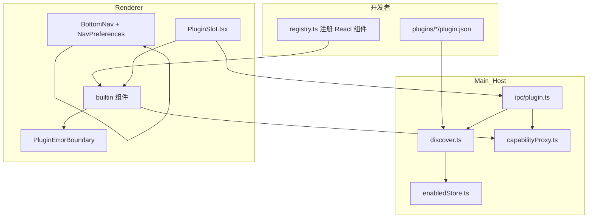

# 插件开发（架构 · 规范 · 规划）

> **状态**：SSOT（2026-07-31）· 加载边界 SPIKE 已交付（`verify:plugin-spike`）· loader 最小闭环已交付（`verify:plugin-loader`）  
> **关联**：[06_ROADMAP](./06_ROADMAP.md) §2–§3（市场 · 会议插件）· **§6**（收费边界）· [04_交互与UI约定](./04_交互与UI约定.md) §2（导航）· [02_技术实现建议](./02_技术实现建议.md) §15.3（AI Capability 扩展）  
> **代码真源**：`src/shared/plugin/types.ts` · `src/shared/navigation/` · `src/main/plugin/` · `src/renderer/src/plugin/` · `plugins/`

---

## 1. 定位

### 1.1 一句话

LanPM 插件体系 = **VS Code 式「扩展中心 + 贡献点（Slot）」**：用户在 **Profile → 扩展** 启停插件；日常在 **业务场景** 消费 Slot 挂载的 UI；数据经 Host **能力白名单** 代理。产品主轴是 **人（聊天）· 事（任务）** — 一切扩展围绕二者加厚，而非替代。

### 1.2 与 VS Code 对照

| VS Code | LanPM |
|---------|-------|
| Extensions 视图（安装 / 启停 / 配置） | Profile → **扩展** Tab（`PluginsPanel`） |
| `contributes.*`（views / menus / commands） | `plugin.json` → **`slots[]`** + **`contributions.views[]`**（Layer C · ✅ v1.74.0） |
| Extension API | `window.lanpm.plugin.invokeCapability`（preload 暴露） |
| `activate()` 跑扩展代码 | **builtin registry** 映射 React 组件（见 §3.2） |
| Command Palette | **未做**（P2 候选） |
| Marketplace | **未做**（ROADMAP P2 · 见 §8.5） |

### 1.3 核心 vs 扩展

| 类别 | 示例 | 规则 |
|------|------|------|
| **永远核心（主轴）** | 聊天、任务实体、`/task` 引用、任务详情、至少一种任务主视图 | **不可关停** · 不可拆卖 |
| **任务透镜（核心 Tab）** | 看板、任务树、甘特、日历 | 同一批「事」的不同看法；**可藏 Tab、可排序**（§3.7） |
| **协作附件 Tab** | 白板、文件 | 围绕项目上下文；**可藏 Tab** |
| **免费扩展模块** | `lanpm.example`、表情包包（规划） | `pricing: free` |
| **可购扩展** | `lanpm.formjs`、规划中的 `lanpm.meeting` | `pricing: paid`；离线许可证闸 **待做** |
| **核心内置 + manifest** | AI 助手 UI（顶栏） | UI 在核心；manifest 用于展示/未来 Slot 对齐 |

收费边界详见 [06_ROADMAP](./06_ROADMAP.md) §6.3：**主路径高频能力必须免费**；小众/重资源可购。

### 1.4 产品原则：人 · 事主轴（拍板）

```
        人（聊天）              事（任务）
            │                      │
            └──────────┬───────────┘
                       │
                一切扩展挂在这上面
                       │
       ┌───────────────┼───────────────┐
       ▼               ▼               ▼
   主题/表情      详情区/工具条      辅助 Tab
  （核心定制）    （插件 Slot）    （可藏可排序）
```

| 层级 | 含义 | 能否关停 |
|------|------|----------|
| **主轴** | 聊天（人）· 任务（事）：群聊、DM、`/task`、任务引用、任务详情、改任务 | **不能关** |
| **任务透镜** | 看板 / 树 / 甘特 / 日历 — 看同一批任务的不同方式 | 可藏 **Tab**，**事仍在**（聊天里仍能 @任务、进详情） |
| **协作附件** | 文件、白板 | 可藏 Tab |
| **定制 & 扩展** | 主题、表情包、详情插件、聊天工具条、会议按钮… | 在主轴上**加厚**，不替代主轴 |

**硬约束（实现与文档须一致）**

1. **`chat` Tab 永远可见**（匿名群仍仅聊天；DM 仅聊天）。  
2. **任务不可从产品中移除**：至少保留「能看任务、能改任务、聊天能引用任务」— 通常 = **看板或任务树至少保留一个入口**（或未来合并为单一「任务」Tab 再分子视图）。  
3. **插件不注册「第二聊天中心 / 第二任务中心」** — 扩展进 Slot，不抢底栏主轴。  
4. **关 Tab ≠ 关能力**：藏起甘特后，任务排期仍可通过其他透镜或聊天上下文访问；深链 `/g/:id/gantt` 须回落默认 Tab 或提示「已在设置中隐藏」。  
5. **群类型约束优先于用户偏好**：职能群、匿名群等 `tabRules` 锁定规则 **不可**被用户设置绕过。

**定制举例（应支持的方向）**

| 用户想要 | 机制 | 不是 |
|----------|------|------|
| 换主题 | 核心亮/暗 + 未来主题令牌 | 可购插件卡脖子 |
| 表情包 | `chat.composer.action` 或内置库 + 可选表情插件 | 新 Tab |
| 任务详情加表单 | `task.detail.section`（已有） | 替代任务详情 |
| 聊天加会议 | `chat.toolbar.media`（规划） | 群顶堆满图标 |
| 不用甘特/白板 | **导航偏好** `hiddenViews` | 删掉任务数据 |
| 看板放第一个 | **导航偏好** `order` | 插件 |

### 1.5 统一扩展中心 vs 贡献点

| 层 | 用户/开发者入口 | 作用 |
|----|-----------------|------|
| **扩展中心（Hub）** | Profile → **扩展**；未来顶栏「扩展」+ 市场 | 发现、启停、权限、安装（P2） |
| **贡献点（Slot）** | `plugin.json` → `slots[]` | 运行时 UI 挂在聊天/任务/看板等场景 |
| **导航偏好** | Profile → **导航与视图**（规划） | Tab 隐藏与排序 — **不是插件** |

开发者心智：**扩展中心管生命周期；manifest 管出现在哪；导航设置管核心 Tab 布局。**

---

## 2. 架构总览



### 2.1 三层职责

| 层 | 负责方 | 职责 |
|----|--------|------|
| **Manifest** | 插件作者 | 声明 `id`、版本、`slots`、`capabilities`、`pricing` |
| **Slot Host** | LanPM 核心 | 在任务详情 / 聊天 / 看板等视图挂载 `<PluginSlot />` |
| **Capability** | LanPM 核心 | `invokePluginCapability` 白名单代理；插件 **禁止** 直连 DB / `ipcMain` |

### 2.2 三层定制模型（灵活性的关键）

| 层 | 名称 | 解决什么 | 典型能力 | 状态 |
|----|------|----------|----------|------|
| **Layer A** | **导航偏好** | 我用哪些核心 Tab、什么顺序 | `hiddenViews` · `order` · 每群覆盖（可选） | 📋 未实现 |
| **Layer B** | **Tab 内 Slot** | 在聊天/任务/看板/甘特 **内部** 加功能 | 会议、表情、表单、导出… | ⚠️ M1：仅 `task.detail.section` |
| **Layer C** | **贡献新 Tab** | 整页插件视图（思维导图、报表…） | `contributions.views[]` | ✅ v1.74.0 |

**不要混用：**

- 用插件「关掉甘特 Tab」→ ❌ 应用 Layer A。  
- 用导航设置「加会议按钮」→ ❌ 应用 Layer B Slot。  
- 用 Layer C 注册 `chat` / `board` 路由取代主轴 → ❌ 违反 §1.4。  
- 在 `ChatView` 里硬编码会议按钮 → ❌ 应挂 `chat.toolbar.media` Slot（§3.5）。

**Tab 内开放性原则（Layer B）**：每个底栏视图 = **薄宿主（ViewHost）** + **若干固定 Slot 区**；业务逻辑进插件，宿主只负责布局、上下文与启停。详见 §3.5。

### 2.3 安全模型（必须遵守）

常量：`PLUGIN_SECURITY_RULES`（`src/shared/plugin/types.ts`）

| 规则 | 含义 |
|------|------|
| `no-renderer-node-integration` | 渲染进程隔离 |
| `no-plugin-ipcMain` | 插件不得注册 IPC |
| `no-direct-sqlite` | 不得直连数据库 |
| `capabilities-via-host-only` | 仅 `invokeCapability` |
| `no-unsigned-remote-code` | 禁止未签名远程代码（市场阶段 enforce） |

**Renderer 不执行 `plugins/` 目录内任意 JS**。UI 须在 `src/renderer/src/plugin/builtins/` 实现并在 `registry.ts` 注册（见 `plugins/README.md`）。

### 2.4 发现与启停

| 路径 | 说明 |
|------|------|
| 内置插件根 | 开发：`仓库/plugins/`；打包：`resources/plugins/` |
| 用户启停状态 | `userData/plugin-enabled.json` |
| 默认策略 | **未配置 → 默认关闭**；官方白名单默认开（`enabledDefaults.ts`） |

当前默认启用：`lanpm.formjs`、`lanpm.ai-assistant`（偏好）。

启停链路：`PluginsPanel` → `setEnabled` → 持久化 → `PLUGIN_ENABLED_CHANGED_EVENT` → `PluginSlot` 重拉。**对已接线 Slot 基本 OK**（`verify:plugin-enable-ui`）。**未接线 Slot 启停无可见效果**；`paid` 不拦授权。

---

## 3. 贡献点（Slot）· Layer B

### 3.1 已定义 Slot（types 真源）

| Slot | 用途 | 接线状态 |
|------|------|----------|
| `task.detail.section` | 任务详情内嵌区 | ✅ `TaskDetailPanel` |
| `chat.toolbar.media` | 聊天输入区媒体工具 | 📋 会议 Sprint |
| `files.preview.action` | 文件预览操作 | 📋 待接 |
| `topbar.menu` | 顶栏跨群工具 | 📋 待接 |
| `group.tab.overflow` | 群级「更多」 | 📋 待接 |
| `profile.tab` | 扩展设置 Tab | 📋 待接 |

### 3.2 按视图扩展地图（规划 · 立项时入 types）

围绕 **人（聊天）** 与 **事（任务）** 扩能力，**不新增主轴 Tab**（P2 整页插件视图另议）。

| 视图 | 规划 Slot | 扩什么 | 主轴关系 |
|------|-----------|--------|----------|
| **聊天** | `chat.toolbar.media` | 会议、语音、投屏 | 人 |
| | `chat.composer.action` | 表情包、模板、机器人 | 人 |
| | `chat.message.action` | 消息菜单：翻译、转任务 | 人 → 事 |
| **任务树** | `task.detail.section` | 右侧详情插件区（与看板共用） | 事 |
| | `tree.toolbar` | 树筛选、批量、视图切换 | 事 |
| **任务详情** | `task.detail.section` | 表单、验收、评审 | 事 |
| **看板** | `board.toolbar` | 筛选、WIP、批量 | 事 |
| | `board.card.footer` | 卡片小部件 | 事 |
| **甘特** | `gantt.toolbar` | 导出、基线 | 事 |
| | `gantt.bar.context` | 条右键扩展 | 事 |
| **日历** | `calendar.toolbar` | 视图切换、导出 | 事 |
| | `calendar.event.action` | 日程条右键 / 快捷操作 | 事 |
| **白板** | `whiteboard.toolbar` | 导出、模板、协作工具 | 附件 |
| **文件** | `files.preview.action` | 预览旁操作 | 附件 |
| | `files.toolbar` | 上传、排序、批量 | 附件 |

### 3.3 Slot 组件契约

```typescript
export type PluginSlotComponentProps = {
  plugin: PluginView
  groupId: string
  taskId: string   // 群级 Slot：PluginGroupSlot 演进后 optional
}
```

`PluginSlot.tsx`：`listSlotPlugins` → `registry` → `PluginErrorBoundary`。

### 3.4 与底栏 Tab 的关系

- 底栏 7 Tab 由 **`VIEW_TABS`**（`paths.ts`）+ **`isViewAllowedForGroup`**（`tabRules.ts`）驱动。  
- 插件 **不替代** BottomNav；在 Tab **内部** 挂 Slot。  
- 用户隐藏甘特 Tab ≠ 卸载甘特插件；插件关闭 ≠ 隐藏核心 Tab。  
- **Tab 内部**的灵活开放见 §3.5；**整页新 Tab** 见 §3.6（Layer C）。

---

## 3.5 Tab 视图宿主与内部开放性（规范）

> **目标**：每个 BottomNav Tab 对应一个 **View Host** — 核心只提供布局骨架与 Slot 锚点；功能增强走插件 Slot，避免在 `ChatView` / `BoardView` 等文件里堆 `if (feature)` 硬编码，方便后续为任意 Tab 接插件。

### 3.5.1 设计原则

| # | 原则 | 说明 |
|---|------|------|
| 1 | **薄宿主、厚 Slot** | 视图负责路由、群上下文、空态/权限；按钮、侧栏、卡片脚标等优先 `<PluginSlotHost />` |
| 2 | **Slot 命名空间** | `{viewId}.{zone}.{语义}`，与 `AppView` 对齐；立项时同步入 `types.ts` |
| 3 | **统一上下文** | `ViewPluginContext` 传递 `groupId` + `view` + 可选 `selection`（见 §3.5.2） |
| 4 | **新 Tab 必带锚点** | 新增核心 Tab 须完成 §3.5.4 检查表，**不得**「先上线再补 Slot」 |
| 5 | **Layer C 底栏合并** | `BottomNav` 在核心 `VIEW_TABS` 之后合并 `contributions.views`（§3.6 · v1.74.0） |

### 3.5.2 视图内区域（Zone）模型

| Zone | 典型 UI 位置 | 挂载方式 | 示例 Slot |
|------|--------------|----------|-----------|
| `toolbar` | 主内容顶栏 / 工具条 | 横向 `PluginSlotHost` 容器 | `board.toolbar` · `gantt.toolbar` |
| `composer` | 输入区附属（聊天等） | 输入框旁图标组 | `chat.composer.action` |
| `detail` | 详情抽屉 / 侧栏 / Modal 内 | 与 `task.detail.section` 同模式 | `task.detail.section` |
| `card` | 看板卡片 / 列表项 chrome | 卡片底部或角标区 | `board.card.footer` |
| `context` | 右键 / 长按菜单（虚拟 Slot） | Host 收集贡献项渲染菜单 | `gantt.bar.context` · `chat.message.action` |
| `preview` | 预览器工具区 | 预览头/尾操作条 | `files.preview.action` |

```typescript
// 规划 · 立项时入 src/shared/plugin/viewHost.ts
export type ViewPluginZone =
  | 'toolbar' | 'composer' | 'detail' | 'card' | 'context' | 'preview'

export type ViewPluginContext = {
  groupId: string
  view: AppView
  /** 随视图变化；群级 Slot 可不传 */
  selection?: {
    taskId?: string
    fileId?: string
    messageId?: string
  }
}

/** PluginSlot 演进：接受 slot id + 统一 context */
export type PluginSlotHostProps = {
  slot: PluginSlotId
  context: ViewPluginContext
}
```

**契约演进**：现有 `PluginSlotComponentProps`（强依赖 `taskId`）→ `ViewPluginContext`；`PluginTaskSlot` / `PluginGroupSlot` 为薄封装，避免每个视图手写 props。

### 3.5.3 各 Tab 宿主 Slot 清单（SSOT）

| `AppView` | 视图组件（真源） | 应接 Slot（zone） | 接线状态 |
|-----------|------------------|-------------------|----------|
| `chat` | `ChatView` | `chat.toolbar.media`（toolbar）· `chat.composer.action`（composer）· `chat.message.action`（context） | ✅ toolbar/composer/context 已接 |
| `board` | `BoardView` | `board.toolbar`（toolbar）· `board.card.footer`（card）· `task.detail.section`（detail · Modal） | ✅ toolbar/card/detail 已接 |
| `tree` | `TreeView` | `tree.toolbar`（toolbar）· `task.detail.section`（detail） | ✅ toolbar · 详情面板已接 |
| `gantt` | `GanttView` | `gantt.toolbar`（toolbar）· `gantt.bar.context`（context） | ✅ toolbar/context 已接 |
| `calendar` | `CalendarView` | `calendar.toolbar`（toolbar）· `calendar.event.action`（context） | ✅ toolbar/context 已接 |
| `whiteboard` | `WhiteboardView` | `whiteboard.toolbar`（toolbar） | ✅ toolbar 已接 |
| `files` | `FilesView` | `files.toolbar`（toolbar）· `files.preview.action`（preview） | ✅ toolbar/preview 已接 |

**反模式（禁止）**

- 在 `ChatView` 直接写「会议」「表情」按钮而不走 Slot — 应迁到 `chat.toolbar.media` / `chat.composer.action`。  
- 看板 `TaskEditModal` 与任务树详情 **能力不一致** — 两处都应挂 `task.detail.section`。  
- 每个视图复制一套 `listSlotPlugins` + 错误边界 — 统一用 `PluginSlotHost`。

### 3.5.4 新 Tab / 视图扩展检查表（开发者）

立项或 PR 时勾选：

- [ ] `paths.ts` 注册 `AppView` + 路由常量  
- [ ] `tabRules.ts` 补充群类型可见性  
- [ ] 视图内至少预留 **toolbar** zone 的 `PluginSlotHost` 锚点（无插件时容器为空即可）  
- [ ] 若有详情/预览/输入区，对应 zone 一并预留  
- [ ] `types.ts` 新增 `PluginSlotId`；本文 §3.1 / §3.5.3 同步  
- [ ] `viewSlotMap.ts`（规划）登记 `view → zones → slotIds`  
- [ ] verify 脚本断言锚点存在（如 `verify:view-slot-hosts`）

### 3.5.5 目标代码结构

```
src/renderer/src/
  views/
    ChatView.tsx           # 薄宿主：布局 + PluginSlotHost×N
    BoardView.tsx
    ...
  plugin/
    PluginSlot.tsx         # 演进 → PluginSlotHost（context 驱动）
    viewSlotMap.ts         # 规划：view ↔ zones ↔ slotIds
    builtins/              # 插件 UI 仍在此注册
```

**现状**：仅 `TaskDetailPanel` 接 `task.detail.section`；其余 Tab **无** Slot 锚点 — 见 §8.3、§12.2。

---

## 3.6 插件贡献新 Tab · Layer C（✅ v1.74.0）

在 Layer B（Tab **内** Slot）之上，允许插件通过 manifest 声明 **整页新 Tab**，出现在底栏（受 Layer A 排序/隐藏与群类型约束）。

### 3.6.1 manifest 扩展（建议）

```json
{
  "id": "lanpm.mindmap",
  "contributions": {
    "views": [{
      "id": "mindmap",
      "route": "mindmap",
      "titleKey": "nav.mindmap",
      "icon": "apartment",
      "groupTypes": ["project"],
      "pricing": "paid"
    }]
  },
  "slots": ["mindmap.toolbar"]
}
```

| 字段 | 说明 |
|------|------|
| `contributions.views[].id` | 稳定视图 id；**不可**占用主轴：`chat` · `board` · `tree` |
| `route` | 与 `paths.ts` 风格一致；深链 `/g/:groupId/mindmap` |
| `groupTypes` | 可选；默认继承 `tabRules` 校验 |
| 视图组件 | 仍在 `builtins/` + `registry.ts` 注册（与 Slot 相同，M1 无 drop-in） |

### 3.6.2 底栏合并规则

```
BottomNav 最终列表 =
  核心 VIEW_TABS（Layer A 过滤排序）
  ∪ 已启用插件的 contributions.views（去重、校验 route）
  → 再应用 tabRules ∩ NavPreferences
```

- 插件 Tab **不能**插入在 `chat` 之前或替代任务主入口。  
- 用户可在 Layer A 隐藏插件 Tab（与藏甘特同理），不等于卸载插件。  
- 插件 Tab 内部仍遵守 §3.5：须自带 `toolbar` 等 zone 锚点。

### 3.6.3 与主轴的关系

| 允许 | 禁止 |
|------|------|
| 思维导图、报表、自定义看板透镜 | 第二聊天中心、第二任务中心 |
| 围绕 `groupId` 的整页工具 | 绕过 `tabRules` 的匿名群全功能 Tab |
| `pricing: paid` + 许可证闸 | 未签名远程整页加载 |

---

## 3.7 导航与 Tab 定制 · Layer A（规划）

### 3.7.1 配置粒度

| 粒度 | 场景 | 存储（建议） |
|------|------|--------------|
| **用户全局** | 「我从不用白板」 | `userData/nav-preferences.json` |
| **每群覆盖**（P2 可选） | 「本群只要聊天+看板」 | 群 meta / SQLite |

### 3.7.2 数据模型（建议）

```typescript
type AppView =
  | 'chat' | 'board' | 'tree' | 'gantt'
  | 'calendar' | 'whiteboard' | 'files'

type NavPreferences = {
  /** 隐藏的核心 Tab（仍受 §1.4 与群类型约束） */
  hiddenViews: AppView[]
  /** 可见 Tab 的显示顺序 */
  order: AppView[]
}
```

### 3.7.3 渲染规则

```
BottomNav 最终列表 =
  群类型允许（tabRules）
  ∩ 主轴不可隐藏（chat + 至少一种任务入口）
  ∩ 用户 hiddenViews
  → 按 order 排序
```

| Tab | 用户可隐藏？ | 备注 |
|-----|--------------|------|
| `chat` | **否** | 人 · 主轴 |
| `board` / `tree` | **至少保留其一** | 事 · 主入口（产品可合并为一个「任务」Tab） |
| `gantt` / `calendar` | 是 | 任务透镜 |
| `whiteboard` / `files` | 是 | 附件（职能群 files 仍受群类型约束） |

### 3.7.4 设置入口（产品）

- Profile → **「导航与视图」**：拖拽排序 + 开关（与 **「扩展」** Tab 分离）。  
- 深链落到已隐藏 Tab：重定向默认视图或 Toast 说明。

**代码现状**：`VIEW_TABS` 固定顺序；**无** `NavPreferences` — 见 §8.4、§12.2。

---

## 4. 能力（Capability）· Extension API

### 4.1 已实现白名单

| Capability | 参数 | 说明 |
|------------|------|------|
| `task.get` | `{ taskId }` | 单任务 |
| `task.list` | `{ groupId }` | 群任务列表 |
| `group.get` | `{ groupId }` | 群元数据 |
| `file.listMeta` | `{ groupId }` | 文件元数据（无内容） |
| `chat.listMessages` | `{ groupId, beforeLamportTs? }` | 最近一页聊天；可选更早分页 |
| `task.getChecklist` | `{ groupId, taskId }` | 任务验收清单 + 进度 |
| `member.list` | `{ groupId }` | 群成员（含 presence） |
| `chat.sendTaskRef` | `{ groupId, taskId }` | 受控发送任务引用消息 |

```typescript
await getLanpmApi().plugin.invokeCapability(plugin.id, 'task.get', { taskId })
```

Host 校验：插件存在 → 已启用 → manifest 已声明 capability。

### 4.2 规划中的能力（按视图 · 立项入 types）

| 层级 | 视图 | 候选 Capability | 风险 |
|------|------|-----------------|------|
| 读 | 任务 | `task.getChecklist` | 低 · **v0.2 ✅** |
| 读 | 聊天 | `chat.listMessages` | 低 · **v0.2 ✅** |
| 读 | 成员 | `member.list` | 低 · **v0.2 ✅** |
| 写 | 任务 | `task.patch` · `task.create` | 中 · 建议人审 |
| 写 | 聊天 | `chat.sendText` · `chat.sendTaskRef` | 中高 · **`chat.sendTaskRef` v0.2 ✅** |
| 写 | 文件 | `file.upload` | 中高 |
| AI | — | `ai.streamChat` · `chat.sendMarkdown` | 中 · [02](./02_技术实现建议.md) §15.3 |
| 媒体 | 聊天 | `media.signal.*` · `media.captureDesktop` | 高 · Main 代理 |
| 授权 | — | `license.feature` | 产品 · 拦 `paid` |

**原则**：不开放完整 `LanpmApi`；写操作默认确认/人审；返回值逐步类型化（少 `unknown`）。

### 4.3 新增 Capability 流程

1. `types.ts` + `PLUGIN_CAPABILITY_IDS`  
2. `capabilityProxy.ts` 实现  
3. 更新本文 §4 + verify  
4. manifest 声明后方可调用  

### 4.4 Extension API 版本路线

| 版本 | 范围 | 状态 |
|------|------|------|
| **v0.1** | 4 个只读 capability + `task.detail.section` | ✅ M1 |
| **v0.2** | 聊天/看板读 + `chat.sendTaskRef`；`chat.toolbar.media` | ✅ v1.72.0 · `verify:extension-api-v0.2` |
| **v0.3** | `task.patch` · `board.*` · `gantt.toolbar` Slot | 📋 |
| **v0.4** | `license.feature` · 侧载格式 | 📋 P1–P2 |
| **v1.0** | 市场 + 签名 + `commands[]` 命令面板 | 📋 P2 |

---

## 5. `plugin.json` 规范

### 5.1 Schema

| 字段 | 必填 | 说明 |
|------|------|------|
| `id` | ✅ | 稳定 id，如 `lanpm.formjs` |
| `name` · `version` | ✅ | 展示名 · semver |
| `slots` | ✅ | `PluginSlotId[]`，至少一项 |
| `capabilities` | ✅ | 可为 `[]` |
| `pricing` | ✅ | `free` \| `paid` |
| `engines.lanpm` | 可选 | 宿主 semver |

非法 manifest **静默跳过**（`validateManifest.ts`）。

### 5.2 最小示例

见 `plugins/lanpm.example/plugin.json`。

### 5.3 官方插件清单

| id | Slot | pricing | 默认启用 | UI |
|----|------|---------|----------|-----|
| `lanpm.example` | `task.detail.section` | free | 否 | `ExampleStub` |
| `lanpm.formjs` | `task.detail.section` | paid | 是 | `FormJsPoc` |
| `lanpm.meeting` | `chat.toolbar.media` | paid | 否 | `MeetingStub` |
| `lanpm.ai-assistant` | （manifest 含未白名单 cap，发现跳过） | free | 是 | 核心 `AiAssistantShell` |

---

## 6. 开发者流程

### 6.1 合入式插件（当前唯一路径）

```
plugins/<dir>/plugin.json
→ builtins/<Name>.tsx
→ registry.ts
→ i18n · verify:plugin-*
→ PR
```

### 6.2 选型检查表

- [ ] 符合 §1.4 主轴（不替代聊天/任务）  
- [ ] Slot 匹配 §3.2 视图地图 · 新视图完成 §3.5.4 检查表  
- [ ] capabilities 最小权限  
- [ ] 仅 `getLanpmApi().plugin.*`  
- [ ] 已注册 `registry.ts`  

### 6.3 IPC 面

`listPlugins` · `listSlotPlugins` · `setEnabled` · `invokeCapability` — 见 `shared/plugin/channels.ts`。

---

## 7. 用户消费路径

### 7.1 插件三步

| 步骤 | 动作 |
|------|------|
| 拿到 | 随客户端 / 未来市场安装 |
| 打开 | Profile → **扩展** 启停 |
| 使用 | 进入场景（任务详情、聊天工具栏…）自动出现 |

### 7.2 定制三步（含 Layer A）

| 步骤 | 动作 |
|------|------|
| 主题 | 顶栏/设置切换亮暗（核心）；未来主题包 |
| Tab 布局 | Profile → **导航与视图**（规划）：藏甘特/白板、排序 |
| 扩展能力 | Profile → **扩展**：会议、表单、表情… |

### 7.3 示例

- **form-js**：任务树 → 详情 → 「扩展（插件）」区块  
- **AI**：顶栏「AI 助手」（核心 Shell）  
- **会议（规划）**：聊天输入旁 → `chat.toolbar.media`  
- **表情（规划）**：输入区 → `chat.composer.action`  

---

## 8. 生态与成熟度

### 8.1 阶段路线

| 阶段 | 能力 | 状态 |
|------|------|------|
| **M1** | 发现 · 单 Slot · 只读 capability · Profile 插件启停 | ✅ |
| **M1.5** | **ViewHost 标准化**（§3.5）· 各 Tab 预留 Slot 锚点 · `ViewPluginContext` | 📋 |
| **M1.6** | **导航偏好** · 多视图 Slot 接线 · 看板详情 PluginSlot | 📋 |
| **M2** | `chat.toolbar.media` · 会议 · Extension API v0.2 | 📋 |
| **M3** | `board.*` / `gantt.*` Slot · API v0.3 | 📋 |
| **M4** | `contributions.views`（Layer C）· 命令面板 · `commands[]` | Layer C ✅ · 命令面板 📋 P2 |
| **M5** | **插件市场** · 侧载 · 签名 · 离线许可证 | 侧载+许可 POC ✅ v1.75.0 · 商店 📋 P2 |

### 8.2 插件市场（P1 POC ✅ · 商店 P2）

对齐 [06_ROADMAP](./06_ROADMAP.md) §2 · 本节 §12（Electron 生存 · 市场）。

| 形态 | 说明 |
|------|------|
| 公开市场 | 浏览、购买、更新、签名校验 |
| 内网私有源 | **不依赖公网** · 离线许可证 · 信创刚需 |
| 原则 | 市场是 **M8 战略差异**；排在功能/美观领先之后；空壳商店无意义 |

阶段：**P1 侧载 + 授权 POC ✅ v1.75.0** → P2 商店 UI + 私有源 → 受控第三方上架。

### 8.2.1 侧载格式（v1.75.0 POC）

| 项 | 约定 |
|----|------|
| 目录 | `userData/sideload-plugins/<dirName>/`（镜像 `plugins/` 布局） |
| 必需 | `plugin.json`（同内置 manifest 校验） |
| 签名 | 同目录 `signature.json`：`ed25519` · `manifestSha256` · `signature`（base64） |
| 开发跳过 | `LANPM_PLUGIN_SKIP_VERIFY=1` 或测试环境 |
| 许可 | `userData/plugin-licenses.json` · Profile 导入 · `license.feature` |

### 8.2.2 离线许可证策略（v1.76.0）

| 项 | 约定 |
|----|------|
| 格式 | `SignedPluginLicense`：`version` · `machineId` · `issuedAt` · `term` · `grants[]` · `algorithm` · `signature` |
| 粒度 | **整插件** — 每条 grant 一个 `pluginId`，`features: ["license.feature"]` |
| 试用 | `term: "trial"` · **90 天**（`expiresAt = issuedAt + 90d`） |
| 永久 | `term: "perpetual"` · 无 `expiresAt` |
| 机器 | 文件级 `machineId`（`sha256:` + 平台稳定 ID）；换机须重新 `collect` / `issue` |
| 签名 | Ed25519；Host 内置签发公钥；**仅签名文件可导入** |
| 工具 | `tools/lanpm-license/` — `collect` · `issue` · `verify`（CMake + OpenSSL） |
| 开发跳过 | `LANPM_LICENSE_SKIP_VERIFY=1`（勿用于生产） |

```bash
lanpm-license collect -o machine-request.json
lanpm-license issue --request machine-request.json --plugin lanpm.formjs \
  --term trial --key issuer-private.pem -o license.json
```

### 8.3 当前缺口

| 缺口 | 影响 |
|------|------|
| 无 **ViewHost** 规范落地 | 各 Tab 无法一致接插件；硬编码功能难拆 |
| 无 `ViewPluginContext` / `PluginSlotHost` | 群级 Slot 仍被迫传 `taskId` |
| 无 `viewSlotMap.ts` | 视图 ↔ Slot 关系仅文档，无代码真源 |
| 无 `NavPreferences` | Tab 不可藏、不可排序 |
| 仅 `task.detail.section` 接线 | 聊天/看板/甘特扩展无处挂 |
| 看板 `TaskEditModal` 无 `PluginSlot` | 入口不一致 |
| 仅 4 个只读 capability | 无法写任务/发消息 |
| ~~`paid` 无许可证闸~~ | ✅ v1.75.0 `license.feature` + 离线导入 |
| 须合入 registry | 第三方不能 drop-in |
| ai-assistant manifest 与 types 不一致 | 需对齐 |

### 8.4 当前成熟度自检

| 维度 | 结论 |
|------|------|
| **是否「最灵活」终态？** | **否** — 是可验证的 **M1 底座** |
| **插件启停** | ✅ Profile 开关 + 持久化 + Slot 刷新（已接线处） |
| **Tab 启停/排序** | ❌ 未做（Layer A） |
| **Tab 内开放性** | ⚠️ §3.5 已规范；7 个视图仅 1 处接线 |
| **按视图扩展** | ⚠️ Slot 地图 + Zone 模型已文档化；代码几乎未接 |
| **插件贡献新 Tab** | ✅ Layer C · `verify:contributions-views` · v1.74.0 |
| **第三方自助** | ❌ 须 PR 合入 registry；市场 P2 |

---

## 9. 验收与守护

| 脚本 | 用途 |
|------|------|
| `verify:plugin-spike` | 安全基线 |
| `verify:plugin-loader` | loader · Slot |
| `verify:plugin-enable-ui` | Profile 启停 |
| `verify:meeting-spike` | 会议架构 |
| `verify:meeting-plugin` | 会议 stub · 媒体 capability · 语音面板 Slot |
| `verify:meeting-mesh-poc` | Lite mesh POC · `media_signal` · RTCPeerConnection · 投屏代理 |
| `verify:media-signal` | 媒体信令房间注册表 · inbox 往返 |
| `verify:view-slot-hosts` | §3.5 各 Tab Slot 锚点 |
| `verify:nav-preferences` | Layer A 导航偏好 MVP |
| `verify:plugin-market-spike` | 侧载 · 签名 · 离线许可证 POC |
| `verify:offline-license-cli` | 签名许可证 · CLI · 试用/永久策略 |

---

## 10. 相关文档

| 文档 | 内容 |
|------|------|
| [06_ROADMAP](./06_ROADMAP.md) | 排期 SSOT |
| [06_ROADMAP](./06_ROADMAP.md) §6 · 本节 §12 | 收费 · 市场 |
| [04_交互与UI约定](./04_交互与UI约定.md) §2 | BottomNav |
| [02_技术实现建议](./02_技术实现建议.md) §15.3 | AI Capability |

---

## 11. 文档维护

- §1.4 主轴原则变更须产品确认。  
- Slot / Capability / ViewHost：**同步** `types.ts` 与 §3–§4。  
- 导航偏好立项：**更新** §3.7 与 `04` §2。  
- 新增核心 Tab：**必须**更新 §3.5.3 并完成 §3.5.4 检查表。  
- Sprint 候选：**§12**；`plan.md` 只链本文。  

---

## 12. Sprint 候选与排期

> **SSOT**：插件与导航扩展相关未立项 Sprint。`.cursorGrowth/plan.md` 插件项已迁入本节。

### 12.1 候选队列（未立项）

| 候选 Sprint | Goal | 优先级 |
|-------------|------|--------|
| **ViewHost 标准化** | `ViewPluginContext` · `PluginSlotHost` · `viewSlotMap.ts` · 7 个核心 Tab 预留 toolbar（及已有 zone）锚点 · `verify:view-slot-hosts` | **P1 · 多视图接线前置** |
| **导航偏好 MVP** | `NavPreferences` · BottomNav 读配置 · Profile「导航与视图」拖拽+开关 · 主轴硬约束 · `verify:nav-preferences` | **P1 · 与会议并行** |
| **会议实现** | `chat.toolbar.media` + `lanpm.meeting` + 媒体 capability | **P1** |
| **多视图 Slot 接线** | 在 ViewHost 锚点上接 `board.toolbar` · `gantt.toolbar` · 看板 `TaskEditModal` PluginSlot | P1 |
| **Extension API v0.2** | 聊天/任务读 + 受控写 capability 清单 | P1 |
| **form-js 真库** | `@bpmn-io/form-js` 不进核心 deps | P1 |
| **思维导图插件** | mind-elixir · Layer C `contributions.views` 或 Tab 内 Slot | P1–P2 |
| **插件市场** | 签名 · 商店 · 侧载 · 离线许可证 | **P2 · M8** |

**建议顺序**：ViewHost 标准化 → 导航偏好 MVP ∥ 会议实现 → 多视图 Slot 接线 + API v0.2 → form-js → 思维导图（Layer C）→ 市场 SPIKE。

### 12.2 导航偏好 MVP（详纲）

| 项 | 交付 |
|----|------|
| 模型 | `NavPreferences` · `userData/nav-preferences.json` |
| 规则 | §1.4：`chat` 不可藏；`board`/`tree` 至少留一；`tabRules` 优先 |
| UI | Profile「导航与视图」：列表拖拽 + Switch |
| 宿主 | `BottomNav` 用 `order`/`hiddenViews` 过滤 `VIEW_TABS` |
| 深链 | 隐藏 Tab 的 URL 回落或提示 |
| 验收 | `verify:nav-preferences` |

**Out of scope**：每群覆盖 · 插件注册新 Tab（属 Layer C · §12.6）。

### 12.3 ViewHost 标准化 Sprint（详纲）

| 项 | 交付 |
|----|------|
| 类型 | `src/shared/plugin/viewHost.ts`：`ViewPluginContext` · `ViewPluginZone` |
| 组件 | `PluginSlotHost`（演进 `PluginSlot`）；`PluginGroupSlot` 不再强依赖 `taskId` |
| 地图 | `viewSlotMap.ts`：7 个 `AppView` → zones → `PluginSlotId[]` |
| 锚点 | 各 `*View.tsx` 预留空 `PluginSlotHost`（至少 `toolbar` zone） |
| 验收 | `verify:view-slot-hosts`：断言每个核心视图存在约定 data-slot 锚点 |

**Out of scope**：具体插件 UI · Layer C 动态底栏 · 写 capability。

### 12.4 会议实现 Sprint（详纲）

Goal：扩展媒体 Slot/capability + `lanpm.meeting` stub + 聊天 `voice` → `chat.toolbar.media`。

TASK 提纲：扩展 types → `PluginGroupSlot` + `ChatView` 接线 → manifest + registry → capability 代理（可 stub）→ 替换 `voiceComingSoon` → `verify:meeting-plugin`。

详见原 SPIKE-376 · `archive/20260714_214500_meeting_plugin_spike.md`。

### 12.5 form-js · 市场 · 思维导图

- **form-js**：`FormJsView` 真库 + `FormJsPoc` 降级；Slot 不变；`verify:formjs-plugin` ✅ v1.73.0
- **市场**：侧载+`license.feature` ✅ v1.75.0；P2 商店+私有源；`.lanpm-plugin` zip 安装后续  
- **思维导图**：`lanpm.mindmap` · Layer C `contributions.views` + `mindmap.toolbar` · `verify:contributions-views` ✅ v1.74.0

### 12.6 Layer C · 贡献新 Tab（✅ v1.74.0）

| 项 | 交付 |
|----|------|
| manifest | `contributions.views[]` 校验 · 保留路由黑名单 |
| 路由 | 动态注册 `/g/:groupId/:pluginView` |
| 底栏 | `BottomNav` 合并已启用插件 views（在 Layer A 之后） |
| 宿主 | 插件整页视图同样遵守 §3.5 Zone 模型 |
| 验收 | `verify:contributions-views` ✅ |

### 12.7 已交付 Sprint（摘要）

| Sprint | 版本 | 验收 |
|--------|------|------|
| PLUGIN-SPIKE | v1.19 | `verify:plugin-spike` |
| form-js-real | v1.73.0 | `verify:formjs-plugin` |
| mindmap-layer-c | v1.74.0 | `verify:contributions-views` |
| plugin-market-spike | v1.75.0 | `verify:plugin-market-spike` |
| PLUGIN-ENABLE-UI | v1.23 | `verify:plugin-enable-ui` |
| MEETING-PLUGIN-SPIKE | v1.30.1 | `verify:meeting-spike` |
