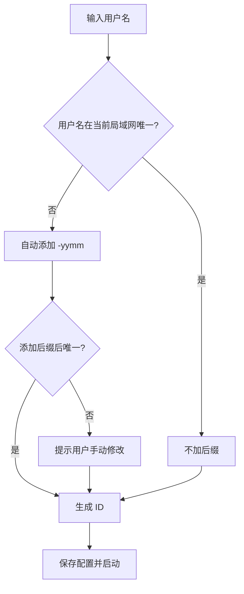

# LanPM 需求文档（分布式局域网协作客户端 v2.0）

> 基于 Electron 的局域网/VPN 协作工具 | 融合即时通讯 + 项目管理 + 文件共享

---

## 1. 产品概述

### 1.1 产品定位

一款**分布式局域网协作客户端**，对标飞秋/飞鸽传书的即时通讯能力，同时融合项目管理（看板/任务树/甘特图）与企业级功能（驾驶舱/AI 评估）。**无中心服务器**，所有数据在群组内点对点同步。

### 1.2 核心理念

```
┌─────────────────────────────────────────────────────────────┐
│                                                             │
│   即时通讯（飞秋/飞鸽体验） + 项目管理（看板/树/甘特）           │
│                          +                                  │
│              文件共享 + 领导驾驶舱 + AI 辅助                   │
│                                                             │
│   所有数据在局域网内传输，不依赖互联网                          │
│                                                             │
└─────────────────────────────────────────────────────────────┘
```

### 1.3 技术栈


| 层级   | 技术选型                            | 理由            |
| ---- | ------------------------------- | ------------- |
| 桌面框架 | Electron                        | 成熟稳定，支持插件扩展   |
| 前端框架 | Vue 3 / React 18                | 待定，根据团队偏好     |
| 本地存储 | IndexedDB + SQLite              | 支持大量离线数据      |
| 网络通信 | WebRTC (P2P) + UDP 广播           | 局域网发现 + 点对点传输 |
| 数据同步 | CRDT (Yjs)                      | 分布式最终一致性      |
| 加密   | Node.js Crypto (AES-256-GCM)    | 局域网传输加密       |
| 文件预览 | Office Web Viewer / LibreOffice | Office 文件本地预览 |


---

## 2. 用户场景与角色


| 角色    | 典型场景           | 核心需求      |
| ----- | -------------- | --------- |
| 团队成员  | 日常沟通、任务跟进、文件分享 | 聊天、看板、文件  |
| 项目经理  | 进度跟踪、任务分配      | 任务树、甘特图   |
| 部门主管  | 跨项目监控、汇报       | 驾驶舱、周报/月报 |
| 多设备用户 | 办公本+笔记本同时使用    | 同一身份多端登录  |
| 开发人员  | 分享代码片段         | 代码高亮分享    |


---

## 3. 用户标识与身份

### 3.1 唯一标识规则

> **核心原则**：同一用户可在多台电脑登录，视为同一人


| 字段    | 说明           | 示例                  |
| ----- | ------------ | ------------------- |
| 用户名   | 显示名称         | 张三                  |
| 后缀    | 可选，用于区分同名用户  | `-87`、`-93`、`-2401` |
| 完整显示名 | 用户名 + 后缀（如有） | 张三 / 张三-87          |
| 设备列表  | 该用户的所有登录设备   | 办公本、笔记本             |
| 在线状态  | 任一设备在线即为在线   | ✅ / ❌               |


### 3.2 后缀生成规则


| 场景           | 处理方式                               |
| ------------ | ---------------------------------- |
| 首次注册时用户名未被占用 | 不加后缀                               |
| 首次注册时用户名已存在  | 自动添加 `-yymm`（如 `-2401` 表示 2024年1月） |
| 用户手动修改       | 允许，但需保证群组内唯一                       |


### 3.3 ID 结构示例

```javascript
{
  "userId": "zhangsan",                    // 唯一标识（含后缀）
  "displayName": "张三-87",                 // 显示名称
  "suffix": "-87",                         // 后缀（可选）
  "devices": [
    { "deviceId": "office-pc", "name": "办公本", "lastSeen": "2026-01-10" },
    { "deviceId": "laptop", "name": "笔记本", "lastSeen": "2026-01-09" }
  ],
  "online": true                           // 任一设备在线
}
```

---

## 4. 首次启动配置

> 首次打开客户端时弹出配置向导，必须完成后方可使用

### 4.1 配置步骤

```
┌─────────────────────────────────────────┐
│           欢迎使用 LanPM                │
├─────────────────────────────────────────┤
│                                         │
│  用户名： [张三            ]            │
│                                         │
│  设备名称：[办公本           ]           │
│                                         │
│  部门（可选）：[研发部          ]        │
│                                         │
│  头像：  [🎨 随机生成]  [📁 上传]        │
│                                         │
│         [    完成    ]                  │
└─────────────────────────────────────────┘
```

### 4.2 配置字段


| 字段   | 必填  | 说明            |
| ---- | --- | ------------- |
| 用户名  | ✅   | 显示名称，2-20 个字符 |
| 设备名称 | ✅   | 用于区分自己的多台电脑   |
| 部门   | ❌   | 用于驾驶舱的部门视图    |
| 头像   | ❌   | 自动生成或上传       |


### 4.3 生成 ID 流程




---

## 5. 主界面布局

### 5.1 整体结构

```
┌─────────────────────────────────────────────────────────────────┐
│  [Logo]  [项目▼]  [驾驶舱]   🔍 全局搜索...   [🌙] [🌐] [👤 张三] │ ← 顶部栏
├─────────────────────────────────────────────────────────────────┤
│                                                                 │
│                        主内容区域                                │
│                                                                 │
│   第一维度：项目 / 职能群组 / 匿名群组 / 驾驶舱                    │
│   第二维度：聊天 | 看板 | 任务树 | 甘特图 | 文件                   │
│                                                                 │
├─────────────────────────────────────────────────────────────────┤
│   💬 聊天   📋 看板   🌲 任务树   📊 甘特图   📁 文件              │ ← 底部导航
└─────────────────────────────────────────────────────────────────┘
```

### 5.2 顶部栏详解


| 元素   | 功能                 | 交互         |
| ---- | ------------------ | ---------- |
| Logo | 返回默认视图（上次使用的项目+聊天） | 点击         |
| 项目下拉 | 切换项目/职能群组/匿名群组     | 下拉选择       |
| 驾驶舱  | 快捷进入领导驾驶舱          | 点击         |
| 全局搜索 | 搜索任务/消息/文件/成员      | 输入关键词，实时过滤 |
| 主题切换 | 亮色/暗色模式            | 点击切换，记住偏好  |
| 语言切换 | 中文/英文              | 下拉选择       |
| 个人信息 | 头像+用户名             | 点击弹出配置面板   |


### 5.3 底部导航（5 大视图）


| 图标  | 视图  | 功能定位         |
| --- | --- | ------------ |
| 💬  | 聊天  | 即时通讯，群聊/私聊   |
| 📋  | 看板  | 任务状态流转       |
| 🌲  | 任务树 | 层级任务结构       |
| 📊  | 甘特图 | 任务时间轴与进度     |
| 📁  | 文件  | 群组文件库 + 网址书签 |


---

## 6. 聊天模块

### 6.1 界面布局

```
┌─────────────────────┬───────────────────────────────────────────┐
│     成员列表         │              聊天消息区域                  │
│                     │                                           │
│  🟢 张三            │  ┌─────────────────────────────────────┐  │
│  🟢 张三-87         │  │ [10:30] 张三：这个任务我来做         │  │
│  🟡 李四            │  │                                     │  │
│  ⚪ 王五            │  │ [10:32] 李四：收到，需要协助吗       │  │
│                     │  │                                     │  │
│  ─────────────────  │  │ ```javascript                      │  │
│  在线: 2/4          │  │ function hello() {                 │  │
│                     │  │   console.log("code")              │  │
│                     │  │ }                                  │  │
│                     │  │ ```                                │  │
│                     │  │                                     │  │
│                     │  │ [📎 附件] [💻 代码] [✅ 创建任务]     │  │
│                     │  │                                     │  │
│                     │  │ 输入框...                    [发送]  │  │
│                     │  └─────────────────────────────────────┘  │
└─────────────────────┴───────────────────────────────────────────┘
```

### 6.2 成员列表


| 功能     | 说明                            |
| ------ | ----------------------------- |
| 显示所有成员 | 显示完整显示名（含后缀）                  |
| 在线状态   | 🟢 在线（至少一台设备在线）/ 🟡 离开 / ⚪ 离线 |
| 多设备标识  | 鼠标悬停显示该用户的所有设备                |
| 右键菜单   | 发起私聊、@提及、查看资料                 |


### 6.3 聊天消息


| 功能     | 说明                    |
| ------ | --------------------- |
| 文本消息   | 支持表情、@提及              |
| 代码分享   | 支持语法高亮（自动识别语言）        |
| 文件发送   | 拖拽或点击上传，局域网点对点传输      |
| 快捷创建任务 | 输入框内输入 `/task` 快速创建任务 |
| 消息已读回执 | ✅ 显示双灰勾（已发送）/ 双蓝勾（已读） |
| 桌面通知   | 新消息/@提及 时弹出通知         |


### 6.4 代码分享详解

```javascript
// 发送代码块示例
const codeBlock = {
  language: 'javascript',  // 自动检测或手动选择
  code: `function hello() {
  console.log("Hello LanPM");
}`,
  theme: 'dark'            // 跟随编辑器主题
}
```

**支持的语言**：JavaScript/TypeScript/Python/Java/Go/Rust/HTML/CSS/JSON/Shell 等主流语言

### 6.5 消息已读回执


| 状态  | 图标  | 说明       |
| --- | --- | -------- |
| 发送中 | ⏳   | 正在传输     |
| 已发送 | ✅   | 已送达对方客户端 |
| 已读  | ✅✅  | 对方已阅读消息  |


---

## 7. 看板模块（Kanban）

### 7.1 状态列


| 列名  | 英文          | 说明        |
| --- | ----------- | --------- |
| 待办  | TODO        | 未开始的任务    |
| 进行中 | IN PROGRESS | 正在处理的任务   |
| 已完成 | DONE        | 已完成的任务    |
| 其他  | OTHER       | 阻塞/待评审/搁置 |


### 7.2 卡片信息

```
┌─────────────────┐
│ 📋 任务标题      │
│ 👤 张三         │
│ 📅 2026-01-15   │
│ 🏷️ 标签         │
└─────────────────┘
```

### 7.3 交互功能


| 功能   | 说明                       |
| ---- | ------------------------ |
| 拖拽移动 | 跨列拖拽改变状态                 |
| 新增卡片 | 每列底部有「+ 添加任务」按钮          |
| 编辑卡片 | 双击卡片编辑详情（标题/负责人/截止日期/标签） |
| 删除卡片 | 右键菜单或拖拽至垃圾桶              |
| 实时同步 | 任何操作立即同步至群组所有成员          |


### 7.4 拖拽规则


| 来源          | 目标          | 结果                 |
| ----------- | ----------- | ------------------ |
| TODO        | IN PROGRESS | 状态改为 `doing`       |
| TODO        | DONE        | 状态改为 `done`        |
| IN PROGRESS | DONE        | 状态改为 `done`        |
| DONE        | TODO        | 重新打开任务             |
| ANY         | OTHER       | 状态改为 `other`，需填写原因 |


---

## 8. 任务树模块

### 8.1 界面示例

```
📁 项目：LanPM 开发
├── 📋 M1：基础框架 (张三 · 100%) ✅
│   ├── 📋 搭建 Electron 项目 (张三 · 100%) ✅
│   ├── 📋 实现主布局 (李四 · 80%) 🔄
│   └── 📋 首次配置向导 (王五 · 0%) ⏳
├── 📋 M2：聊天模块 (张三 · 50%) 🔄
│   ├── 📋 成员列表 (李四 · 100%) ✅
│   ├── 📋 消息收发 (王五 · 30%) 🔄
│   └── 📋 代码高亮 (赵六 · 0%) ⏳
└── 📋 M3：看板模块 (未开始) ⏳
```

### 8.2 功能清单


| 功能    | 说明                           |
| ----- | ---------------------------- |
| 树形展示  | 展示父子层级关系                     |
| 展开/折叠 | 点击箭头展开或折叠子任务                 |
| 进度显示  | 子任务完成比例自动汇总到父任务              |
| 状态标识  | ✅ 完成 / 🔄 进行中 / ⏳ 待办 / ⚠️ 阻塞 |
| 右键菜单  | 新增子任务、编辑、删除、移动               |
| 搜索高亮  | 全局搜索结果在树中高亮显示                |


### 8.3 任务详情面板（点击后右侧弹出）

```
┌─────────────────────────────────┐
│ 任务：搭建 Electron 项目        │
├─────────────────────────────────┤
│ 负责人：[张三 ▼]                │
│ 状态：  [已完成 ▼]              │
│ 优先级：[高 ▼]                  │
│ 截止日期：[2026-01-10]          │
│ 描述：                          │
│ ┌─────────────────────────────┐ │
│ │ 使用 Electron Forge 初始化   │ │
│ │ 配置打包和更新              │ │
│ └─────────────────────────────┘ │
│ 子任务：3个 (全部完成)           │
│ 关联文件：[📄 package.json]      │
│                                 │
│ [保存] [删除] [关闭]             │
└─────────────────────────────────┘
```

---

## 9. 甘特图模块

### 9.1 界面示例

```
┌────────────┬──────────┬──────────┬──────────┬──────────┬──────────┐
│ 任务名称    │ 负责人   │ 开始日期  │ 结束日期  │ 进度    │ 时间轴   │
├────────────┼──────────┼──────────┼──────────┼──────────┼─────────────────▶
│ M1 基础框架 │ 张三     │ 01-01    │ 01-10    │ 100%    │ ████████░░  │
│ M2 聊天模块 │ 李四     │ 01-05    │ 01-20    │ 50%     │ ████░░░░░░  │
│ M3 看板     │ 王五     │ 01-10    │ 01-25    │ 20%     │ ██░░░░░░░░  │
│ M4 任务树   │ 赵六     │ 01-15    │ 01-30    │ 0%      │ ░░░░░░░░░░  │
└────────────┴──────────┴──────────┴──────────┴──────────┴─────────────────▶
              01-01      01-08      01-15      01-22      01-29
```

### 9.2 功能清单


| 功能   | 说明                   |
| ---- | -------------------- |
| 时间轴  | 日/周/月 视图切换           |
| 拖拽调整 | 拖拽任务条调整起止时间          |
| 进度显示 | 进度百分比 + 视觉填充         |
| 依赖连线 | 任务间依赖关系（FS/SS/FF/SF） |
| 里程碑  | 标记关键节点（菱形图标）         |
| 缩放   | 时间轴缩放（Ctrl+滚轮）       |
| 导出   | 导出为 PNG/PDF          |


### 9.3 依赖类型


| 类型  | 含义    | 示例             |
| --- | ----- | -------------- |
| FS  | 完成-开始 | 任务A完成后，任务B才能开始 |
| SS  | 开始-开始 | 任务A开始时，任务B同时开始 |
| FF  | 完成-完成 | 任务A完成时，任务B才完成  |
| SF  | 开始-完成 | 任务A开始时，任务B才完成  |


---

## 10. 文件模块

### 10.1 界面布局

```
┌──────────┬─────────────────────────────────────────────────────┐
│  类型筛选 │                 文件列表                            │
├──────────┼─────────────────────────────────────────────────────┤
│ 📁 全部   │ 📄 需求文档.docx   张三  01-10   [预览] [下载]       │
│ 📄 文档   │ 📊 项目计划.xlsx   李四  01-09   [预览] [下载]       │
│ 🖼️ 图片   │ 🖼️ 架构图.png      王五  01-08   [预览] [下载]       │
│ 🎬 视频   │ 🔗 内网 Wiki      系统  01-07   [打开] [编辑]       │
│ 🔗 网址   │ 💻 code.js         赵六  01-06   [预览] [复制]       │
│ 💻 代码   │                                                     │
├──────────┼─────────────────────────────────────────────────────┤
│          │ [上传文件] [添加网址]                                │
└──────────┴─────────────────────────────────────────────────────┘
```

### 10.2 文件类型与预览


| 类型        | 扩展名                    | 预览方式                                  |
| --------- | ---------------------- | ------------------------------------- |
| Office 文档 | .docx, .xlsx, .pptx    | 内嵌 Office Web Viewer / LibreOffice 转换 |
| PDF       | .pdf                   | 内嵌 PDF.js 查看器                         |
| 图片        | .png, .jpg, .gif, .svg | 内嵌图片查看器                               |
| 视频        | .mp4, .webm            | 内嵌视频播放器                               |
| 文本/代码     | .txt, .js, .py, .json  | 内嵌代码编辑器（含高亮）                          |
| 网址        | http://, https://      | 内嵌 WebView（不跳转外部浏览器）                  |


### 10.3 网址书签


| 功能   | 说明                       |
| ---- | ------------------------ |
| 添加网址 | 输入 URL + 标题，保存到群组        |
| 内嵌访问 | 点击后在内嵌 WebView 中打开，不离开应用 |
| 组织分类 | 支持文件夹分类                  |
| 导入导出 | 从浏览器导入书签                 |


### 10.4 文件传输


| 特性   | 说明                      |
| ---- | ----------------------- |
| 传输协议 | WebRTC DataChannel（P2P） |
| 断点续传 | 支持                      |
| 传输队列 | 同时最多 3 个文件传输            |
| 限速   | 可配置上传/下载限速              |
| 传输记录 | 历史传输记录可查                |


---

## 11. 群组系统

### 11.1 群组类型


| 类型   | 项目管理能力           | 成员可见性         | 使用场景     |
| ---- | ---------------- | ------------- | -------- |
| 项目群组 | ✅ 完整（看板/任务树/甘特图） | 显示真实姓名+后缀     | 具体项目协作   |
| 职能群组 | ❌ 无              | 显示真实姓名+后缀     | 部门/职能沟通  |
| 匿名群组 | ❌ 无              | 匿名代号（访客1、访客2） | 敏感讨论、跨部门 |


### 11.2 群组创建

```javascript
// 创建群组 API
{
  "type": "project" | "function" | "anonymous",
  "name": "LanPM 开发组",
  "members": ["zhangsan", "lisi", "wangwu"],  // 邀请成员
  "autoDiscover": true  // 是否允许局域网自动发现
}
```

### 11.3 匿名群组规则


| 规则    | 说明                     |
| ----- | ---------------------- |
| 匿名代号  | 自动分配（访客1、访客2...），不可自定义 |
| 无法追溯  | 无法查看代号与真实身份的映射         |
| 无文件共享 | 仅支持文本聊天                |
| 无历史同步 | 退出后重新加入，看不到历史消息        |


---

## 12. 领导驾驶舱

### 12.1 界面布局

```
┌─────────────────────────────────────────────────────────────────┐
│  📊 驾驶舱                              [周报] [月报] [API Key]  │
├─────────────────────────────────────────────────────────────────┤
│                                                                 │
│  ┌─────────────┐ ┌─────────────┐ ┌─────────────┐               │
│  │ 项目总数: 8  │ │ 进行中: 5   │ │ 延期: 2     │               │
│  └─────────────┘ └─────────────┘ └─────────────┘               │
│                                                                 │
│  📁 项目列表                                                    │
│  ┌─────────────────────────────────────────────────────────┐   │
│  │ LanPM      ████████░░ 80%  🟢 正常    [查看]            │   │
│  │ 内部OA     ████░░░░░░ 40%  🟡 风险    [查看]            │   │
│  │ 数据平台   ██░░░░░░░░ 20%  🔴 延期    [查看]            │   │
│  └─────────────────────────────────────────────────────────┘   │
│                                                                 │
│  👥 部门完成率                                                  │
│  ┌─────────────────────────────────────────────────────────┐   │
│  │ 研发部 ██████████ 95% │ 产品部 ████████░░ 78%            │   │
│  │ 设计部 ██████░░░░ 60% │ 市场部 ████░░░░░░ 40%            │   │
│  └─────────────────────────────────────────────────────────┘   │
│                                                                 │
│  🤖 AI 评估：项目 LanPM 进度正常，建议关注 M3 模块风险...       │
│                                                                 │
└─────────────────────────────────────────────────────────────────┘
```

### 12.2 报表生成


| 报表类型 | 内容                | 格式                  |
| ---- | ----------------- | ------------------- |
| 周报   | 本周完成任务、进行中任务、下周计划 | Markdown / PDF / 文本 |
| 月报   | 本月里程碑、进度对比、风险汇总   | Markdown / PDF / 文本 |


### 12.3 API-Key 配置

```javascript
// 支持的 AI 服务
{
  "provider": "openai" | "anthropic" | "custom",
  "apiKey": "sk-xxx",
  "baseUrl": "https://api.openai.com/v1",  // 可配置代理
  "model": "gpt-4"
}
```

#### AI 能力


| 功能   | 输入        | 输出          |
| ---- | --------- | ----------- |
| 任务审核 | 任务标题+描述   | 评分 + 改进建议   |
| 进度评估 | 项目任务列表+进度 | 风险识别 + 建议   |
| 周报生成 | 一周任务变更    | 结构化的周报文本    |
| 阻塞预警 | 延期任务      | 高亮提醒 + 建议方案 |


> **隐私保护**：API 调用仅发送脱敏数据（任务标题、状态、进度），不发送完整聊天记录或文件内容

---

## 13. 分布式网络架构

### 13.1 架构图

```
┌─────────────────────────────────────────────────────────────────┐
│                        局域网 / VPN                              │
│                                                                 │
│   ┌──────────┐      WebRTC      ┌──────────┐                   │
│   │ 张三-办公本 │ ◄──────────────► │ 李四-Win │                   │
│   │          │                   │          │                   │
│   │  - 消息   │      UDP 广播     │  - 消息   │                   │
│   │  - 任务   │ ◄──────────────► │  - 任务   │                   │
│   │  - 文件   │                   │  - 文件   │                   │
│   └──────────┘                   └──────────┘                   │
│         ▲                              ▲                        │
│         │                              │                        │
│         ▼                              ▼                        │
│   ┌──────────┐                   ┌──────────┐                   │
│   │ 王五-Mac  │                   │ 赵六-Linux│                   │
│   └──────────┘                   └──────────┘                   │
│                                                                 │
│   所有节点对等，无中心服务器                                       │
└─────────────────────────────────────────────────────────────────┘
```

### 13.2 发现机制


| 方式    | 协议     | 说明                      |
| ----- | ------ | ----------------------- |
| 局域网广播 | UDP    | 自动发现同网段节点               |
| 手动添加  | TCP/IP | 输入 IP:端口 添加远端节点（VPN 场景） |
| 组播发现  | UDP 组播 | 跨子网发现                   |


### 13.3 数据同步


| 数据类型  | 同步策略        | 冲突解决        |
| ----- | ----------- | ----------- |
| 聊天消息  | 广播 + 顺序保证   | Lamport 时间戳 |
| 任务数据  | CRDT (Yjs)  | 自动合并        |
| 文件元数据 | 索引广播 + 按需拉取 | 最后写入获胜      |
| 成员状态  | 心跳广播        | 最新心跳为准      |


### 13.4 加密传输

```javascript
// AES-256-GCM 加密配置
{
  "algorithm": "AES-256-GCM",
  "keyExchange": "Diffie-Hellman (2048-bit)",
  "authentication": "HMAC-SHA256"
}
```


| 数据    | 加密方式              |
| ----- | ----------------- |
| 点对点消息 | 端到端加密（基于 DH 密钥交换） |
| 群组广播  | 群组共享密钥（定期轮换）      |
| 文件传输  | 临时会话密钥            |


---

## 14. 非功能需求

### 14.1 性能要求


| 指标         | 要求           |
| ---------- | ------------ |
| 启动时间       | ≤ 3 秒        |
| 内存占用（空闲）   | ≤ 200MB      |
| 内存占用（聊天活跃） | ≤ 350MB      |
| 文件传输速度     | 局域网线速（受限于网络） |
| UI 响应时间    | ≤ 100ms      |


### 14.2 兼容性


| 平台      | 最低版本                       |
| ------- | -------------------------- |
| Windows | 10 (64-bit)                |
| macOS   | Monterey (12.0+)           |
| Linux   | Ubuntu 22.04+ / Debian 12+ |


### 14.3 可靠性


| 指标   | 目标           |
| ---- | ------------ |
| 离线消息 | 上线后自动同步（7天内） |
| 数据备份 | 支持导出/导入全量数据  |
| 崩溃恢复 | 重启后恢复上次会话    |


### 14.4 安全性


| 维度   | 方案                    |
| ---- | --------------------- |
| 传输加密 | AES-256-GCM + TLS 1.3 |
| 本地存储 | SQLite 加密（SQLCipher）  |
| 身份验证 | 首次使用无密码，信任局域网环境       |
| 防篡改  | 消息哈希链（可选）             |


---

## 15. 第一阶段功能清单（MVP）

### ✅ P0（必须完成）


| 模块   | 功能                               |
| ---- | -------------------------------- |
| 首次配置 | 用户名 + 设备名 + 部门 + 后缀自动生成/手动修改     |
| 主框架  | 顶部栏 + 底部导航 + 主内容区                |
| 聊天   | 成员列表 + 消息收发 + 已读回执 + 桌面通知        |
| 代码分享 | 语法高亮（自动识别语言）                     |
| 看板   | 4列 + 拖拽移动 + 增删改查                 |
| 任务树  | 父子层级 + 展开折叠 + 进度汇总               |
| 甘特图  | 时间轴 + 进度条 + 拖拽调整                 |
| 文件   | 上传/下载 + Office 预览 + 网址内嵌 WebView |
| 群组   | 项目/职能/匿名 三类群组                    |
| 驾驶舱  | 项目总览 + 报表生成 + API-Key 配置         |
| 网络   | UDP 广播发现 + P2P 消息/文件传输 + AES 加密  |


### ✅ P1（第二阶段）


| 模块      | 功能        |
| ------- | --------- |
| 屏幕共享    | 桌面/应用窗口共享 |
| 语音通话    | 1v1 语音    |
| 思维导图    | 独立编辑器     |
| 插件系统    | 加载第三方扩展   |
| 移动端 Web | PWA 基础版本  |


### ⏳ P2（未来规划）


| 模块       | 功能            |
| -------- | ------------- |
| 视频通话     | 多人视频会议        |
| 完整插件市场   | 插件发布/安装/更新    |
| 原生移动 App | iOS + Android |


---

## 16. 验收标准

### 16.1 首次配置

- 首次启动弹出配置向导
- 必须填写用户名和设备名
- 用户名重复时自动添加 `-yymm` 后缀
- 允许用户手动修改后缀
- 配置后生成唯一 ID 并保存

### 16.2 主界面

- 顶部栏包含：项目下拉、驾驶舱、搜索、主题切换、语言切换、个人信息
- 底部包含 5 个导航：聊天、看板、任务树、甘特图、文件
- 支持亮色/暗色主题切换

### 16.3 聊天

- 左侧显示成员列表（含在线状态）
- 支持发送文本消息
- 支持发送代码块 + 语法高亮
- 支持 @提及
- 消息已读回执显示
- @提及 时触发桌面通知

### 16.4 看板

- 包含 4 列：TODO、IN PROGRESS、DONE、OTHER
- 支持拖拽卡片跨列移动
- 支持新增/编辑/删除任务

### 16.5 任务树

- 支持树形展示父子任务
- 支持展开/折叠
- 父任务自动汇总子任务进度

### 16.6 甘特图

- 显示任务时间轴
- 支持拖拽调整任务起止时间
- 支持日/周/月视图切换

### 16.7 文件

- 显示文件列表
- 支持 Office 文件预览
- 支持网址添加 + 内嵌 WebView 访问
- 支持文件上传/下载（P2P）

### 16.8 群组

- 支持创建项目群组
- 支持创建职能群组
- 支持创建匿名群组（成员匿名）
- 群组内全员数据同步

### 16.9 驾驶舱

- 显示所有项目列表和进度
- 支持配置 API-Key
- 支持 AI 任务审核
- 支持生成周报/月报

### 16.10 分布式

- UDP 广播发现同网段节点
- P2P 消息传输加密
- 同用户多设备在线合并显示

---

## 17. 里程碑计划


| 阶段     | 名称       | 内容                        | 预估时间    |
| ------ | -------- | ------------------------- | ------- |
| M0     | 项目初始化    | Electron + 框架搭建 + 首次配置    | 2天      |
| M1     | 主框架      | 顶部栏 + 底部导航 + 主题切换         | 2天      |
| M2     | 聊天模块     | 成员列表 + 消息收发 + 代码高亮 + 已读回执 | 3天      |
| M3     | 看板 + 任务树 | Kanban + 树形任务管理           | 3天      |
| M4     | 甘特图 + 文件 | 甘特图 + 文件预览/传输             | 3天      |
| M5     | 群组 + 驾驶舱 | 三类群组 + 驾驶舱 + API-Key      | 2天      |
| M6     | 网络层      | UDP 发现 + P2P 传输 + 加密      | 3天      |
| M7     | 测试与优化    | 集成测试 + 性能优化 + Bug 修复      | 2天      |
| **合计** |          |                           | **20天** |


---

## 18. 技术实现建议

### 18.1 项目结构

```
lanpm/
├── src/
│   ├── main/           # Electron 主进程
│   │   ├── index.ts
│   │   ├── network/    # UDP 发现 + P2P 连接
│   │   ├── storage/    # SQLite + IndexedDB
│   │   └── crypto/     # 加密模块
│   ├── renderer/       # 渲染进程（前端）
│   │   ├── views/      # 5 个主视图
│   │   ├── components/ # 公共组件
│   │   ├── stores/     # Pinia/Vuex 状态
│   │   └── styles/     # 主题样式
│   └── preload/        # 预加载脚本
├── resources/          # 图标、安装包资源
├── docs/               # 文档
├── tests/              # 测试
├── package.json
└── electron-builder.yml
```

### 18.2 推荐依赖

```json
{
  "dependencies": {
    "electron": "^28.0.0",
    "sqlite3": "^5.1.0",
    "yjs": "^13.6.0",
    "simple-peer": "^9.11.0",
    "dgram": "builtin",
    "highlight.js": "^11.9.0",
    "pdfjs-dist": "^4.0.0"
  }
}
```

### 18.3 关键实现难点


| 难点          | 解决方案                                      |
| ----------- | ----------------------------------------- |
| UDP 跨平台广播   | Electron 主进程中使用 `dgram` 模块                |
| P2P 穿透      | `simple-peer` + STUN 服务器（可选）              |
| CRDT 同步     | Yjs + WebRTC 数据通道                         |
| Office 文件预览 | 内嵌 `office-web-viewer` 或调用 LibreOffice 转换 |
| 多设备合并       | 心跳机制 + 状态聚合                               |


---

## 19. 文档附录

### 19.1 术语表


| 术语   | 说明                     |
| ---- | ---------------------- |
| 后缀   | 用于区分同名用户的可选标识（如 `-87`） |
| 设备名  | 用户自己命名的电脑标识（如 `办公本`）   |
| 项目群组 | 绑定项目数据（看板/任务树/甘特图）的群组  |
| 职能群组 | 仅聊天的部门群组               |
| 匿名群组 | 隐藏成员真实身份的群组            |
| CRDT | Conflict-free          |


