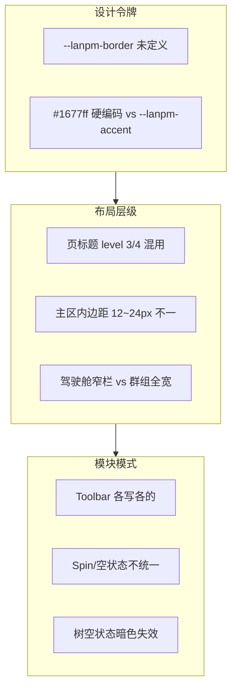

# LanPM 完整执行计划（v2.0 对齐版）

> 依据文档：`docs/00` ~ `docs/06`（见 [docs/00_文档导航.md](./docs/00_文档导航.md)）
>
> **P0 里程碑 M0–M7 已完成**（`1.0.0-rc.2`）。逐阶段详情见 [archive/20260528_235810_M0-M7完成_plan逐阶段执行计划归档.md](./archive/20260528_235810_M0-M7完成_plan逐阶段执行计划归档.md)

---

## 1. 项目目标与边界

### 1.1 核心目标
- 交付一个无中心服务器的分布式局域网/VPN 协作客户端（Electron）。
- 在 P0 阶段完成 IM + 项目管理 + 文件共享 + 驾驶舱 + 网络基础能力闭环。
- 建立可演进的工程结构，支持 P1/P2 功能连续扩展。

### 1.2 本期范围（P0）
- 首次配置、主框架、聊天、代码分享、看板、任务树、甘特图、文件、群组、驾驶舱、网络层。
- 跨平台目标：Windows 10+ / macOS 12+ / Ubuntu 22.04+。

### 1.3 非目标（本期不做）
- 多人视频会议、完整插件市场、原生移动 App（P2）。
- 强依赖公网服务的中心化同步方案。

---

## 2. 交付原则

- **需求一致性**：任何实现必须能映射到 `docs/01~06` 的明确条目（索引见 `docs/00`）。
- **分层实现**：先骨架后联调，先稳定后增强，避免跨层返工。
- **验收驱动**：每个里程碑都有对应 checklist、演示路径和回归点。
- **变更可追踪**：每次阶段性调整同步更新 `CHANGELOG.md` 与本计划。

---

## 3. 工作分解结构（WBS）

### 3.1 产品与交互（对应 `docs/01`）
- IA 与导航：顶部栏 + 5 大视图 + 群组维度切换。
- 身份体系：用户名/后缀、设备标识、多设备在线聚合。
- 模块交互：聊天、看板、任务树、甘特图、文件、驾驶舱。
- 匿名群组约束：匿名代号、无历史同步、仅文本聊天。

### 3.2 技术底座（对应 `docs/02` + `docs/04`）
- 主进程网络模块：UDP 发现、连接管理、心跳广播。
- P2P 传输层：WebRTC DataChannel 消息/文件通道。
- 数据同步：聊天顺序保证 + 任务 CRDT + 文件元数据广播。
- 安全链路：DH 密钥交换 + AES-256-GCM + HMAC。
- 本地存储：SQLite（可加密）+ IndexedDB 分工。
- 数据模型：按 `docs/04` 实现 User/Group/Message/Task/File 与 SyncEnvelope。

### 3.3 交付与验证（对应 `docs/03`）
- P0 全量功能验收项落地。
- M0-M7 每阶段构建、联调、回归闭环。
- 性能与可靠性指标验证（启动、内存、响应、恢复）。

---

## 4. 里程碑总览（M0–M7，已完成）

| 阶段 | 目标 | 版本 | 状态 |
|------|------|------|------|
| M0 | 项目初始化与首次配置 | v0.5.0-m0 | ✅ |
| M1 | 主框架与主题能力 | v0.5.2-m1 | ✅ |
| M2 | 聊天与代码分享 | v0.6.0-m2+ | ✅ |
| M3 | 看板与任务树 | v0.7.0-m3 | ✅ |
| M4 | 甘特图与文件模块 | v0.8.1-m4 | ✅ |
| M5 | 群组与驾驶舱 | v0.9.0-m5 | ✅ |
| M6 | 网络层强化 | v0.10.0-m6 | ✅ |
| M7 | 测试优化与 RC | 1.0.0-rc.1 | ✅ |

> 逐阶段任务清单、交付物、验收点：[archive/20260528_235810_M0-M7完成_plan逐阶段执行计划归档.md](./archive/20260528_235810_M0-M7完成_plan逐阶段执行计划归档.md)  
> 任务 DoD 明细：[archive/20260528_234920_M7完成_todo执行清单归档.md](./archive/20260528_234920_M7完成_todo执行清单归档.md)

---

## 5. 当前阶段：RC → 正式版 1.0.0

手验与发布门禁见 [todo.md](./todo.md)、[docs/08_M7_RC验收清单.md](./docs/08_M7_RC验收清单.md)。

| 项 | 说明 |
|----|------|
| 三平台冒烟 | Win / macOS / Linux |
| 性能手测 | docs/06 §3：冷启动 / 内存 / Tab P95 |
| 局域网双机 | docs/06 §4；`LANPM_TCP_PORT` 区分端口 |
| 打版 | `1.0.0`（`CHANGELOG` + tag） |

---

## 6. v1.1+ Backlog

| 项 | 优先级 | 状态 |
|----|--------|------|
| 顶栏全局搜索（任务 + 消息） | P1 | ✅ rc.2 |
| 看板删除任务 UI | P1 | ✅ rc.2 |
| 任务 P2P / Yjs 同步 | P1 | 待做 |
| 远端文件 P2P 下载 | P1 | 待做 |
| 看板列内 Sortable | P2 | 待做 |

---

## 7. 验收策略（执行方式）

### 7.1 验收分层
- **功能验收**：按 `docs/03` 第 16 章逐条打勾。
- **联调验收**：跨模块主链路（聊天建任务→看板→树→甘特→驾驶舱）。
- **性能验收**：启动、内存、响应、传输吞吐。
- **安全验收**：加密链路与密钥轮换策略验证。

### 7.2 核心验收路径
- 路径 A：首次配置 → 进入主界面 → 加入群组 → 发消息。
- 路径 B：聊天 `/task` → 看板拖拽 → 任务树进度汇总 → 甘特时间调整。
- 路径 C：上传文件 → 预览 → 下载 → 传输记录查询。
- 路径 D：驾驶舱查看项目 → 生成周报/月报 → AI 评估提示。

---

## 8. 风险清单与缓解

| 风险 | 影响 | 缓解措施 |
|------|------|----------|
| UDP 跨平台差异 | 节点发现不稳定 | 主进程做统一适配层，建立多平台回归用例 |
| P2P 建链失败率 | 消息/文件不可达 | 增加重试退避、候选通道、故障回退提示 |
| CRDT 与视图一致性 | 任务状态错乱 | 单一任务源模型，视图层订阅更新 |
| 大文件传输中断 | 用户体验差 | 分片 + 断点续传 + 队列并发控制 |
| 性能超标 | 发布阻塞 | 持续性能基线监控（见 docs/06 §3） |
| 文档与实现偏差 | 返工 | 每里程碑末做“文档-实现映射审计” |

---

## 9. 协作与节奏

### 9.1 日常节奏
- 每日站会：同步昨日产出、今日目标、阻塞项。
- 每两天一次里程碑小结：范围、风险、变更决策。

### 9.2 文档维护机制
- 需求变更：先改 `docs/01` / `docs/03`，涉及字段时同步 `docs/04`，最后改 `plan.md` 与 `docs/00` 追溯表。
- 阶段完成：更新 `CHANGELOG.md`（最新在最上）。
- 归档规则：已完成计划与临时稿放 `archive/`，文件名 `YYYYMMDD_HHMMSS_功能_模块说明.md`。

---

## 10. 关键决策（已拍板）

| 主题 | 已确定方案 | 说明 |
|------|------------|------|
| 前端框架 | React 18 + TypeScript | 生态成熟、维护与招聘更稳、后续迁移与对接便利 |
| UI 组件库 | Ant Design 5.x | 企业协作密集型界面；见 `docs/05` §8 |
| 样式方案 | CSS Modules | 与 Ant Design 主题配合，不引入 Tailwind |
| 全局状态 | Zustand | 跨视图/群组状态管理 |
| 甘特图 | `gantt-task-react` | M4 集成，与任务 CRDT 同源 |
| Office 预览主链路 | 本地 LibreOffice 优先 | 核心数据不出域，保障内网数据边界 |
| AI 阶段范围 | P0 手动触发，P1 自动化 | 先满足审核可用，再逐步提升自动化能力 |
| 全局搜索 P0 | 任务 + 消息 | 成员 P1；文件在文件模块内检索 |
| 传输加密 | UDP + WebRTC + 应用层 AES-GCM/DH/HMAC | 无独立 TLS 层；见 `docs/02` §14.4 |
| 看板拖拽 | `@dnd-kit/core` | M3 看板跨列；见 `docs/05` §8 |

### 10.1 你已确认的规则（已落文档）

- 外部 API 是明确需求，可接入（前提：仅脱敏字段外发）。
- “无互联网依赖”解释为“核心业务数据不出域”，而非“设备绝对离线”。
- 已读回执按 `userId` 聚合：同用户任一设备阅读即已读。
- 冲突处理采用“最新事件优先”，问题回滚仅影响本人，不影响他人状态。
- 网络协议参数已有开发初稿，可先按默认值联调。
- M2–M5 使用 NetworkStub 联调；M6 切换真实 UDP/TCP（`LANPM_NETWORK=stub|real`）。

---

## 11. 打版门禁（Release Gate）

- P0 验收项 100% 通过（`docs/03` 第 16 章）。
- 无 P0/P1 阻断级缺陷。
- 启动时间、内存、响应满足 `docs/02` 非功能指标。
- 跨平台最小可用验证完成（Win/macOS/Linux）。
- `CHANGELOG.md`、`plan.md`、`docs/` 状态一致后允许发版。

---

## 12. 视觉一致性整改计划（v1.0.x 补丁）

> **触发**：2026-05-28 全页面视觉审计（见 [todo.md](./todo.md) §视觉一致性）。  
> **原则**：先令牌、后布局、再模块模式；每项可独立 PR，不阻塞 `1.0.0` RC 手验，建议在 `1.0.0` 前或 `1.0.1` 合入。

### 12.1 审计范围（已覆盖）

| 页面/模块 | 入口 | 样式入口 |
|-----------|------|----------|
| 启动/配置 | `App.tsx` → `SetupWizard` | `SetupWizard.module.css`（Apple 风格，较完整） |
| 主壳 | `layout/MainLayout` + `TopBar` + `BottomNav` | `MainLayout.module.css`、`TopBar/BottomNav.module.css` |
| 聊天 | `GroupView` → `ChatView` | `GroupView.module.css`、`chat.module.css` |
| 看板 / 树 / 甘特 / 文件 | `GroupView` → 各 `*View` | `board` / `tree` / `gantt` / `files.module.css` |
| 驾驶舱 | `CockpitView` | `CockpitView.module.css` |
| 主题 | `ThemeProvider` + `global.module.css` | Ant `colorPrimary` 与 CSS 变量双轨 |

### 12.2 主要问题摘要

### 12.3 分阶段执行（对应 todo V-01 ~ V-14）

| 阶段 | 工期估 | 任务 ID | 产出 |
|------|--------|---------|------|
| **S1 令牌** | 0.5d | V-01, V-02, V-03 | `global.module.css` 扩展；替换硬编码强调色；暗色可读 |
| **S2 页壳** | 0.5d | V-04 ~ V-07 | 统一 `ViewHeader`、主区 padding、驾驶舱布局与群组视图对齐 |
| **S3 模块** | 1d | V-08 ~ V-11 | `ViewToolbar`、空/加载组件、甘特暗色、标题语义产品确认 |
| **S4 收尾** | 0.5d | V-12 ~ V-14 | 删遗留占位、同步 `docs/05`、亮暗手验截图 |

### 12.4 验收标准（DoD）

- 亮/暗色切换后，五视图 + 驾驶舱 + 配置向导边框/强调色/选中态视觉同源（无 Ant 默认蓝残留）。
- `docs/05` §1 尺寸表与实现一致（改代码或改文档二选一，禁止长期双标）。
- `todo.md` 中 V-01 ~ V-14 全部勾选，或明确推迟项写入 `docs/08` 已知限制。

### 12.5 不在本期

- 大规模重设计 SetupWizard（已符合 Apple 分组风格，仅做令牌对齐）。
- 替换 Ant Design / 甘特库（技术栈已锁定，见 §10）。
